# Java 设计模式 

 **作者 github 主页：[whyOnism (why) (github.com)](https://github.com/whyOnism)**


[TOC]


## 概述

设计模式是软件工程中常用的解决特定问题的优雅和经过时间检验的结构。它们是解决软件设计中常见问题的最佳实践，并且可以帮助开发者编写可重用、可维护和可理解的代码。设计模式不仅仅关注代码，而且还关注系统架构设计和软件设计原则。

### 1. 设计模式的分类

设计模式通常可以分为三大类：创建型、结构型和行为型模式。

1. **创建型模式**：关注如何有效的创建对象，包括：单例模式、建造者模式、原型模式、工厂模式和抽象工厂模式。
2. **结构型模式**：关注如何组织不同的类和对象以形成更大的结构，以及类和对象之间的关系，包括：适配器模式、桥接模式、装饰器模式、组合模式、外观模式、享元模式和代理模式。
3. **行为型模式**：关注对象间的通信，以及如何分配职责，包括：责任链模式、命令模式、解释器模式、迭代器模式、中介者模式、备忘录模式、观察者模式、状态模式、策略模式、模板方法模式和访问者模式。

### 2. 学习顺序

> 1. **创建型模式**：创建型模式关注对象的创建机制，从简单到复杂地介绍了一系列模式。工厂模式是最基础的创建型模式，抽象工厂模式在此基础上提供了更高层次的抽象，单例模式解决了对象唯一性的问题，建造者模式帮助构建复杂对象，原型模式则提供了对象的克隆机制。这些模式为后续的学习打下了坚实的基础。
> 2. **结构型模式**：结构型模式关注对象的组织方式和关系，帮助构建更大规模的系统。适配器模式解决了接口不兼容的问题，装饰器模式提供了动态的对象包装机制，代理模式实现了对象的间接访问，享元模式减少了对象的重复创建，外观模式简化了复杂子系统的使用，桥接模式分离了抽象和实现，组合模式实现了对象的树形结构。这些模式使得系统更灵活、可扩展，并且具备更好的组织结构。
> 3. **行为型模式**：行为型模式关注对象之间的交互和责任分配，使系统更具弹性和灵活性。观察者模式定义了对象之间的一对多依赖关系，策略模式封装了算法的变化，模板方法模式定义了算法的骨架，迭代器模式提供了对集合的遍历方式，责任链模式将请求的发送者和接收者解耦，命令模式封装了请求为对象，状态模式使对象在不同状态下有不同行为，中介者模式协调了对象之间的交互，访问者模式分离了数据结构和操作，解释器模式定义了语言的文法和解释过程，备忘录模式提供了对象状态的保存和恢复机制。这些模式使得系统更具弹性，并支持对象之间的松耦合。
>
> 这种学习顺序将设计模式按照一定的逻辑进行组织，从简单到复杂，从创建到交互，逐步引入不同的概念和技术。这样的学习顺序可以逐步理解和掌握设计模式的思想和应用，建立起对设计模式的整体认知和框架。

1. **创建型模式**：工厂模式 -> 抽象工厂模式 -> 单例模式 -> 建造者模式 -> 原型模式
2. **结构型模式**：适配器模式 -> 装饰器模式 -> 代理模式 -> 享元模式 -> 外观模式 -> 桥接模式 -> 组合模式
3. **行为型模式**：观察者模式 -> 策略模式 -> 模板方法模式 -> 迭代器模式 -> 责任链模式 -> 命令模式 -> 状态模式 -> 中介者模式 -> 访问者模式 -> 解释器模式 -> 备忘录模式

## 一、工厂模式

工厂设计模式是一种创建型设计模式，旨在提供一种统一的方式来创建对象，而无需直接使用构造函数。它通过定义一个公共接口来实现对象的创建，并将具体对象的实例化延迟到子类中。这种方式可以隐藏对象创建的细节，提供更高的灵活性和可维护性。

### 1. 问题

工厂设计模式旨在解决以下问题：

1. **对象的创建与使用耦合度高**：在传统的对象创建方式中，对象的创建通常直接发生在使用该对象的代码中，导致对象的创建与使用紧密耦合在一起。这种紧耦合关系使得代码难以扩展和维护，因为每次需要更改对象创建方式时，都需要修改使用该对象的代码。

2. **难以通过继承来更改创建逻辑**：如果使用继承来创建不同类型的对象，那么每个子类都需要实现对象的创建逻辑。这样的设计在创建逻辑变化时会导致子类的修改，违反了开闭原则。

### 2. 例子

以下是两个实际的例子，说明工厂设计模式的应用：

1. **图形绘制**：假设我们需要绘制不同类型的图形，如圆形、矩形和三角形。使用工厂设计模式，我们可以定义一个抽象的图形接口，并创建具体的图形工厂类来实例化不同类型的图形对象。这样，通过调用工厂类的方法，我们可以根据需要创建相应的图形对象，而不需要直接使用具体的构造函数。

2. **数据库连接**：在应用程序中经常需要与数据库进行交互。使用工厂设计模式，我们可以定义一个数据库连接接口，并创建具体的数据库连接工厂类来根据不同的配置信息创建对应的数据库连接对象。这样，我们可以通过工厂类来获取数据库连接，而不需要暴露具体的连接实现细节。

### 3. 代码示例

工厂模式在项目中常见的结构包括以下几个角色：

> 1. **抽象产品（Abstract Product）**：定义产品的接口或抽象类，声明产品的共同方法。
> 2. **具体产品（Concrete Product）**：实现抽象产品接口或继承抽象产品类，是具体的产品对象。
> 3. **抽象工厂（Abstract Factory）**：定义创建产品对象的接口，声明创建产品的方法。
> 4. **具体工厂（Concrete Factory）**：实现抽象工厂接口，负责创建具体产品的对象。

假设有一个游戏开发项目，需要创建不同类型的游戏角色，包括战士（Warrior）、法师（Mage）和射手（Archer）。

1. **抽象产品（Abstract Product）：**
```java
// 游戏角色接口
public interface GameCharacter {
    void attack();
}
```

2. **具体产品（Concrete Product）：**
```java
// 具体战士角色类
public class Warrior implements GameCharacter {
    @Override
    public void attack() {
        System.out.println("战士发起攻击！");
    }
}

// 具体法师角色类
public class Mage implements GameCharacter {
    @Override
    public void attack() {
        System.out.println("法师发起攻击！");
    }
}

// 具体射手角色类
public class Archer implements GameCharacter {
    @Override
    public void attack() {
        System.out.println("射手发起攻击！");
    }
}
```

3. **抽象工厂（Abstract Factory）：**
```java
// 游戏角色工厂接口
public interface GameCharacterFactory {
    GameCharacter createCharacter();
}
```

4. **具体工厂（Concrete Factory）：**
```java
// 战士角色工厂
public class WarriorFactory implements GameCharacterFactory {
    @Override
    public GameCharacter createCharacter() {
        // 创建战士角色对象
        return new Warrior();
    }
}

// 法师角色工厂
public class MageFactory implements GameCharacterFactory {
    @Override
    public GameCharacter createCharacter() {
        // 创建法师角色对象
        return new Mage();
    }
}

// 射手角色工厂
public class ArcherFactory implements GameCharacterFactory {
    @Override
    public GameCharacter createCharacter() {
        // 创建射手角色对象
        return new Archer();
    }
}
```

在使用工厂模式时，客户端代码可以通过具体工厂来创建不同类型的游戏角色对象，而不需要直接实例化具体产品类。例如：

```java
// 使用战士工厂创建战士角色
GameCharacterFactory warriorFactory = new WarriorFactory();
GameCharacter warrior = warriorFactory.createCharacter();
warrior.attack(); // 输出：战士发起攻击！

// 使用法师工厂创建法师角色
GameCharacterFactory mageFactory = new MageFactory();
GameCharacter mage = mageFactory.createCharacter();
mage.attack(); // 输出：法师发起攻击！

// 使用射手工厂创建射手角色
GameCharacterFactory archerFactory = new ArcherFactory();
GameCharacter archer = archerFactory.createCharacter();
archer.attack(); // 输出：射手发起攻击！
```

通过工厂模式，客户端代码可以通过工厂类来创建具体产品对象，从而实现了对象的解耦和灵活性。这样，在需要新增其他类型的游戏角色时，只需要添加对应的具体产品类和工厂类，而不需要修改客户端代码。

### 4. 类图

下面是使用工厂设计模式的类图：

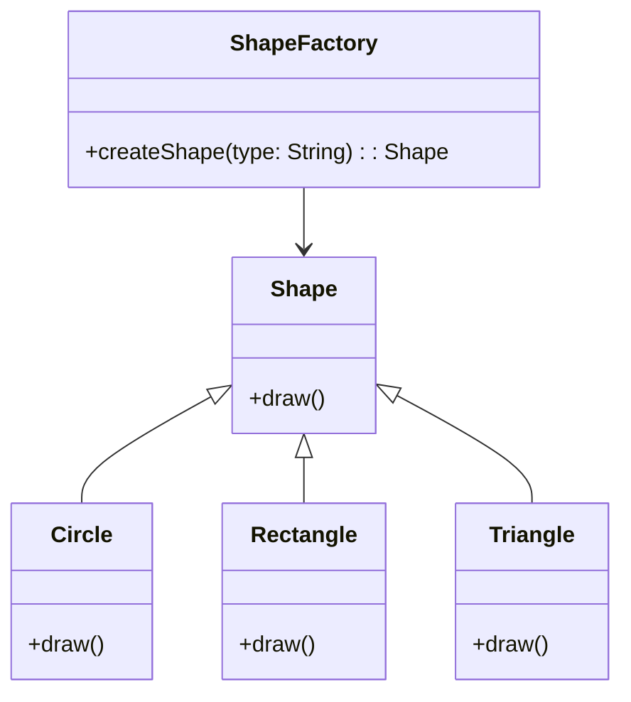
```mermaid
classDiagram
    class Shape {
        +draw()
    }
    class Circle {
        +draw()
    }
    class Rectangle {
        +draw()
    }
    class Triangle {
        +draw()
    }
    class ShapeFactory {
        +createShape(type: String): Shape
    }
    Shape <|-- Circle
    Shape <|-- Rectangle
    Shape <|-- Triangle
    ShapeFactory --> Shape
```

> - `Shape` 是抽象产品类，它定义了一个绘制方法。
> - `Circle`、`Rectangle` 和 `Triangle` 是具体产品类，它们实现了绘制方法，分别代表圆形、矩形和三角形。
> - `ShapeFactory` 是工厂类，它包含一个根据传入的类型创建图形对象的方法。
> - 工厂类 `ShapeFactory` 和抽象产品类 `Shape` 之间存在关联关系，表示工厂类通过调用抽象产品类的方法来创建具体产品对象。

### 5. 案例：音乐播放器

假设我们正在开发一个音乐播放器应用程序。该应用程序需要支持播放不同类型的音频文件，如MP3、WAV和FLAC。使用工厂设计模式可以很好地满足这个需求。

首先，我们定义一个抽象的音频接口（`Audio`），其中包含播放音频的方法。然后，我们创建具体的音频类来实现该接口，如`MP3Audio`、`WAVAudio`和`FLACAudio`。

接下来，我们创建一个音频工厂类（`AudioFactory`），它包含一个方法 `createAudio`，根据传入的音频类型参数来创建相应的音频对象。在工厂内部，我们可以根据不同的音频类型使用条件语句或者映射关系来实例化具体的音频对象。

使用工厂模式，我们可以在应用程序中的任何地方通过工厂类来获取所需的音频对象，而不需要直接使用具体的构造函数。这种方式使得应用程序更具灵活性，易于扩展和维护。

```java
// 音频接口
interface Audio {
    void play();
}

// MP3音频类
class MP3Audio implements Audio {
    @Override
    public void play() {
        System.out.println("播放MP3音频");
    }
}

// WAV音频类
class WAVAudio implements Audio {
    @Override
    public void play() {
        System.out.println("播放WAV音频");
    }
}

// FLAC音频类
class FLACAudio implements Audio {
    @Override
    public void play() {
        System.out.println("播放FLAC音频");
    }
}

// 音频工厂类
class AudioFactory {
    public Audio createAudio(String type) {
        if (type.equalsIgnoreCase("MP3")) {
            return new MP3Audio();
        } else if (type.equalsIgnoreCase("WAV")) {
            return new WAVAudio();
        } else if (type.equalsIgnoreCase("FLAC")) {
            return new FLACAudio();
        }
        return null;
    }
}

// 使用工厂创建音频对象
public class Main {
    public static void main(String[] args) {
        AudioFactory factory = new AudioFactory();

        Audio audio1 = factory.createAudio("MP3");
        audio1.play();  // 输出：播放MP3音频

        Audio audio2 = factory.createAudio("WAV");
        audio2.play();  // 输出：播放WAV音频

        Audio audio3 = factory.createAudio("FLAC");
        audio3.play();  // 输出：播放FLAC音频
    }
}
```

通过工厂设计模式，我们可以根据不同的音频类型创建相应的音频对象，而不需要直接使用具体的构造函数。这种灵活性使得我们能够轻松扩展音频类型，例如添加新的音频格式，而不需要修改使用音频对象的代码。

------

## 二、抽象工厂模式

抽象工厂模式是一种创建型设计模式，它提供了一种创建一组相关或相互依赖对象的方式，而无需指定它们的具体类。与工厂模式不同，抽象工厂模式关注于创建一组相关的产品对象，而不是单个产品对象。这种模式有助于确保一组对象的一致性，因为它们是由同一个工厂创建的。

### 1. 问题

抽象工厂模式旨在解决以下问题：

1. **创建一组相关对象**：在某些情况下，需要一组相关的对象，例如，一个图形界面需要创建窗口、按钮、文本框等各种控件，这些控件之间可能存在关联。抽象工厂模式提供了一种组织和创建这些相关对象的方式。

2. **确保产品一致性**：在某些情况下，一组对象需要保持一致性，即它们必须属于相同的产品族或产品系列。抽象工厂模式确保了创建的对象属于同一产品族，因为它们是由同一个工厂创建的。

### 2. 例子

以下是一个实际的例子，说明抽象工厂模式的应用：

假设我们正在开发一个跨平台的图形界面库，需要支持在不同操作系统上创建窗口和按钮。在不同操作系统下，窗口和按钮的外观和行为可能会有所不同。使用抽象工厂模式，我们可以创建一个抽象工厂来定义创建窗口和按钮的方法，然后为每个操作系统创建具体的工厂来实现这些方法，以确保所创建的窗口和按钮是与操作系统兼容的。

### 3. 代码示例

抽象工厂模式在项目中常见的结构包括以下几个角色：

1. **抽象工厂（Abstract Factory）**：定义创建一组相关产品的接口，包括创建窗口和创建按钮的方法。

2. **具体工厂（Concrete Factory）**：实现抽象工厂接口，负责创建一组具体产品，例如，在不同操作系统下创建窗口和按钮。

3. **抽象产品（Abstract Product）**：定义一组相关产品的接口，例如，抽象窗口和抽象按钮。

4. **具体产品（Concrete Product）**：实现抽象产品接口，具体产品属于一组相关产品，例如，在特定操作系统下实现的具体窗口和按钮。

以下是一个简化的图形界面库示例：

```java
// 抽象窗口接口
interface Window {
    void render();
}

// 抽象按钮接口
interface Button {
    void onClick();
}

// 具体窗口实现 - Windows窗口
class WindowsWindow implements Window {
    @Override
    public void render() {
        System.out.println("渲染Windows窗口");
    }
}

// 具体按钮实现 - Windows按钮
class WindowsButton implements Button {
    @Override
    public void onClick() {
        System.out.println("点击了Windows按钮");
    }
}

// 具体窗口实现 - MacOS窗口
class MacOSWindow implements Window {
    @Override
    public void render() {
        System.out.println("渲染MacOS窗口");
    }
}

// 具体按钮实现 - MacOS按钮
class MacOSButton implements Button {
    @Override
    public void onClick() {
        System.out.println("点击了MacOS按钮");
    }
}

// 抽象工厂接口
interface GUIFactory {
    Window createWindow();
    Button createButton();
}

// 具体工厂实现 - Windows工厂
class WindowsGUIFactory implements GUIFactory {
    @Override
    public Window createWindow() {
        return new WindowsWindow();
    }

    @Override
    public Button createButton() {
        return new WindowsButton();
    }
}

// 具体工厂实现 - MacOS工厂
class MacOSGUIFactory implements GUIFactory {
    @Override
    public Window createWindow() {
        return new MacOSWindow();
    }

    @Override
    public Button createButton() {
        return new MacOSButton();
    }
}
```

在上述示例中，我们定义了抽象窗口接口 `Window`、抽象按钮接口 `Button`，以及具体的窗口和按钮实现。然后，我们创建了两个具体工厂 `WindowsGUIFactory` 和 `MacOSGUIFactory`，它们分别负责创建与 Windows 和 MacOS 兼容的窗口和按钮。

现在，客户端代码可以根据需要选择工厂，并使用工厂创建窗口和按钮，而不需要关心具体的实现细节：

```java
// 使用Windows工厂创建窗口和按钮
GUIFactory windowsFactory = new WindowsGUIFactory();
Window windowsWindow = windowsFactory.createWindow();
Button windowsButton = windowsFactory.createButton();

windowsWindow.render();  // 输出：渲染Windows窗口
windowsButton.onClick(); // 输出：点击了Windows按钮

// 使用MacOS工厂创建窗口和按钮
GUIFactory macFactory = new MacOSGUIFactory();
Window macWindow = macFactory.createWindow();
Button macButton = macFactory.createButton();

macWindow.render();  // 输出：渲染MacOS窗口
macButton.onClick(); // 输出：点击了MacOS按钮
```

通过抽象工厂模式，我们可以轻松创建一组相关的产品对象，并确保它们是相互兼容的，同时也提高了代码的可维护性和扩展性。当需要添加新的产品族（例如，在新的操作系统上支持更多控件）时，只需创建新的具体工厂类，而无需修改现有代码。这有助于遵循开闭原则，使代码更加灵活。

### 4. 类图

以下是抽象工厂模式的类图，它展示了抽象工厂、具体工厂、抽象产品和具体产品之间的关系：

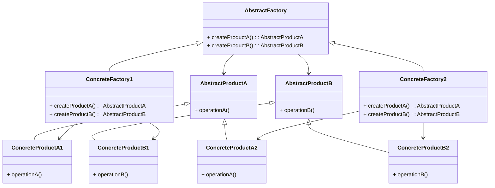
```mermaid
classDiagram
    class AbstractFactory {
        + createProductA(): AbstractProductA
        + createProductB(): AbstractProductB
    }
    class ConcreteFactory1 {
        + createProductA(): AbstractProductA
        + createProductB(): AbstractProductB
    }
    class ConcreteFactory2 {
        + createProductA(): AbstractProductA
        + createProductB(): AbstractProductB
    }
    class AbstractProductA {
        + operationA()
    }
    class ConcreteProductA1 {
        + operationA()
    }
    class ConcreteProductA2 {
        + operationA()
    }
    class AbstractProductB {
        + operationB()
    }
    class ConcreteProductB1 {
        + operationB()
    }
    class ConcreteProductB2 {
        + operationB()
    }

    AbstractFactory <|-- ConcreteFactory1
    AbstractFactory <|-- ConcreteFactory2
    AbstractProductA <|-- ConcreteProductA1
    AbstractProductA <|-- ConcreteProductA2
    AbstractProductB <|-- ConcreteProductB1
    AbstractProductB <|-- ConcreteProductB2
    AbstractFactory --> AbstractProductA
    AbstractFactory --> AbstractProductB
    ConcreteFactory1 --> ConcreteProductA1
    ConcreteFactory1 --> ConcreteProductB1
    ConcreteFactory2 --> ConcreteProductA2
    ConcreteFactory2 --> ConcreteProductB2

```

- `AbstractFactory` 是抽象工厂类，它定义了创建一组相关产品的接口，例如 `createProductA` 和 `createProductB` 方法。

- `ConcreteFactory1` 和 `ConcreteFactory2` 是具体工厂类，它们实现了抽象工厂接口，分别负责创建一组具体产品。

- `AbstractProductA` 和 `AbstractProductB` 是抽象产品类，它们定义了一组相关产品的接口，例如 `operationA` 和 `operationB` 方法。

- `ConcreteProductA1`、`ConcreteProductA2`、`ConcreteProductB1` 和 `ConcreteProductB2` 是具体产品类，它们实现了抽象产品接口，分别属于不同的产品族。

抽象工厂模式通过将相关产品的创建封装在工厂类中，有助于维护产品之间的一致性，并使系统更容易扩展，以支持新的产品族或变体。

### 5. 案例：汽车工厂

假设我们正在开发一个汽车制造系统，该系统需要支持不同类型的汽车，包括经济型汽车和豪华型汽车。每种类型的汽车都有不同的部件，如发动机、轮胎和内饰。我们可以使用抽象工厂模式来管理这些相关的产品。

首先，我们定义了抽象工厂 `CarFactory`，它包括创建发动机和创建轮胎的方法。然后，我们创建两个具体工厂类 `EconomyCarFactory` 和 `LuxuryCarFactory`，它们分别负责生产经济型汽车和豪华型汽车所需的部件。

接下来，我们定义了抽象部件类 `Engine` 和 `Tire`，它们分别表示汽车的发动机和轮胎。然后，我们创建了具体部件类 `EconomyEngine`、`EconomyTire`、`LuxuryEngine` 和 `LuxuryTire`，它们实现了相应的抽象部件。

最后，我们创建汽车类 `Car`，它包含了发动机和轮胎作为其部件，并且能够组装这些部件。

```java
// 抽象发动机接口
interface Engine {
    void start();
}

// 抽象轮胎接口
interface Tire {
    void inflate();
}

// 具体经济型发动机
class EconomyEngine implements Engine {
    @Override
    public void start() {
        System.out.println("启动经济型发动机");
    }
}

// 具体经济型轮胎
class EconomyTire implements Tire {
    @Override
    public void inflate() {
        System.out.println("充气经济型轮胎");
    }
}

// 具体豪华型发动机
class LuxuryEngine implements Engine {
    @Override
    public void start() {
        System.out.println("启动豪华型发动机");
    }
}

// 具体豪华型轮胎
class LuxuryTire implements Tire {
    @Override
    public void inflate() {
        System.out.println("充气豪华型轮胎");
    }
}

// 抽象工厂接口
interface CarFactory {
    Engine createEngine();
    Tire createTire();
}

// 具体经济型汽车工厂
class EconomyCarFactory implements CarFactory {
    @Override
    public Engine createEngine() {
        return new EconomyEngine();
    }

    @Override
    public Tire createTire() {
        return new EconomyTire();
    }
}

// 具体豪华型汽车工厂
class LuxuryCarFactory implements CarFactory {
    @Override
    public Engine createEngine() {
        return new LuxuryEngine();
    }

    @Override
    public Tire createTire() {
        return new LuxuryTire();
    }
}

// 汽车类
class Car {
    private Engine engine;
    private Tire tire;

    public Car(CarFactory factory) {
        engine = factory.createEngine();
        tire = factory.createTire();
    }

    public void drive() {
        engine.start();
        tire.inflate();
        System.out.println("汽车行驶中...");
    }
}
```

现在，我们可以使用这些类来创建不同类型的汽车，并组装其部件。例如：

```java
// 创建经济型汽车
CarFactory economyFactory = new EconomyCarFactory();
Car economyCar = new Car(economyFactory);
economyCar.drive();
// 输出：
// 启动经济型发动机
// 充气经济型轮胎
// 汽车行驶中...

// 创建豪华型汽车
CarFactory luxuryFactory = new LuxuryCarFactory();
Car luxuryCar = new Car(luxuryFactory);
luxuryCar.drive();
// 输出：
// 启动豪华型发动机
// 充气豪华型轮胎
// 汽车行驶中...
```

通过抽象工厂模式，我们能够轻松创建不同类型的汽车，并确保其部件的一致性，以满足不同市场需求。这种方式使得系统更加灵活，并且在添加新类型的汽车或部件时，不需要修改现有的代码，符合开闭原则。

> **工厂模式与抽象工厂的区别**
>
> - 工厂模式关注单一产品对象的创建，通过将创建过程进行封装提供更好的灵活性。
> - 抽象工厂模式关注一系列相关产品对象的创建，以满足复杂的产品族需求。

----

## 三、单例模式

单例模式是一种创建型设计模式，旨在确保类只有一个实例，并提供全局访问点。这意味着无论在应用程序的哪个地方请求该类的实例，都将获得同一个实例。单例模式通常用于管理全局资源、配置设置、数据库连接池等需要唯一实例的场景。

### 1. 问题

单例模式旨在解决以下问题：

1. **确保一个类只有一个实例**：在某些情况下，需要确保系统中某个类的实例只存在一个，以避免资源浪费或不一致的状态。

2. **提供全局访问点**：需要在整个应用程序中访问该实例，而不必将实例传递给每个需要它的对象。

### 2. 例子

以下是一个示例，说明单例模式的应用：

**日志记录器**：在一个应用程序中，需要记录各种信息的日志，如信息、警告和错误。如果多个组件同时尝试访问和写入日志文件，可能会导致竞态条件和性能问题。使用单例模式，可以创建一个全局的日志记录器，确保只有一个实例，并通过全局访问点让所有组件能够访问它。

### 3. 代码示例

单例模式的关键是将类的构造函数设为私有，以防止外部代码直接实例化它。然后，提供一个方法来获取类的唯一实例。

以下是一个简单的单例模式的示例：

```java
public class Logger {
    // 私有静态变量，用于保存唯一实例
    private static Logger instance;

    // 私有构造函数，防止外部实例化
    private Logger() {
    }

    // 公共静态方法，用于获取唯一实例
    public static Logger getInstance() {
        // 第一次调用时，instance为null，需要创建单例实例
        if (instance == null) {
            instance = new Logger();
        }
        // 返回单例实例
        return instance;
    }

    // 公共方法，用于记录日志
    public void log(String message) {
        System.out.println("Log: " + message);
    }
}

// 示例用法
public class Main {
    public static void main(String[] args) {
        // 获取日志记录器实例
        Logger logger = Logger.getInstance();

        // 记录日志
        logger.log("这是一条日志消息。");

        // 在其他组件中也可以获取相同的实例
        Logger anotherLogger = Logger.getInstance();
        anotherLogger.log("另一条日志消息。");

        // 这两个实例是相同的
        System.out.println(logger == anotherLogger); // 输出 true
    }
}

```

在上述示例中，`Logger` 类的构造函数是私有的，只能通过 `getInstance` 方法获取实例。这确保了在整个应用程序中只有一个 `Logger` 实例，而且可以在多个组件中共享。

### 4. 类图

以下是单例模式的类图：

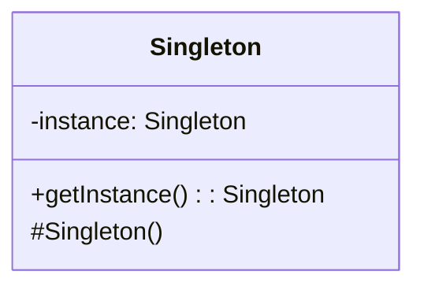
```mermaid
classDiagram
    class Singleton {
        -instance: Singleton
        +getInstance(): Singleton
        #Singleton()
    }
```

> - `Singleton` 类包含一个私有静态变量 `instance`，用于保存唯一实例。
> - 它还包含一个公共静态方法 `getInstance()`，用于获取实例。
> - 构造函数 `Singleton()` 是私有的，以防止外部实例化。

### 5. 单例模式的变种

单例模式有多种实现方式，包括懒汉式、饿汉式、双重检查锁等。每种实现方式都有其优点和适用场景，选择合适的方式取决于应用程序的需求和性能要求。

#### 懒汉式单例

懒汉式单例是在首次请求实例时才进行初始化，具体实现如下：

```java
public class LazySingleton {
    // 单例实例变量，初始化为null
    private static LazySingleton instance;

    // 私有构造函数，防止外部实例化
    private LazySingleton() {
    }

    // 获取单例实例的静态方法，使用synchronized关键字确保线程安全
    public static synchronized LazySingleton getInstance() {
        // 第一次调用时，instance为null，需要创建单例实例
        if (instance == null) {
            instance = new LazySingleton();
        }
        // 返回单例实例
        return instance;
    }
}

```

#### 饿汉式单例

饿汉式单例在类加载时就进行初始化，具体实现如下：

```java
public class EagerSingleton {
    // 在类加载时就创建的单例实例，因此称为饿汉式
    private static final EagerSingleton instance = new EagerSingleton();

    // 私有构造函数，防止外部实例化
    private EagerSingleton() {
    }

    // 获取单例实例的静态方法
    public static EagerSingleton getInstance() {
        // 直接返回预先创建好的单例实例
        return instance;
    }
}
	
```

#### 双重检查锁单例

双重检查锁单例通过双重检查来确保只有一个实例被创建，具体实现如下：

```java
public class DoubleCheckedSingleton {
    // 使用volatile关键字确保多线程下的可见性和顺序性
    private volatile static DoubleCheckedSingleton instance;

    // 私有构造函数，防止外部实例化
    private DoubleCheckedSingleton() {
    }

    // 获取单例实例的静态方法
    public static DoubleCheckedSingleton getInstance() {
        // 第一次检查：如果实例为空，才会进入同步块
        if (instance == null) {
            // 同步块：只有一个线程能进入，避免多次创建实例
            synchronized (DoubleCheckedSingleton.class) {
                // 第二次检查：在同步块内再次检查实例是否为空，以防止并发情况下多次创建实例
                if (instance == null) {
                    // 创建单例实例
                    instance = new DoubleCheckedSingleton();
                }
            }
        }
        // 返回单例实例
        return instance;
    }
}

```

选择哪种单例实现方式取决于项目的具体需求，例如是否需要延迟初始化、是否要求线程安全等。

### 6. 单例模式的注意事项

单例模式虽然能够确保只有一个实例，但在多线程环境下需要注意线程安全性。在上述示例中，懒汉式单例和双重检查锁单例使用了同步机制来保证线程安全，但这会带来一定的性能开销。饿汉式单例在类加载时就初始化实例，天生是线程安全的，但可能会浪费内存。

在选择单例实现方式时，需要根据具体情况综合考虑延迟初始化、性能、线程安全等因素。

----

## 四、建造者模式

建造者模式是一种创建型设计模式，旨在将一个复杂对象的构建过程与其表示分离，使得同样的构建过程可以创建不同的表示。这种模式的核心思想是将对象的构建步骤抽象出来，并由具体的建造者类来实现这些步骤，从而使得客户端代码可以根据需要选择不同的建造者来构建不同的对象。

### 1. 问题

建造者模式旨在解决以下问题：

1. **创建复杂对象**：当一个对象的构建过程较为复杂，涉及多个步骤或部件时，直接在客户端代码中创建这个对象会导致代码复杂化，可读性降低。

2. **构建过程与表示分离**：建造者模式可以将一个对象的构建过程与其最终表示分离，使得同样的构建过程可以创建不同的表示，这在创建不同配置的对象时非常有用。

### 2. 例子

假设我们正在开发一个电脑制造的系统。一个电脑可以由多个部件组成，包括处理器（CPU）、内存（RAM）、硬盘（Storage）等。不同类型的电脑可能配置不同的部件。使用建造者模式可以实现根据用户需求构建不同配置的电脑。

### 3. 代码示例

建造者模式在项目中常见的结构包括以下几个角色：

> 1. **产品（Product）**：表示正在构建的复杂对象。产品类通常包含多个组成部件。
> 2. **抽象建造者（Abstract Builder）**：定义了构建产品的抽象方法，可以有多个不同的具体建造者类。
> 3. **具体建造者（Concrete Builder）**：实现了抽象建造者接口，负责具体的构建过程，以及返回最终构建的产品。
> 4. **指导者（Director）**：负责使用具体建造者来构建产品。可以通过指导者来隔离客户端代码与产品的构建过程。

下面是建造者模式的示例代码：

```java
// 产品类（电脑）
class Computer {
    private String processor;
    private String memory;
    private String storage;

    public void setProcessor(String processor) {
        this.processor = processor;
    }

    public void setMemory(String memory) {
        this.memory = memory;
    }

    public void setStorage(String storage) {
        this.storage = storage;
    }

    // 其他方法...
}

// 抽象建造者
interface ComputerBuilder {
    void buildProcessor();
    void buildMemory();
    void buildStorage();
    Computer getResult();
}

// 具体建造者
class StandardComputerBuilder implements ComputerBuilder {
    private Computer computer = new Computer();

    @Override
    public void buildProcessor() {
        computer.setProcessor("i5 13600K");
    }

    @Override
    public void buildMemory() {
        computer.setMemory("32GB DDR5");
    }

    @Override
    public void buildStorage() {
        computer.setStorage("512GB SSD");
    }

    @Override
    public Computer getResult() {
        return computer;
    }
}

// 指导者
class ComputerManufacturer {
    private ComputerBuilder builder;

    public ComputerManufacturer(ComputerBuilder builder) {
        this.builder = builder;
    }

    public void constructComputer() {
        builder.buildProcessor();
        builder.buildMemory();
        builder.buildStorage();
    }
}

// 客户端代码
public class Main {
    public static void main(String[] args) {
        ComputerBuilder builder = new StandardComputerBuilder();
        ComputerManufacturer manufacturer = new ComputerManufacturer(builder);

        manufacturer.constructComputer();
        Computer computer = builder.getResult();

        // 使用构建完成的电脑对象
        System.out.println("处理器: " + computer.getProcessor());
        System.out.println("内存: " + computer.getMemory());
        System.out.println("硬盘: " + computer.getStorage());
    }
}
```

在这个示例中，`Computer` 类表示正在构建的复杂对象，即电脑。`ComputerBuilder` 接口定义了构建电脑的抽象方法。`StandardComputerBuilder` 类实现了具体的构建过程，而 `ComputerManufacturer` 类则负责指导具体建造者来构建电脑。

### 4. 类图

下面是使用建造者设计模式的类图：

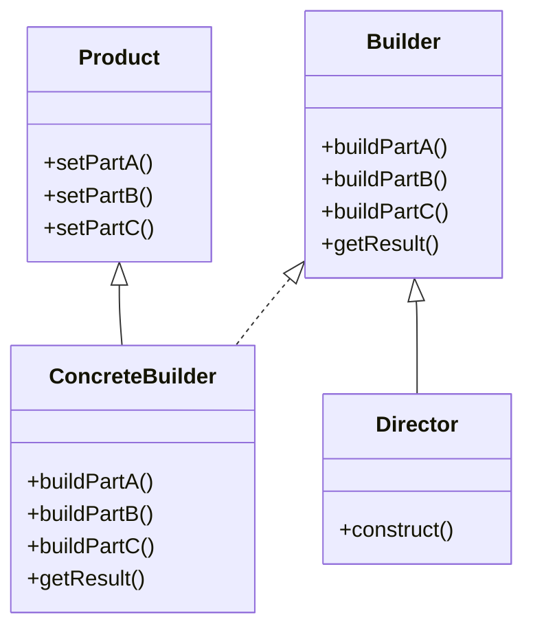
```mermaid
classDiagram
    class Product {
        +setPartA()
        +setPartB()
        +setPartC()
    }
    class Builder {
        +buildPartA()
        +buildPartB()
        +buildPartC()
        +getResult()
    }
    class ConcreteBuilder {
        +buildPartA()
        +buildPartB()
        +buildPartC()
        +getResult()
    }
    class Director {
        +construct()
    }
    Product <|-- ConcreteBuilder
    Builder <|.. ConcreteBuilder
    Builder <|-- Director

```

> - `Product` 是复杂对象（产品）类，它定义了构建的复杂对象的结构。
> - `Builder` 是抽象建造者接口，定义了构建复杂对象的抽象方法。
> - `ConcreteBuilder` 是具体建造者类，实现了抽象建造者接口，负责实际的构建过程。
> - `Director` 是指导者类，负责使用具体建造者来构建复杂对象。它可以隔离客户端代码与构建过程。

### 5. 案例：汽车制造

假设我们正在开发一个汽车制造系统。一个汽车可以由多个部件组成，包括引擎（Engine）、车身（Body）和轮胎（Tire）。不同类型的汽车可能配置不同的部件。使用建造者模式可以实现根据用户需求构建不同配置的汽车。

```java
// 产品类（汽车）
class Car {
    private String engine;
    private String body;
    private String tire;

    public void setEngine(String engine) {
        this.engine = engine;
    }

    public void setBody(String body) {
        this.body = body;
    }

    public void setTire(String tire) {
        this.tire = tire;
    }

    // 其他方法...
}

// 抽象建造者
interface CarBuilder {
    void buildEngine();
    void buildBody();
    void buildTire();
    Car getResult();
}

// 具体建造者
class SportsCarBuilder implements CarBuilder {
    private Car car = new Car();

    @Override
    public void buildEngine() {
        car.setEngine("V8 涡轮增压");
    }

    @Override
    public void buildBody() {
        car.setBody("流线型运动车身");
    }

    @Override
    public void buildTire() {
        car.setTire("低剖面运动轮胎");
    }

    @Override
    public Car getResult() {
        return car;
    }
}

// 指导者
class CarManufacturer {
    private CarBuilder builder;

    public CarManufacturer(CarBuilder builder) {
        this.builder = builder;
    }

    public void constructCar() {
        builder.buildEngine();
        builder.buildBody();
        builder.buildTire();
    }
}

// 客户端代码
public class Main {
    public static void main(String[] args) {
        CarBuilder builder = new SportsCarBuilder();
        CarManufacturer manufacturer = new CarManufacturer(builder);

        manufacturer.constructCar();
        Car car = builder.getResult();

        // 使用构建完成的汽车对象
        System.out.println("引擎: " + car.getEngine());
        System.out.println("车身: " + car.getBody());
        System.out.println("轮胎: " + car.getTire());
    }
}
```

在这个示例中，`Car` 类表示正在构建的复杂对象，即汽车。`CarBuilder` 接口定义了构建汽车的抽象方法。`SportsCarBuilder` 类实现了具体的构建过程，而 `CarManufacturer` 类则负责指导具体建造者来构建汽车。

通过建造者模式，我们可以根据不同的用户需求构建不同配置的汽车，而不需要直接使用具体的构造函数。这种灵活性使得我们能够轻松扩展汽车配置，例如添加新的部件类型，而不需要修改使用汽车对象的代码。

建造者模式的优势在于将构建复杂对象的过程封装起来，提供了更好的可读性和维护性，并且允许客户端代码根据需要选择不同的建造者来构建对象。这有助于降低代码的耦合度和复杂度。

---

## 五、原型模式

原型模式（Prototype Pattern）是一种创建型设计模式，它用于创建对象的克隆副本，而无需直接使用构造函数或者创建新的实例。通过克隆，原型模式可以在运行时动态地创建对象的副本，避免了对象创建过程中的构造函数调用和初始化过程，提高了创建对象的效率。

### 1. 问题

原型模式主要解决以下问题：

1. **对象创建成本较高**：有些对象的创建过程涉及复杂的初始化操作，如果需要频繁创建相似的对象，会导致性能下降。

2. **类的实例化过程较复杂**：有些对象的构造过程包含了大量的初始化逻辑，不适合直接创建多个实例。

### 2. 例子

考虑一个简单的图形绘制应用程序，其中需要创建多个相似的图形对象。使用原型模式，我们可以定义一个抽象的图形原型接口，让具体的图形类实现这个接口并提供克隆方法。当需要创建新的图形对象时，可以通过克隆已有的图形对象来得到副本。

### 3. 代码示例

以下是一个使用原型模式的简单示例，假设我们要创建不同类型的图形对象：

1. **抽象原型（Prototype）：**
```java
// 图形原型接口
interface ShapePrototype {
    ShapePrototype clone();
    void draw();
}
```

2. **具体原型（Concrete Prototype）：**
```java
// 圆形类，实现图形原型接口
class CirclePrototype implements ShapePrototype {
    private int radius;

    public CirclePrototype(int radius) {
        this.radius = radius;
    }

    @Override
    public ShapePrototype clone() {
        return new CirclePrototype(this.radius);
    }

    @Override
    public void draw() {
        System.out.println("绘制圆形，半径：" + radius);
    }
}

// 矩形类，实现图形原型接口
class RectanglePrototype implements ShapePrototype {
    private int width;
    private int height;

    public RectanglePrototype(int width, int height) {
        this.width = width;
        this.height = height;
    }

    @Override
    public ShapePrototype clone() {
        return new RectanglePrototype(this.width, this.height);
    }

    @Override
    public void draw() {
        System.out.println("绘制矩形，宽：" + width + "，高：" + height);
    }
}
```

3. **客户端代码：**
```java
public class Main {
    public static void main(String[] args) {
        ShapePrototype originalCircle = new CirclePrototype(10);
        ShapePrototype clonedCircle = originalCircle.clone();
        originalCircle.draw(); // 输出：绘制圆形，半径：10
        clonedCircle.draw();   // 输出：绘制圆形，半径：10

        ShapePrototype originalRectangle = new RectanglePrototype(5, 7);
        ShapePrototype clonedRectangle = originalRectangle.clone();
        originalRectangle.draw(); // 输出：绘制矩形，宽：5，高：7
        clonedRectangle.draw();   // 输出：绘制矩形，宽：5，高：7
    }
}
```

在这个示例中，`CirclePrototype` 和 `RectanglePrototype` 分别实现了 `ShapePrototype` 接口，并在 `clone` 方法中返回了新的实例。当需要创建新的图形对象时，可以通过已有的图形对象调用 `clone` 方法得到一个副本。这样，创建新对象的过程就避免了直接调用构造函数和初始化过程。

### 4. 类图

下面是使用原型模式的类图：

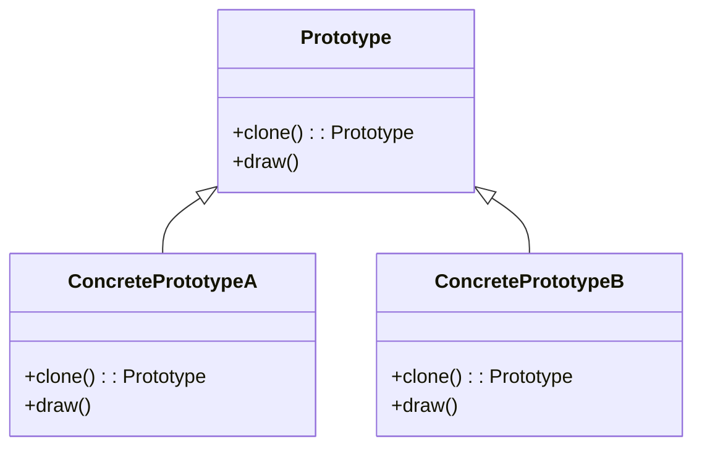
```mermaid
classDiagram
    class Prototype {
        +clone(): Prototype
        +draw()
    }
    class ConcretePrototypeA {
        +clone(): Prototype
        +draw()
    }
    class ConcretePrototypeB {
        +clone(): Prototype
        +draw()
    }
    Prototype <|-- ConcretePrototypeA
    Prototype <|-- ConcretePrototypeB
```

> - `Prototype` 是抽象原型类，声明了 `clone` 方法和绘制方法。
> - `ConcretePrototypeA` 和 `ConcretePrototypeB` 是具体原型类，它们实现了 `clone` 方法和绘制方法。
> - `ConcretePrototypeA` 和 `ConcretePrototypeB` 类继承自抽象原型类 `Prototype`，并在 `clone` 方法中返回自身的副本。

### 5. 案例：简历复制

假设我们需要设计一个简历复制功能，用户可以通过原始简历创建多份副本。使用原型模式可以实现这个功能。

首先，我们定义一个抽象的简历原型接口（`ResumePrototype`），包含一个复制方法。然后，我们创建具体的简历类实现这个接口，并在复制方法中返回新的简历实例。

```java
// 简历原型接口
interface ResumePrototype {
    // 克隆方法，用于复制对象
    ResumePrototype clone();
    
    // 显示简历内容的方法
    void display();
}

// 具体简历类
class Resume implements ResumePrototype {
    private String name;
    private String education;
    private String experience;

    // 构造函数，用于创建原始简历
    public Resume(String name, String education, String experience) {
        this.name = name;
        this.education = education;
        this.experience = experience;
    }

    // 私有构造函数，用于复制简历对象
    private Resume(Resume other) {
        this.name = other.name;
        this.education = other.education;
        this.experience = other.experience;
    }

    @Override
    public ResumePrototype clone() {
        // 创建并返回一个新的简历对象，复制原始简历的属性
        return new Resume(this);
    }

    @Override
    public void display() {
        // 显示简历的内容
        System.out.println("姓名：" + name);
        System.out.println("教育：" + education);
        System.out.println("经验：" + experience);
    }
}

// 客户端代码
public class Main {
    public static void main(String[] args) {
        // 创建原始简历
        ResumePrototype originalResume = new Resume("张三", "研究生", "3年开发经验");
        
        // 克隆简历对象
        ResumePrototype clonedResume1 = originalResume.clone();
        ResumePrototype clonedResume2 = originalResume.clone();

        // 显示各个简历的内容
        System.out.println("原始简历：");
        originalResume.display();
        System.out.println("=========");
        System.out.println("克隆的简历1：");
        clonedResume1.display();
        System.out.println("=========");
        System.out.println("克隆的简历2：");
        clonedResume2.display();
    }
}

```

在这个示例中，`Resume` 类实现了 `ResumePrototype` 接口，并提供了一个私有的复制构造函数，用于创建新的简历实例。通过调用 `clone` 方法，我们可以创建新的简历副本，而不需要重新构造每个字段的值。

通过原型模式，我们可以轻松地复制对象，使得创建对象的过程更加高效和灵活。这在需要创建大量相似对象的情况下特别有用。

### 6. 扩展

1. **深克隆与浅克隆**：在原型模式中，需要注意深克隆和浅克隆的区别。浅克隆只复制对象本身，而不复制对象内部的引用对象，因此新对象和原对象会共享引用对象。深克隆则会递归复制所有引用对象，确保新对象完全独立于原对象。在实现原型模式时，需要根据需求选择合适的克隆方式。

2. **原型管理器**：可以使用原型管理器（Prototype Manager）来管理和注册原型对象，以便在需要时快速获取克隆对象。原型管理器可以是一个字典、缓存或注册表等数据结构，它提供了一种机制来维护原型对象的集合。

3. **应用于多线程环境**：在多线程环境下使用原型模式需要注意线程安全性。如果多个线程同时访问和修改原型对象，可能会导致竞态条件和不一致性。在这种情况下，需要采取适当的同步机制来确保线程安全。

4. **序列化与反序列化**：原型模式通常与序列化和反序列化结合使用，以便将对象保存到磁盘或通过网络传输。通过将对象序列化为字节流，然后反序列化为新对象，可以轻松实现对象的深克隆和远程对象的创建。

5. **带原型参数的工厂方法**：在工厂方法模式中，可以将原型对象作为参数传递给工厂方法，以便工厂方法根据原型对象来创建新对象。这种方式将工厂模式与原型模式结合，提供了更大的灵活性。

   > **使用带原型参数的工厂方法模式：动态创建多样化报告**
   >
   > 在实际生产中，考虑一个情景：你正在开发一个报告生成系统，该系统需要支持多种报告类型，如销售报告、财务报告和用户活动报告。每种报告都可能有不同的数据源、格式和样式要求。使用带原型参数的工厂方法模式可以在这种情况下提供更大的灵活性。
   >
   > **抽象原型接口**
   >
   > ```java
   > public interface ReportPrototype {
   >     ReportPrototype clone();
   >     void generateReport();
   > }
   > ```
   >
   > **具体原型类**
   >
   > ```java
   > public class SalesReport implements ReportPrototype {
   >     // ...
   >     @Override
   >     public ReportPrototype clone() {
   >         return new SalesReport(this);
   >     }
   >     @Override
   >     public void generateReport() {
   >         // 生成销售报告
   >     }
   > }
   > 
   > public class FinancialReport implements ReportPrototype {
   >     // ...
   >     @Override
   >     public ReportPrototype clone() {
   >         return new FinancialReport(this);
   >     }
   >     @Override
   >     public void generateReport() {
   >         // 生成财务报告
   >     }
   > }
   > ```
   >
   > **带原型参数的工厂接口**
   >
   > ```java
   > public interface ReportFactory {
   >     ReportPrototype createReport();
   > }
   > ```
   >
   > **具体工厂实现**
   >
   > ```java
   > public class SalesReportFactory implements ReportFactory {
   >     private ReportPrototype prototype;
   >     public SalesReportFactory(ReportPrototype prototype) {
   >         this.prototype = prototype;
   >     }
   >     @Override
   >     public ReportPrototype createReport() {
   >         return prototype.clone();
   >     }
   > }
   > 
   > public class FinancialReportFactory implements ReportFactory {
   >     private ReportPrototype prototype;
   >     public FinancialReportFactory(ReportPrototype prototype) {
   >         this.prototype = prototype;
   >     }
   >     @Override
   >     public ReportPrototype createReport() {
   >         return prototype.clone();
   >     }
   > }
   > ```
   >
   > **应用实例**
   >
   > ```java
   > public class ReportApp {
   >     public static void main(String[] args) {
   >         ReportPrototype salesReport = new SalesReport();
   >         ReportFactory salesFactory = new SalesReportFactory(salesReport);
   > 
   >         ReportPrototype financialReport = new FinancialReport();
   >         ReportFactory financialFactory = new FinancialReportFactory(financialReport);
   > 
   >         // 动态创建报告对象
   >         ReportPrototype newSalesReport = salesFactory.createReport();
   >         newSalesReport.generateReport();
   > 
   >         ReportPrototype newFinancialReport = financialFactory.createReport();
   >         newFinancialReport.generateReport();
   >     }
   > }
   > ```
   >
   > 在这个示例中，通过带原型参数的工厂方法模式，我们可以在运行时选择不同的原型报告对象，然后使用工厂方法来创建新的报告对象。这使得系统能够根据不同的需求动态创建多样化的报告，而无需在每次创建报告时重新设置所有属性和样式。这种方式在报告生成系统中具有很大的实际价值，因为它允许快速适应不断变化的报告需求。

----

## 创建型模式小结

#### 1. 工厂方法模式（Factory Method Pattern）

- **目的**：工厂方法模式定义了一个创建对象的接口，但将实际的对象创建延迟到子类中。这样可以将对象的创建与使用解耦，使系统更加灵活。
- **适用场景**：当需要根据不同条件创建不同类型的对象时，工厂方法模式非常有用。它也符合开闭原则，允许新增产品类型而无需修改现有代码。

#### 2. 抽象工厂模式（Abstract Factory Pattern）

- **目的**：抽象工厂模式提供了一种创建一组相关或相互依赖对象的接口，而无需指定它们的具体类。它通常包括多个工厂方法，每个工厂方法用于创建一类对象。
- **适用场景**：当需要创建一组相关的对象，并希望这些对象能够协同工作时，抽象工厂模式是一个强大的选择。它支持产品族的创建。

#### 3. 单例模式（Singleton Pattern）

- **目的**：单例模式确保一个类只有一个实例，并提供了一个全局访问点以访问该实例。这对于需要共享资源或控制一些共享状态的情况非常有用。
- **适用场景**：单例模式适用于需要确保系统中只有一个实例存在的情况，如日志记录、数据库连接池等。

#### 4. 建造者模式（Builder Pattern）

- **目的**：建造者模式用于创建一个复杂对象，将对象的构建步骤分离开来，允许按照一定的顺序或配置来创建对象。这可以简化构造过程，使得代码更加清晰可维护。
- **适用场景**：当对象的构建过程比较复杂，需要按照一定顺序设置不同参数时，建造者模式非常有用。它允许创建不同配置的对象。

#### 5. 原型模式（Prototype Pattern）

- **目的**：原型模式通过复制现有对象来创建新对象，而无需重新构造。它适用于对象创建成本高、类实例化复杂或需要保护对象状态的情况。
- **适用场景**：当需要创建对象的成本较高，或者需要创建对象的状态相似但有些许差异时，原型模式是一个有效的选择。

每个创建型设计模式都有其独特的优势和适用场景，正确选择和实施适合问题背景的模式可以提高系统的可维护性、可扩展性和性能。这些模式都在面向对象设计中起到了关键作用，并且在不同的应用程序中被广泛使用。

-----

## 六、适配器模式

适配器模式（Adapter Pattern）是一种结构型设计模式，用于将一个类的接口转换成客户端希望的另一个接口。这种模式使得原本由于接口不匹配而无法在一起工作的类可以一起工作。适配器模式涉及到一个单一的类，称为适配器，它连接客户端与不兼容接口的类。这种模式涉及到一个单一的类，称为适配器，它连接客户端与不兼容接口的类。

### 1. 问题

适配器设计模式旨在解决以下问题：

1. **接口不兼容**：当两个或多个类拥有不同的接口或方法签名，但需要在一起工作时，直接使用它们可能会导致编译错误或运行时错误。

2. **重用现有类**：在某些情况下，可能需要重用已经存在的类，但这些类的接口与当前应用程序的要求不匹配。

3. **平滑过渡**：适配器模式可以用作平滑过渡，允许新的实现逐步替代旧的实现，而不会中断现有的系统。

### 2. 例子

假设你正在开发一个文件读取器，能够读取不同格式的文本文件，包括TXT、CSV和JSON。每个文件格式都有自己的读取方法和数据结构。你希望客户端代码能够统一地使用一个接口来读取这些文件，而不必考虑每种格式的差异。

适配器模式可用于解决这个问题。你可以为每种文件格式创建一个适配器类，这些适配器类实现了一个统一的接口，使得客户端代码可以一致地调用读取方法。适配器类内部则调用相应文件格式的特定读取方法。

### 3. 代码示例

下面是一个简单的Java示例，演示了适配器模式的使用来处理不同格式文件的读取：

1. 首先，定义一个统一的文件读取接口 `FileReader`：

```java
// 通用的文件读取接口
public interface FileReader {
    void read(String fileName);
}
```

2. 然后，创建三个具体的文件读取类，分别用于读取TXT、CSV和JSON文件：

```java
// TXT文件读取类
public class TxtFileReader {
    public void readTxtFile(String fileName) {
        System.out.println("读取 TXT 文件：" + fileName);
        // 实际的TXT文件读取逻辑
    }
}

// CSV文件读取类
public class CsvFileReader {
    public void readCsvFile(String fileName) {
        System.out.println("读取 CSV 文件：" + fileName);
        // 实际的CSV文件读取逻辑
    }
}

// JSON文件读取类
public class JsonFileReader {
    public void readJsonFile(String fileName) {
        System.out.println("读取 JSON 文件：" + fileName);
        // 实际的JSON文件读取逻辑
    }
}
```

3. 接下来，创建适配器类，以便将这些具体的文件读取类适配到 `FileReader` 接口：

```java
// TXT文件适配器，实现通用的文件读取接口
public class TxtFileAdapter implements FileReader {
    private TxtFileReader txtFileReader;

    public TxtFileAdapter(TxtFileReader txtFileReader) {
        this.txtFileReader = txtFileReader;
    }

    @Override
    public void read(String fileName) {
        txtFileReader.readTxtFile(fileName);
    }
}

// CSV文件适配器，实现通用的文件读取接口
public class CsvFileAdapter implements FileReader {
    private CsvFileReader csvFileReader;

    public CsvFileAdapter(CsvFileReader csvFileReader) {
        this.csvFileReader = csvFileReader;
    }

    @Override
    public void read(String fileName) {
        csvFileReader.readCsvFile(fileName);
    }
}

// JSON文件适配器，实现通用的文件读取接口
public class JsonFileAdapter implements FileReader {
    private JsonFileReader jsonFileReader;

    public JsonFileAdapter(JsonFileReader jsonFileReader) {
        this.jsonFileReader = jsonFileReader;
    }

    @Override
    public void read(String fileName) {
        jsonFileReader.readJsonFile(fileName);
    }
}

```

4. 现在，客户端代码可以使用 `FileReader` 接口来读取文件，而无需关心文件格式的差异：

```java
// 客户端代码
public class Client {
    public static void main(String[] args) {
        // 使用适配器模式读取不同格式的文件

        FileReader txtReader = new TxtFileAdapter(new TxtFileReader());
        txtReader.read("file.txt"); // 输出：读取 TXT 文件：file.txt

        FileReader csvReader = new CsvFileAdapter(new CsvFileReader());
        csvReader.read("file.csv"); // 输出：读取 CSV 文件：file.csv

        FileReader jsonReader = new JsonFileAdapter(new JsonFileReader());
        jsonReader.read("file.json"); // 输出：读取 JSON 文件：file.json
    }
}
```

通过适配器模式，我们实现了一个统一的接口 `FileReader`，并创建了适配器类，将不同格式的文件读取功能适配到该接口。这样，客户端代码可以使用相同的方式来读取不同格式的文件，实现了接口不匹配的解决方案。

### 4. 类图

下面是适配器模式的类图：

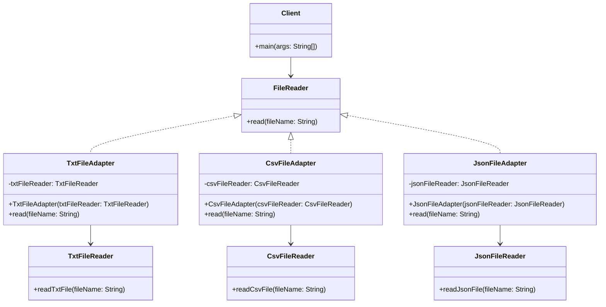
```mermaid
classDiagram
    class Client {
        +main(args: String[])
    }
    class FileReader {
        +read(fileName: String)
    }
    class TxtFileReader {
        +readTxtFile(fileName: String)
    }
    class CsvFileReader {
        +readCsvFile(fileName: String)
    }
    class JsonFileReader {
        +readJsonFile(fileName: String)
    }
    class TxtFileAdapter {
        -txtFileReader: TxtFileReader
        +TxtFileAdapter(txtFileReader: TxtFileReader)
        +read(fileName: String)
    }
    class CsvFileAdapter {
        -csvFileReader: CsvFileReader
        +CsvFileAdapter(csvFileReader: CsvFileReader)
        +read(fileName: String)
    }
    class JsonFileAdapter {
        -jsonFileReader: JsonFileReader
        +JsonFileAdapter(jsonFileReader: JsonFileReader)
        +read(fileName: String)
    }

    Client --> FileReader
    FileReader <|.. TxtFileAdapter
    FileReader <|.. CsvFileAdapter
    FileReader <|.. JsonFileAdapter
    TxtFileAdapter --> TxtFileReader
    CsvFileAdapter --> CsvFileReader
    JsonFileAdapter --> JsonFileReader

```

在类图中，`Client` 是客户端类，它使用 `FileReader` 接口来读取文件。具体的文件读取类包括 `TxtFileReader`、`CsvFileReader` 和 `JsonFileReader`。适配器类 `TxtFileAdapter`、`CsvFileAdapter` 和 `JsonFileAdapter` 实现了 `FileReader` 接口，并将具体的文件读取类包装在内部。客户端代码使用适配器类来读取不同格式的文件。

### 5. 案例：数据库驱动适配器

另一个常见的适配器模式的应用是数据库驱动程序。不同的数据库提供商通常提供不同的 API 来与其数据库交互。为了在不同的数据库中执行相同的操作，开发人员需要编写特定于每个数据库的代码。适配器模式可以用来创建统一的接口，使得应用程序可以使用通用的数据库操作方法，而无需关心底层数据库的细节。

以下是一个简化的数据库驱动适配器示例：

```java
// 通用的数据库连接接口
interface DatabaseConnection {
    void connect(String connectionString);
    void executeQuery(String query);
}

// MySQL 数据库连接类
class MySQLConnection implements DatabaseConnection {
    @Override
    public void connect(String connectionString) {
        System.out.println("连接到 MySQL 数据库：" + connectionString);
    }

    @Override
    public void executeQuery(String query) {
        System.out.println("执行 MySQL 查询：" + query);
    }
}

// PostgreSQL 数据库连接类
class PostgreSQLConnection implements DatabaseConnection {
    @Override
    public void connect(String connectionString) {
        System.out.println("连接到 PostgreSQL 数据库：" + connectionString);
    }

    @Override
    public void executeQuery(String query) {
        System.out.println("执行 PostgreSQL 查询：" + query);
    }
}

// 数据库适配器，用于统一不同数据库的接口
class DatabaseAdapter implements DatabaseConnection {
    private DatabaseConnection databaseConnection;

    DatabaseAdapter(String databaseType) {
        if (databaseType.equalsIgnoreCase("MySQL")) {
            databaseConnection = new MySQLConnection();
        } else if (databaseType.equalsIgnoreCase("PostgreSQL")) {
            databaseConnection = new PostgreSQLConnection();
        }
    }

    @Override
    public void connect(String connectionString) {
        databaseConnection.connect(connectionString);
    }

    @Override
    public void executeQuery(String query) {
        databaseConnection.executeQuery(query);
    }
}

// 客户端代码
public class Main {
    public static void main(String[] args) {
        // 创建MySQL数据库连接
        DatabaseConnection dbConnection = new DatabaseAdapter("MySQL");
        
        dbConnection.connect("jdbc:mysql://localhost:3306/mydb");
        dbConnection.executeQuery("SELECT * FROM users");
        
        // 创建PostgreSQL数据库连接
        dbConnection = new DatabaseAdapter("PostgreSQL");
        
        dbConnection.connect("jdbc:postgresql://localhost:5432/mydb");
        dbConnection.executeQuery("SELECT * FROM users");
    }
}
```

在上述示例中，`DatabaseAdapter` 充当了适配器的角色，它根据传入的数据库类型选择合适的数据库连接实现（`MySQLConnection` 或 `PostgreSQLConnection`）。然后，`DatabaseAdapter` 实现了通用的 `DatabaseConnection` 接口，将调用委托给所选的数据库连接实现。这使得客户端代码可以统一使用通用的接口来连接和执行查询，而不需要关心具体的数据库类型。

通过数据库驱动适配器，我们可以轻松切换不同的数据库连接实现，而不需要修改应用程序的其他部分。

适配器模式可以帮助应用程序在不同接口或类之间建立桥梁，实现不同部分的协同工作。这种模式在解决接口不兼容和重用现有类的情况下非常有用。

---

## 七、装饰器模式

装饰器设计模式是一种结构型设计模式，它允许在不修改现有对象的情况下动态地添加新功能或行为。该模式通过创建一系列装饰器类，这些类实现了与要装饰的对象相同的接口，并包含一个对目标对象的引用。通过将装饰器类与原始对象层层包装，可以逐步为对象添加新的功能。

### 1. 问题

装饰器模式旨在解决以下问题：

1. **类的扩展与修改耦合度高**：在传统的方式中，如果需要为一个类添加新的功能，可能需要修改该类的源代码。这样的修改会导致类的扩展与修改耦合在一起，违背了开闭原则。

2. **子类爆炸**：通过继承来扩展类的功能可能会导致子类的数量急剧增加，这样会使类继承层次变得复杂。

### 2. 例子

以下是一个示例，说明装饰器模式的应用：

假设我们正在开发一个咖啡店的点单系统。每杯咖啡可以有不同的配料，如牛奶、糖和巧克力。我们希望能够动态地为咖啡添加不同的配料，而且可以随时添加新的配料。

在传统的方式中，我们可能会为每种可能的配料组合创建一个子类，这会导致类的数量增多。但使用装饰器模式，我们可以通过创建具体的装饰器类来逐步为咖啡添加不同的配料，而无需创建大量的子类。

### 3. 代码示例

装饰器模式在项目中常见的结构包括以下几个角色：

> 1. **抽象组件（Component）**：定义对象接口，可以是抽象类或接口，声明装饰器和具体组件的共同方法。
> 2. **具体组件（Concrete Component）**：实现抽象组件接口，是被装饰的具体对象。
> 3. **抽象装饰器（Decorator）**：继承或实现抽象组件接口，持有一个对抽象组件的引用，定义装饰器的公共方法。
> 4. **具体装饰器（Concrete Decorator）**：继承抽象装饰器，实现具体的装饰逻辑，可以包含额外的状态和行为。

以下是咖啡配料的装饰器模式示例：

1. **抽象组件（Component）：**
```java
// 咖啡抽象组件
interface Coffee {
    double cost(); // 返回咖啡价格
    String getDescription(); // 返回咖啡描述
}
```

2. **具体组件（Concrete Component）：**
```java
// 浓缩咖啡
class Espresso implements Coffee {
    @Override
    public double cost() {
        return 2.0;
    }

    @Override
    public String getDescription() {
        return "Espresso";
    }
}

// 混合咖啡
class HouseBlend implements Coffee {
    @Override
    public double cost() {
        return 1.5;
    }

    @Override
    public String getDescription() {
        return "House Blend Coffee";
    }
}
```

3. **抽象装饰器（Decorator）：**
```java
// 咖啡装饰器抽象类
abstract class CoffeeDecorator implements Coffee {
    protected Coffee coffee; // 持有对抽象组件的引用

    public CoffeeDecorator(Coffee coffee) {
        this.coffee = coffee;
    }
}
```

4. **具体装饰器（Concrete Decorator）：**
```java
// 牛奶装饰器
class MilkDecorator extends CoffeeDecorator {
    public MilkDecorator(Coffee coffee) {
        super(coffee);
    }

    @Override
    public double cost() {
        return coffee.cost() + 0.5; // 加牛奶价格
    }

    @Override
    public String getDescription() {
        return coffee.getDescription() + ", Milk";
    }
}

// 糖装饰器
class SugarDecorator extends CoffeeDecorator {
    public SugarDecorator(Coffee coffee) {
        super(coffee);
    }

    @Override
    public double cost() {
        return coffee.cost() + 0.3; // 加糖价格
    }

    @Override
    public String getDescription() {
        return coffee.getDescription() + ", Sugar";
    }
}
```

5. **接下来，我们可以在应用程序中使用这些装饰器来创建不同种类的咖啡并添加配料**：

```java
public class Main {
    public static void main(String[] args) {
        // 创建一杯浓缩咖啡
        Coffee espresso = new Espresso();
        System.out.println("咖啡种类: " + espresso.getDescription());
        System.out.println("价格: $" + espresso.cost());

        // 添加牛奶装饰器
        Coffee milkEspresso = new MilkDecorator(espresso);
        System.out.println("咖啡种类: " + milkEspresso.getDescription());
        System.out.println("价格: $" + milkEspresso.cost());

        // 创建一杯混合咖啡并添加牛奶和糖装饰器
        Coffee houseBlend = new HouseBlend();
        Coffee milkSugarHouseBlend = new SugarDecorator(new MilkDecorator(houseBlend));
        System.out.println("咖啡种类: " + milkSugarHouseBlend.getDescription());
        System.out.println("价格: $" + milkSugarHouseBlend.cost());
    }
}
```

在这个示例中，我们首先定义了两种具体的咖啡：`Espresso`（浓缩咖啡）和`HouseBlend`（混合咖啡）。然后，我们通过创建装饰器类 `CoffeeDecorator` 来实现具体的装饰逻辑。在具体的装饰器类中，我们重写了 `cost` 和 `getDescription` 方法，分别添加了新的配料价格和描述。运行上述代码，你将看到每个咖啡对象可以动态地添加配料，而不需要修改咖啡类的源代码。这正是装饰器模式的核心思想：通过组合而不是继承来扩展对象的功能。这个示例展示了装饰器模式的使用，可以根据需要组合不同的装饰器来扩展对象的行为，而不会引入类爆炸和修改原始类的问题。

### 4. 类图

下面是使用装饰器设计模式的类图：

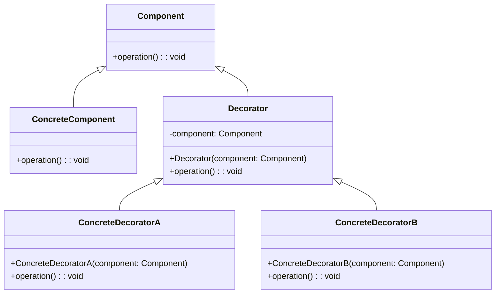
```mermaid
classDiagram
    class Component {
        +operation(): void
    }

    class ConcreteComponent {
        +operation(): void
    }

    class Decorator {
        -component: Component
        +Decorator(component: Component)
        +operation(): void
    }

    class ConcreteDecoratorA {
        +ConcreteDecoratorA(component: Component)
        +operation(): void
    }

    class ConcreteDecoratorB {
        +ConcreteDecoratorB(component: Component)
        +operation(): void
    }

    Component <|-- ConcreteComponent
    Component <|-- Decorator
    Decorator <|-- ConcreteDecoratorA
    Decorator <|-- ConcreteDecoratorB

```

在这个类图中：

- `Component` 是抽象组件类，它定义了一个操作方法 `operation`，是装饰者模式中被装饰的对象的通用接口。
- `ConcreteComponent` 是具体组件类，实现了 `Component` 接口的操作方法，是被装饰的对象。
- `Decorator` 是抽象装饰器类，它也实现了 `Component` 接口，但内部包含了一个指向 `Component` 的引用，它的子类可以用来添加额外的行为。
- `ConcreteDecoratorA` 和 `ConcreteDecoratorB` 是具体装饰器类，它们扩展自 `Decorator`，并且可以装饰具体组件或其他具体装饰器。它们分别实现了 `operation` 方法，以添加额外的行为。

这个类图展示了装饰者模式中的核心类和它们之间的关系，其中 `Component` 表示被装饰的对象，`Decorator` 表示装饰器，而 `ConcreteComponent` 和 `ConcreteDecoratorA/B` 是具体的实现类。装饰器模式允许你动态地将装饰器堆叠在被装饰对象上，以添加新的行为，同时保持接口不变。

### 5. 案例：文件加密

假设你正在开发一个文件加密应用程序。用户可以选择不同的加密算法对文件进行加密，如AES、DES和RSA。同时，用户还可以选择是否要进行压缩。使用装饰器模式，你可以轻松地实现这个需求。

首先，我们定义一个文件加密接口（`FileEncryptor`）：

```java
// 文件加密接口
public interface FileEncryptor {
    void encrypt(String filePath);
}
```

然后，我们创建具体的加密算法类，如AES加密和RSA加密：

```java
// AES加密算法
public class AESEncryptor implements FileEncryptor {
    @Override
    public void encrypt(String filePath) {
        System.out.println("使用AES算法对文件 " + filePath + " 进行加密");
    }
}

// RSA加密算法
public class RSAEncryptor implements FileEncryptor {
    @Override
    public void encrypt(String filePath) {
        System.out.println("使用RSA算法对文件 " + filePath + " 进行加密");
    }
}
```

接下来，我们创建装饰器类来实现文件压缩功能：

```java
// 文件压缩装饰器
public class CompressionDecorator implements FileEncryptor {
    private FileEncryptor fileEncryptor;

    public CompressionDecorator(FileEncryptor fileEncryptor) {
        this.fileEncryptor = fileEncryptor;
    }

    @Override
    public void encrypt(String filePath) {
        fileEncryptor.encrypt(filePath);
        System.out.println("对加密后的文件进行压缩");
    }
}
```

现在，我们可以在应用程序中使用装饰器来选择不同的加密算法和是否进行压缩：

```java
public class Main {
    public static void main(String[] args) {
        // 加密文件使用AES算法
        FileEncryptor aesEncryptor = new AESEncryptor();
        aesEncryptor.encrypt("sample.txt");

        // 加密文件使用RSA算法并进行压缩
        FileEncryptor rsaEncryptorWithCompression = new CompressionDecorator(new RSAEncryptor());
        rsaEncryptorWithCompression.encrypt("sample.txt");
    }
}
```

通过使用装饰器模式，我们可以轻松地组合不同的加密算法和压缩功能，而不需要修改原始的加密算法类。这使得代码更加灵活，并且可以轻松扩展以支持新的加密算法和功能组合。通过装饰器模式，你可以避免类爆炸和源代码修改，同时实现了开闭原则。

---

## 八、代理模式

代理设计模式是一种结构型设计模式，它允许你提供一个代理或者替代品，以控制对其他对象的访问。代理可以充当客户端代码与真实对象之间的中介，用于添加额外的功能或控制对真实对象的访问。

### 1. 问题

代理设计模式旨在解决以下问题：

1. **远程代理**：当客户端需要访问位于远程服务器上的对象时，如分布式系统中的远程对象，直接访问可能涉及网络通信和性能问题。代理可以在本地代表远程对象，将请求通过网络传递给真实对象，从而隐藏了远程通信的复杂性。

2. **虚拟代理**：有些对象的创建和初始化过程可能较为昂贵，或者需要延迟加载。虚拟代理允许在需要时才真正创建和初始化这些对象，以提高性能和资源利用率。

3. **保护代理**：有时候需要对对象的访问进行控制，例如，限制某些用户对对象的操作权限。代理可以担当起验证用户权限的角色。

### 2. 例子

以下是两个示例，说明代理设计模式的应用：

1. **远程代理**：假设你正在开发一个在线电影播放器应用，但实际的电影文件存储在远程服务器上。在这种情况下，你可以使用代理来创建一个远程代理，该代理负责处理与远程服务器的通信，并在需要时下载电影文件。

2. **虚拟代理**：考虑一个文档编辑器应用，其中包含大量的图片。为了加快应用程序的启动时间，你可以使用虚拟代理来表示这些图片，只有当用户滚动文档并且图片出现在可视区域时才实际加载和显示图片。

### 3. 代码示例

代理模式通常涉及三个角色：抽象主题（Subject）、真实主题（Real Subject）、代理（Proxy）。下面是一个简单的示例，演示了虚拟代理的应用。

假设我们有一个文档编辑器，其中包含大量的图片。为了避免一开始加载所有图片，我们使用虚拟代理来延迟加载图片，只有在需要时才加载和显示。

1. **抽象主题（Subject）**：定义了主题接口，真实主题和代理都要实现这个接口。

```java
// 图片接口
public interface Image {
    void display();
}
```

2. **真实主题（Real Subject）**：实际的图片对象，需要加载和显示。

```java
// 具体图片类
public class RealImage implements Image {
    private String filename;

    public RealImage(String filename) {
        this.filename = filename;
        loadFromDisk();
    }

    private void loadFromDisk() {
        System.out.println("加载图像: " + filename);
    }

    @Override
    public void display() {
        System.out.println("显示图像: " + filename);
    }
}
```

3. **代理（Proxy）**：代理对象，用于控制真实对象的访问。在需要时，代理创建和管理真实对象。

```java
// 图片代理类
public class ProxyImage implements Image {
    private RealImage realImage;
    private String filename;

    public ProxyImage(String filename) {
        this.filename = filename;
    }

    @Override
    public void display() {
        if (realImage == null) {
            realImage = new RealImage(filename);
        }
        realImage.display();
    }
}
```

现在，我们可以使用代理对象来加载和显示图片，而无需直接操作真实图片对象：

```java
public class Main {
    public static void main(String[] args) {
        // 使用代理加载和显示图片
        Image image1 = new ProxyImage("image1.jpg");
        Image image2 = new ProxyImage("image2.jpg");

        // 图片在需要时才被加载和显示
        image1.display(); // 实际加载和显示 image1.jpg
        image2.display(); // 实际加载和显示 image2.jpg

        // 图片已经加载过，再次显示时无需重新加载
        image1.display(); // 直接显示 image1.jpg
    }
}
```

在这个示例中，`ProxyImage` 作为代理对象，负责控制 `RealImage` 的访问。只有在 `display` 方法被调用时，代理才会实际创建和加载真实图片对象，从而实现了延迟加载的效果。

### 4. 类图

下面是代理设计模式的类图示例：

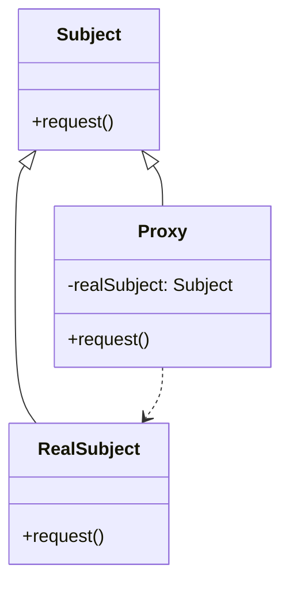
```mermaid
classDiagram
    class Subject {
        +request()
    }
    class RealSubject {
        +request()
    }
    class Proxy {
        -realSubject: Subject
        +request()
    }
    Subject <|-- RealSubject
    Subject <|-- Proxy
    Proxy ..> RealSubject
```

在类图中：

- `Subject` 是抽象主题，定义了真实主题和代理都要实现的接口。
- `RealSubject` 是真实主题，实际的业务对象，实现了 `Subject` 接口。
- `Proxy` 是代理对象，包含一个对真实主题的引用，实现了 `Subject` 接口，通过控制对真实主题的访问来提供额外的功能。

代理设计模式允许你通过代理对象来控制对真实对象的访问，从而实现了许多有用的场景，包括延迟加载、远程代理和保护代理等。

### 5. 案例：远程代理

假设你正在开发一个远程服务器监控系统，需要从远程服务器获取各种监控数据。由于数据可能分散在不同的服务器上，你可以使用代理模式来实现远程代理，以便在客户端和远程服务器之间建立连接并获取数据。

首先，定义一个监控数据接口（`MonitorData`）：

```java
// 监控数据接口
public interface MonitorData {
    void fetchData();
}
```

然后，创建一个具体的远程监控代理（`RemoteMonitorProxy`），它负责与远程服务器建立连接并获取数据：

```java
// 具体的远程监控代理
public class RemoteMonitorProxy implements MonitorData {
    private String serverAddress;

    public RemoteMonitorProxy(String serverAddress) {
        this.serverAddress = serverAddress;
    }

    @Override
    public void fetchData() {
        // 连接远程服务器，获取数据
        System.out.println("连接远程服务器：" + serverAddress);
        // 模拟获取数据的过程
        System.out.println("从远程服务器获取监控数据...");
        System.out.println("监控数据获取成功。");
    }
}
```

客户端代码可以使用远程监控代理来获取监控数据，而无需了解实际的远程连接细节：

```java
public class Main {
    public static void main(String[] args) {
        // 使用远程监控代理获取监控数据
        MonitorData monitorProxy = new RemoteMonitorProxy("http://remote-server.com");
        monitorProxy.fetchData();
    }
}
```

在这个示例中，`RemoteMonitorProxy` 充当了远程服务器的代理，它负责处理与远程服务器的连接和数据获取。客户端代码只需调用 `fetchData` 方法即可获取监控数据，而无需了解实际的网络连接过程。

### 6. 案例：保护代理

假设你正在开发一个文件系统应用程序，需要控制用户对文件的访问权限。你可以使用代理模式来实现保护代理，以确保只有具有适当权限的用户可以访问文件。

首先，定义一个文件接口（`File`）：

```java
// 文件接口
public interface File {
    void read();
    void write();
}
```

然后，创建一个具体的文件类（`ConcreteFile`），它表示实际的文件，并实现了文件的读取和写入操作：

```java
// 具体文件类
public class ConcreteFile implements File {
    private String filename;

    public ConcreteFile(String filename) {
        this.filename = filename;
    }

    @Override
    public void read() {
        System.out.println("读取文件：" + filename);
        // 执行文件读取操作
    }

    @Override
    public void write() {
        System.out.println("写入文件：" + filename);
        // 执行文件写入操作
    }
}
```

接下来，创建一个保护代理类（`ProxyFile`），它包含一个对实际文件的引用，并在访问文件之前检查用户的权限：

```java
// 保护代理类
public class ProxyFile implements File {
    private ConcreteFile realFile;
    private String user;

    public ProxyFile(ConcreteFile realFile, String user) {
        this.realFile = realFile;
        this.user = user;
    }

    @Override
    public void read() {
        // 检查用户权限
        if (userHasReadPermission()) {
            realFile.read();
        } else {
            System.out.println("权限被拒绝。您没有读取此文件的权限。");
        }
    }

    @Override
    public void write() {
        // 检查用户权限
        if (userHasWritePermission()) {
            realFile.write();
        } else {
            System.out.println("权限被拒绝。您没有写入此文件的权限。");
        }
    }

    // 检查用户是否具有读取权限
    private boolean userHasReadPermission() {
        // 实现权限检查逻辑
        return true; // 简化示例，始终返回 true
    }

    // 检查用户是否具有写入权限
    private boolean userHasWritePermission() {
        // 实现权限检查逻辑
        return false; // 简化示例，始终返回 false
    }
}
```

现在，客户端代码可以使用代理文件对象来读取和写入文件，代理会检查用户的权限并相应地控制文件访问：

```java
public class Main {
    public static void main(String[] args) {
        ConcreteFile realFile = new ConcreteFile("document.txt");
        File proxyFile = new ProxyFile(realFile, "user123");

        // 用户尝试读取文件
        proxyFile.read();

        // 用户尝试写入文件
        proxyFile.write();
    }
}
```

在这个示例中，`ProxyFile` 充当了文件的保护代理，它负责检查用户的权限并控制文件的读取和写入操作。这样，你可以灵活地实现文件访问权限的控制，而不需要修改文件类的代码。

通过代理设计模式，你可以引入一个中间层来实现权限控制等功能，从而使系统更具可维护性和安全性。

---

## 九、享元模式

享元模式（Flyweight Pattern）是一种结构型设计模式，它旨在减少对象的内存占用或计算成本，通过共享尽可能多的相似对象来实现这一目标。享元模式适用于需要大量相似对象的情况，以减少内存消耗和提高性能。

### 1. 问题

在某些情况下，应用程序需要创建大量相似的对象，但这些对象在大部分属性上都是相同的，只有少数属性不同。如果为每个对象都分配内存和维护对象状态，将会导致内存浪费和性能下降。

### 2. 解决方案

享元模式通过将对象的状态分成内部状态和外部状态来解决这个问题。内部状态是对象共享的部分，不依赖于对象的上下文，而外部状态是对象的变化部分，依赖于对象的上下文。

享元模式的核心思想是共享相同的内部状态的对象，以减少内存占用。外部状态可以通过参数传递给对象，从而使对象能够在不同的上下文中工作。

### 3. 例子

假设有一个文本编辑器应用程序，用户可以在文档中插入大量的文本字符，其中一些字符是相同的。如果为每个字符都创建一个独立的字符对象，将导致内存浪费。这时可以使用享元模式来共享相同的字符对象。

以下是享元模式的示例：

1. **抽象享元类（Flyweight）：** 定义享元对象的接口，声明设置外部状态的方法。

```java
// 文本字符接口
public interface TextCharacter {
    void printCharacter(String fontFamily);
}
```

2. **具体享元类（Concrete Flyweight）：** 实现抽象享元接口，包含内部状态，并根据外部状态的变化进行不同的操作。

```java
// 具体字符类
public class Character implements TextCharacter {
    private char symbol;  // 内部状态，字符本身

    public Character(char symbol) {
        this.symbol = symbol;
    }

    public char getSymbol() {
        return symbol;
    }

    @Override
    public void printCharacter(String fontFamily) {
        // 外部状态作为参数传入
        System.out.println("字符: " + symbol + ", 字体样式: " + fontFamily);
    }
}
```

3. **享元工厂类（Flyweight Factory）：** 负责管理和提供享元对象，确保相同内部状态的对象被共享。

```java
// 字符工厂类
public class CharacterFactory {
    private Map<Character, TextCharacter> characterMap = new HashMap<>();

    public TextCharacter getCharacter(char symbol) {
        // 检查是否已经存在该字符的享元对象
        TextCharacter character = characterMap.get(symbol);

        if (character == null) {
            // 如果不存在，创建新的享元对象并存储在Map中
            character = new Character(symbol);
            characterMap.put(symbol, character);
        }

        return character;
    }
}
```

4. **客户端代码：** 使用享元模式来共享字符对象，减少内存消耗。

```java
public class Client {
    public static void main(String[] args) {
        CharacterFactory factory = new CharacterFactory();

        // 创建并打印一些字符
        TextCharacter charA = factory.getCharacter('A');
        charA.printCharacter("Arial");

        TextCharacter charB = factory.getCharacter('B');
        charB.printCharacter("Times New Roman");

        TextCharacter charA2 = factory.getCharacter('A'); // 重复使用相同字符
        charA2.printCharacter("Verdana");

        // 输出：
        // 字符: A, 字体样式: Arial
        // 字符: B, 字体样式: Times New Roman
        // 字符: A, 字体样式: Verdana
    }
}
```

在上述示例中，字符对象 `Character` 包含了字符本身作为内部状态，而字体信息作为外部状态。当客户端请求创建字符对象时，工厂类 `CharacterFactory` 会检查是否已经存在相同字符的享元对象，如果存在则返回已有对象，否则创建新的享元对象。这样，相同字符的对象被共享，减少了内存占用。

### 4. 类图

下面是享元模式的类图：

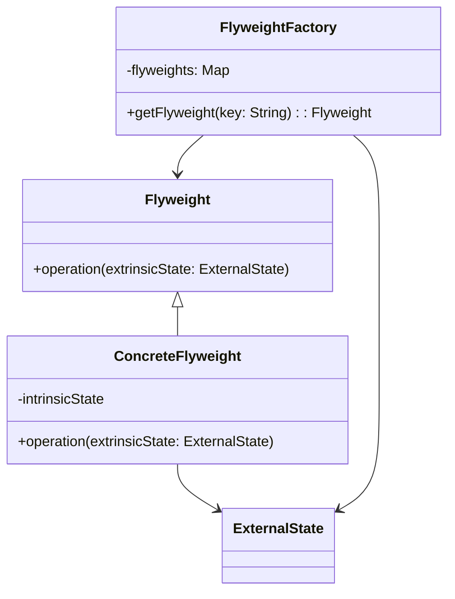
```mermaid
classDiagram
    class Flyweight {
        +operation(extrinsicState: ExternalState)
    }
    class ConcreteFlyweight {
        -intrinsicState
        +operation(extrinsicState: ExternalState)
    }
    class FlyweightFactory {
        -flyweights: Map<key: String, value: Flyweight>
        +getFlyweight(key: String): Flyweight
    }
    class ExternalState
    Flyweight <|-- ConcreteFlyweight
    FlyweightFactory --> Flyweight
    ConcreteFlyweight --> ExternalState
    FlyweightFactory --> ExternalState
```

在类图中：

- `Flyweight` 是抽象享元类，定义了享元对象的接口，包括一个操作方法 `operation` 用于设置外部状态。
- `ConcreteFlyweight` 是具体享元类，实现了抽象享元接口，包括内部状态 `intrinsicState` 和操作方法 `operation`。
- `FlyweightFactory` 是享元工厂类，负责管理和提供享元对象，包含一个私有成员变量 `flyweights` 用于存储已创建的享元对象，以及一个方法 `getFlyweight` 用于获取享元对象。
- `ExternalState` 表示外部状态，它是在享元对象被使用时传入的状态。

### 5. 案例：图形应用程序

当应用享元模式时，最常见的案例之一是图形应用程序，其中需要处理大量的图形对象（如点、线、圆、矩形等）。这些图形对象通常具有许多相同的属性（如颜色、线型等），可以通过享元模式来共享。

让我们来看一个图形编辑器的案例：

1. 首先，我们定义一个抽象的图形享元接口 `Shape`，其中包含一个方法 `draw` 用于绘制图形。

```java
// 抽象享元接口
public interface Shape {
    void draw(int x, int y, String color);
}
```

2. 然后，我们创建具体的图形享元类，比如 `Circle`、`Rectangle` 和 `Line`，它们实现了 `Shape` 接口，并包含内部状态（例如，图形类型）。

```java
// 具体享元类 - 圆形
public class Circle implements Shape {
    private String type = "Circle"; // 内部状态

    @Override
    public void draw(int x, int y, String color) {
        // 外部状态作为参数传入
        System.out.println("绘制一个 " + color + " 的 " + type + "，位于 (" + x + "," + y + ")");
    }
}

// 具体享元类 - 矩形
public class Rectangle implements Shape {
    private String type = "Rectangle"; // 内部状态

    @Override
    public void draw(int x, int y, String color) {
        // 外部状态作为参数传入
        System.out.println("绘制一个 " + color + " 的 " + type + "，位于 (" + x + "," + y + ")");
    }
}

// 具体享元类 - 线
public class Line implements Shape {
    private String type = "Line"; // 内部状态

    @Override
    public void draw(int x, int y, String color) {
        // 外部状态作为参数传入
        System.out.println("绘制一条 " + color + " 的 " + type + "，位于 (" + x + "," + y + ")");
    }
}
```

3. 接下来，我们创建图形享元工厂类 `ShapeFactory`，它负责管理和提供图形享元对象。在工厂类中，我们使用一个 `shapeMap` 来存储已创建的图形享元对象，并在获取图形享元对象时检查是否已存在相同类型的对象。

```java
// 图形享元工厂类
public class ShapeFactory {
    private Map<String, Shape> shapeMap = new HashMap<>();

    public Shape getShape(String type) {
        // 检查是否已经存在相同类型的图形享元对象
        Shape shape = shapeMap.get(type);

        if (shape == null) {
            // 如果不存在，创建新的图形享元对象并存储在Map中
            switch (type) {
                case "Circle":
                    shape = new Circle();
                    break;
                case "Rectangle":
                    shape = new Rectangle();
                    break;
                case "Line":
                    shape = new Line();
                    break;
                // 可以添加更多类型的图形
                default:
                    throw new IllegalArgumentException("无效的图形类型：" + type);
            }
            shapeMap.put(type, shape);
        }

        return shape;
    }
}
```

4. 最后，在客户端代码中，我们使用图形享元工厂来创建和绘制图形对象。由于相同类型的图形具有相同的内部状态，它们可以被共享，从而减少内存占用。

```java
public class Client {
    public static void main(String[] args) {
        ShapeFactory factory = new ShapeFactory();

        // 创建并绘制一些图形
        Shape circle1 = factory.getShape("Circle");
        circle1.draw(10, 10, "红色");

        Shape rectangle = factory.getShape("Rectangle");
        rectangle.draw(20, 20, "蓝色");

        Shape circle2 = factory.getShape("Circle"); // 重复使用相同类型的图形
        circle2.draw(30, 30, "绿色");

        // 输出：
        // 绘制一个 红色 的 Circle，位于 (10,10)
        // 绘制一个 蓝色 的 Rectangle，位于 (20,20)
        // 绘制一个 绿色 的 Circle，位于 (30,30)
    }
}
```

通过使用享元模式，相同类型的图形对象被共享，减少了内存占用，特别是在处理大量图形对象时，可以提高应用程序的性能和效率。

---

## 十、外观模式

外观模式是一种结构型设计模式，它提供了一个简化的接口，用于访问复杂系统、子系统或一组接口。这种模式隐藏了系统的复杂性，并为客户端提供了一个更高级别的接口，使客户端更容易使用系统。

### 1. 问题

外观模式旨在解决以下问题：

1. **复杂系统的使用复杂性**：在大型软件系统中，存在许多子系统和组件，它们之间存在复杂的依赖关系。客户端如果需要直接与这些子系统和组件交互，会增加代码的复杂性，难以维护。

2. **需要简化接口**：有时候，系统可能提供了多个接口和方法，但客户端只需要使用其中一部分，或者需要以特定的顺序调用它们。这时，外观模式可以提供一个更简单、更高级别的接口，符合客户端的需求。

### 2. 例子

以下是一个实际的例子，说明外观模式的应用：

**电脑启动过程**：考虑一个计算机启动的过程，它包括了一系列复杂的步骤，如硬件初始化、加载操作系统、启动应用程序等。每个步骤都涉及多个子系统的操作，而客户端通常只关心计算机是否成功启动。使用外观模式，我们可以创建一个计算机启动外观类，它封装了所有复杂的启动过程，并提供一个简单的方法来启动计算机。

### 3. 代码示例

外观模式的核心思想是创建一个外观类，该类封装了系统中的复杂操作，并提供一个简化的接口供客户端使用。以下是一个简单的示例：

```java
// 子系统1
class CPU {
    void start() {
        System.out.println("CPU 启动");
    }

    void execute() {
        System.out.println("CPU 执行命令");
    }
}

// 子系统2
class Memory {
    void load() {
        System.out.println("内存加载数据");
    }
}

// 子系统3
class HardDrive {
    void readData() {
        System.out.println("硬盘读取数据");
    }
}

// 外观类
class ComputerFacade {
    private CPU cpu;
    private Memory memory;
    private HardDrive hardDrive;

    public ComputerFacade() {
        this.cpu = new CPU();
        this.memory = new Memory();
        this.hardDrive = new HardDrive();
    }

    public void startComputer() {
        System.out.println("启动计算机");
        cpu.start();
        memory.load();
        hardDrive.readData();
        cpu.execute();
    }
}

// 客户端
public class Client {
    public static void main(String[] args) {
        ComputerFacade computer = new ComputerFacade();
        computer.startComputer();
    }
}
```

在这个示例中：

- `CPU`、`Memory` 和 `HardDrive` 分别代表计算机的三个子系统，每个子系统有自己的操作方法。

- `ComputerFacade` 是外观类，它封装了启动计算机的复杂步骤。在 `startComputer` 方法中，它依次启动 CPU、加载内存和读取硬盘数据，然后执行 CPU 操作。

- 客户端只需创建 `ComputerFacade` 的实例并调用 `startComputer` 方法，而无需了解计算机启动的具体步骤。

### 4. 类图

以下是外观模式的类图示例：

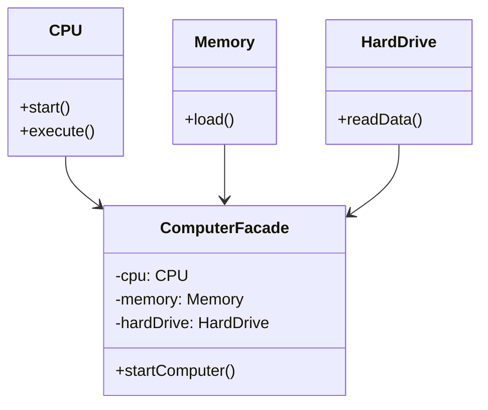
```mermaid
classDiagram
    class CPU {
        +start()
        +execute()
    }
    class Memory {
        +load()
    }
    class HardDrive {
        +readData()
    }
    class ComputerFacade {
        -cpu: CPU
        -memory: Memory
        -hardDrive: HardDrive
        +startComputer()
    }
    CPU --> ComputerFacade
    Memory --> ComputerFacade
    HardDrive --> ComputerFacade
```

- `CPU`、`Memory` 和 `HardDrive` 是子系统类，它们包含了具体的操作方法。

- `ComputerFacade` 是外观类，它包含了对子系统的引用，并提供了一个简化的接口 `startComputer` 来启动计算机。

- 外观类与子系统类之间存在关联关系，外观类通过子系统类来完成具体的操作。

### 5. 案例：电子商务订单处理

假设你正在开发一个电子商务平台，该平台涉及订单处理、库存管理、支付处理等多个子系统。在订单处理过程中，需要协调多个子系统的操作。使用外观模式可以简化订单处理的复杂性。

首先，我们有多个子系统，如订单处理系统、库存管理系统和支付处理系统。每个子系统都有自己的接口和实现。

然后，我们创建一个订单处理外观类，该类封装了以下操作：检查库存、创建订单、处理支付。客户端只需与订单处理外观类交互，而无需了解每个子系统的细节。

```java
// 子系统1: 库存管理
class InventorySystem {
    void checkInventory(int productId, int quantity) {
        // 检查库存并更新库存信息
        System.out.println("检查库存，产品ID：" + productId + "，数量：" + quantity);
    }
}

// 子系统2: 订单处理
class OrderSystem {
    int createOrder(int productId, int quantity) {
        // 创建订单并返回订单ID
        System.out.println("创建订单，产品ID：" + productId + "，数量：" + quantity);
        return 12345; // 假设订单ID为12345
    }
}

// 子系统3: 支付处理
class PaymentSystem {
    void processPayment(int orderId, double amount) {
        // 处理支付
        System.out.println("处理支付，订单ID：" + orderId + "，金额：" + amount);
    }
}

// 订单处理外观类
class OrderProcessingFacade {
    private InventorySystem inventorySystem;
    private OrderSystem orderSystem;
    private PaymentSystem paymentSystem;

    public OrderProcessingFacade() {
        this.inventorySystem = new InventorySystem();
        this.orderSystem = new OrderSystem();
        this.paymentSystem = new PaymentSystem();
    }

    public void processOrder(int productId, int quantity, double amount) {
        // 检查库存
        inventorySystem.checkInventory(productId, quantity);

        // 创建订单
        int orderId = orderSystem.createOrder(productId, quantity);

        // 处理支付
        paymentSystem.processPayment(orderId, amount);

        System.out.println("订单处理完成");
    }
}

// 客户端
public class Client {
    public static void main(String[] args) {
        OrderProcessingFacade facade = new OrderProcessingFacade();

        // 客户下单，参数：产品ID、数量、订单金额
        facade.processOrder(1001, 2, 150.0);
    }
}
```

在这个示例中，客户端只需与 `OrderProcessingFacade` 类交互，而无需了解库存管理、订单处理和支付处理的具体细节。外观类 `OrderProcessingFacade` 封装了这些子系统的操作，提供了一个简化的接口来处理订单。

通过外观模式，我们实现了订单处理过程的简化和解耦，使系统更易于维护和扩展。如果将来需要更改订单处理的流程或添加其他子系统，只需修改外观类而不影响客户端代码。

---

## 十一、桥接模式

桥接模式（Bridge Pattern）是一种结构型设计模式，它的主要目的是将一个抽象部分与它的实现部分分离，使它们可以独立地变化。这种模式涉及到一个接口类，一个抽象类，和实现这个接口的具体类。桥接模式通过将抽象与实现分离，可以使它们独立地进行扩展和修改，同时还可以降低它们之间的耦合度。

### 1. 问题

桥接模式旨在解决以下问题：

1. **抽象和实现的耦合**：在某些情况下，一个类具有多个变化维度，例如，一个图形可以是红色或蓝色的，同时它也可以是正方形或圆形的。如果采用传统的继承方式，就需要为每一种组合都创建一个子类，这会导致类的数量急剧增加，而且难以维护。

2. **难以扩展和修改**：在传统的继承方式中，一旦类的继承关系建立，就难以对抽象部分和实现部分进行独立的扩展和修改，因为任何变化都会影响整个继承层次结构。

### 2. 例子

以下是一个示例，说明桥接模式的应用：

假设我们要设计一个绘图应用程序，可以绘制不同类型的图形（例如，圆形、矩形）以及不同的颜色（例如，红色、蓝色）。如果使用传统的继承方式，就需要创建每种图形和颜色的组合，例如，`RedCircle`、`BlueCircle`、`RedRectangle`、`BlueRectangle` 等。这会导致类的爆炸性增长。

使用桥接模式，我们可以将图形和颜色分开，并通过组合的方式来创建不同的图形。这样，我们只需要创建图形和颜色的独立类，然后将它们组合在一起，而不需要为每种组合创建一个子类。

### 3. 代码示例

桥接模式在项目中常见的结构包括以下几个角色：

> 1. **抽象部分（Abstraction）**：定义了抽象部分的接口，并维护一个指向实现部分的引用。
> 2. **扩展抽象部分（Refined Abstraction）**：扩展了抽象部分，通常包含更多的方法或属性。
> 3. **实现部分（Implementor）**：定义了实现部分的接口，通常包含了实现抽象部分接口的方法。
> 4. **具体实现部分（Concrete Implementor）**：实现了实现部分接口的具体类。

1. 假设我们有两个维度：图形和颜色。首先，我们定义图形和颜色的抽象部分：

```java
// 抽象图形类
abstract class Shape {
    protected Color color;  // 引用颜色对象

    public Shape(Color color) {
        this.color = color;
    }

    abstract void draw();
}

// 抽象颜色类
interface Color {
    void applyColor();
}
```

2. 然后，我们实现具体的图形和颜色类：

```java
// 具体图形类 - 圆形
class Circle extends Shape {
    public Circle(Color color) {
        super(color);
    }

    @Override
    void draw() {
        System.out.print("绘制圆形，颜色为 ");
        color.applyColor();
    }
}

// 具体图形类 - 矩形
class Rectangle extends Shape {
    public Rectangle(Color color) {
        super(color);
    }

    @Override
    void draw() {
        System.out.print("绘制矩形，颜色为 ");
        color.applyColor();
    }
}

// 具体颜色类 - 红色
class Red implements Color {
    @Override
    public void applyColor() {
        System.out.println("红色");
    }
}

// 具体颜色类 - 蓝色
class Blue implements Color {
    @Override
    public void applyColor() {
        System.out.println("蓝色");
    }
}
```

3. 现在，我们可以使用这些抽象和具体类来创建不同的图形，并为它们设置不同的颜色，而不需要创建大量的子类：

```java
public class Main {
    public static void main(String[] args) {
        // 创建一个红色的圆形
        Shape redCircle = new Circle(new Red());
        redCircle.draw();  // 输出：绘制圆形，颜色为 红色

        // 创建一个蓝色的矩形
        Shape blueRectangle = new Rectangle(new Blue());
        blueRectangle.draw();  // 输出：绘制矩形，颜色为 蓝色
    }
}
```

通过桥接模式，我们将图形和颜色分开，使它们可以独立地扩展和修改。这种设计模式允许我们灵活地组合不同的抽象部分和实现部分，而不需要创建大量的子类。这在需要处理多个变化维度的情况下特别有用。

### 4. 类图

下面是使用桥接模式的类图：

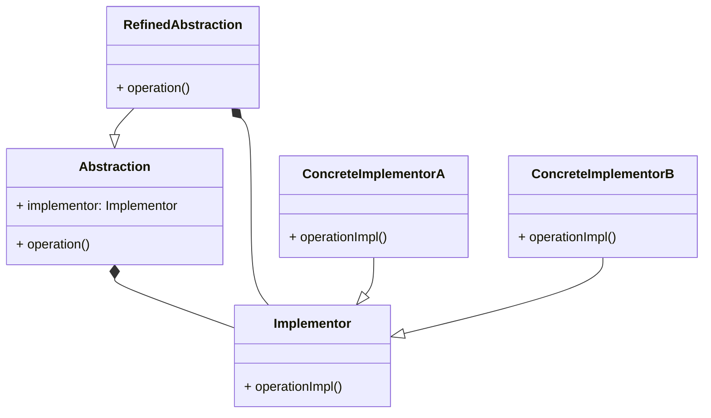
```mermaid
classDiagram
    class Abstraction {
        + implementor: Implementor
        + operation()
    }

    class RefinedAbstraction {
        + operation()
    }

    class Implementor {
        + operationImpl()
    }

    class ConcreteImplementorA {
        + operationImpl()
    }

    class ConcreteImplementorB {
        + operationImpl()
    }

    Abstraction *-- Implementor
    RefinedAbstraction --|> Abstraction
    RefinedAbstraction *-- Implementor
    ConcreteImplementorA --|> Implementor
    ConcreteImplementorB --|> Implementor
```

在这个类图中：

- `Abstraction` 是抽象部分的类，它包含一个指向 `Implementor` 接口的引用，以及定义了抽象方法 `operation`。
- `RefinedAbstraction` 扩展了 `Abstraction`，可以包含更多的方法或属性，并实现了 `operation` 方法。
- `Implementor` 是实现部分的接口，它定义了实现 `operation` 的方法 `operationImpl`。
- `ConcreteImplementorA` 和 `ConcreteImplementorB` 是具体实现部分的类，它们实现了 `Implementor` 接口的方法。

### 5. 案例：遥控器和设备

考虑一个遥控器应用程序，该应用程序可以控制不同类型的设备，如电视（TV）和音响（Stereo）。每种设备都有不同的操作，例如打开、关闭、调整音量等。使用桥接模式，我们可以将遥控器和设备的控制逻辑分离，以便更灵活地添加新的设备或控制方式。

1. 首先，我们定义抽象的设备接口（`Device`）和遥控器接口（`Remote`）：

```java
// 抽象设备接口
interface Device {
    void turnOn();
    void turnOff();
    void setVolume(int volume);
}

// 遥控器接口
interface Remote {
    void power();
    void volumeUp();
    void volumeDown();
}
```

2. 然后，我们实现具体的设备类（`TV` 和 `Stereo`）和遥控器类（`BasicRemote` 和 `AdvancedRemote`）：

```java
// 具体设备类 - 电视
class TV implements Device {
    private boolean on = false;
    private int volume = 30;

    @Override
    public void turnOn() {
        System.out.println("电视已打开");
        on = true;
    }

    @Override
    public void turnOff() {
        System.out.println("电视已关闭");
        on = false;
    }

    @Override
    public void setVolume(int volume) {
        if (on) {
            this.volume = volume;
            System.out.println("音量设置为 " + volume);
        } else {
            System.out.println("请先打开电视");
        }
    }
}

// 具体设备类 - 音响
class Stereo implements Device {
    private boolean on = false;
    private int volume = 50;

    @Override
    public void turnOn() {
        System.out.println("音响已打开");
        on = true;
    }

    @Override
    public void turnOff() {
        System.out.println("音响已关闭");
        on = false;
    }

    @Override
    public void setVolume(int volume) {
        if (on) {
            this.volume = volume;
            System.out.println("音量设置为 " + volume);
        } else {
            System.out.println("请先打开音响");
        }
    }
}

// 基础遥控器类
class BasicRemote implements Remote {
    protected Device device;

    public BasicRemote(Device device) {
        this.device = device;
    }

    @Override
    public void power() {
        if (device != null) {
            if (device.turnOn()) {
                System.out.println("遥控器已打开 " + device.getClass().getSimpleName());
            } else {
                System.out.println("遥控器无法打开 " + device.getClass().getSimpleName());
            }
        }
    }

    @Override
    public void volumeUp() {
        if (device != null) {
            device.setVolume(device.getVolume() + 10);
        }
    }

    @Override
    public void volumeDown() {
        if (device != null) {
            device.setVolume(device.getVolume() - 10);
        }
    }
}

// 高级遥控器类
class AdvancedRemote extends BasicRemote {
    public AdvancedRemote(Device device) {
        super(device);
    }

    public void mute() {
        if (device != null) {
            device.setVolume(0);
        }
    }
}
```

3. 现在，我们可以使用遥控器来控制不同的设备，而无需修改遥控器的代码：

```java
public class Main {
    public static void main(String[] args) {
        // 使用基础遥控器控制电视
        Device tv = new TV();
        Remote remote = new BasicRemote(tv);

        remote.power();      // 打开电视
        remote.volumeUp();   // 增加音量
        remote.volumeUp();   // 增加音量
        remote.volumeDown(); // 减少音量
        remote.power();      // 关闭电视

        // 使用高级遥控器控制音响
        Device stereo = new Stereo();
        remote = new AdvancedRemote(stereo);

        remote.power();      // 打开音响
        remote.mute();       // 静音
        remote.power();      // 关闭音响
    }
}
```

通过桥接模式，我们可以轻松地将不同的设备和遥控器组合在一起，而不需要创建大量的子类。这种设计模式使得系统更加灵活，易于扩展，而且降低了抽象部分和实现部分之间的耦合度。

桥接模式适用于需要处理多个变化维度的情况，可以将这些维度分别抽象出来，使得系统更具弹性。

---

## 十二、组合模式

组合模式是一种结构型设计模式，用于将对象组合成树形结构以表示“整体-部分”层次关系。它允许客户端统一处理单个对象和组合对象，从而使得系统中的对象可以以一致的方式进行处理。

### 1. 问题

在软件设计中，经常会遇到“整体-部分”层次结构的情况。例如，在图形编辑器中，你可能需要处理单个图形元素（如圆、矩形）以及由多个图形元素组成的组合图形（如图形群组）。

然而，处理这种层次结构可能会导致代码的重复性和复杂性。如果我们将单个元素和组合元素分开处理，那么可能需要编写不同的代码来处理它们，这会增加代码的维护难度。组合模式旨在解决这个问题。

### 2. 组合模式的要点

组合模式包括以下几个关键要点：

- **抽象构件（Component）**：定义组合中的对象的通用接口，声明了叶子节点和组合节点的共同方法。
- **叶子构件（Leaf）**：实现抽象构件接口，表示组合中的叶子节点，即无子节点的节点。
- **组合构件（Composite）**：实现抽象构件接口，表示组合中的非叶子节点，即具有子节点的节点。组合节点通常包含一个子节点列表，以及管理子节点的方法。
- **客户端（Client）**：使用抽象构件接口来操作组合中的对象，可以递归地对整个组合结构进行操作，而无需区分单个元素和组合元素。

### 3. 例子

考虑一个文件系统的例子。文件系统由文件和文件夹组成，文件夹可以包含文件和其他文件夹。使用组合模式，我们可以构建一个表示文件系统结构的树，使得文件和文件夹都可以以相同的方式进行处理。

以下是一个简化的示例：

```java
// 抽象构件：文件和文件夹的通用接口
interface FileSystemComponent {
    void display();
}

// 叶子构件：表示文件
class File implements FileSystemComponent {
    private String name;

    public File(String name) {
        this.name = name;
    }

    @Override
    public void display() {
        System.out.println("File: " + name);
    }
}

// 组合构件：表示文件夹
class Folder implements FileSystemComponent {
    private String name;
    private List<FileSystemComponent> components = new ArrayList<>();

    public Folder(String name) {
        this.name = name;
    }

    public void addComponent(FileSystemComponent component) {
        components.add(component);
    }

    @Override
    public void display() {
        System.out.println("Folder: " + name);
        for (FileSystemComponent component : components) {
            component.display();
        }
    }
}

// 客户端代码
public class Client {
    public static void main(String[] args) {
        File file1 = new File("file1.txt");
        File file2 = new File("file2.txt");
        File file3 = new File("file3.txt");

        Folder folder1 = new Folder("folder1");
        folder1.addComponent(file1);
        folder1.addComponent(file2);

        Folder folder2 = new Folder("folder2");
        folder2.addComponent(file3);
        folder2.addComponent(folder1);

        folder2.display();
    }
}
```

在这个示例中，`File` 表示文件，`Folder` 表示文件夹，它们都实现了抽象构件 `FileSystemComponent` 的接口。`Folder` 组合构件可以包含多个文件和文件夹作为子节点。客户端代码可以递归地处理整个文件系统结构，而无需关心是文件还是文件夹。

### 4. 类图

以下是组合模式的类图：

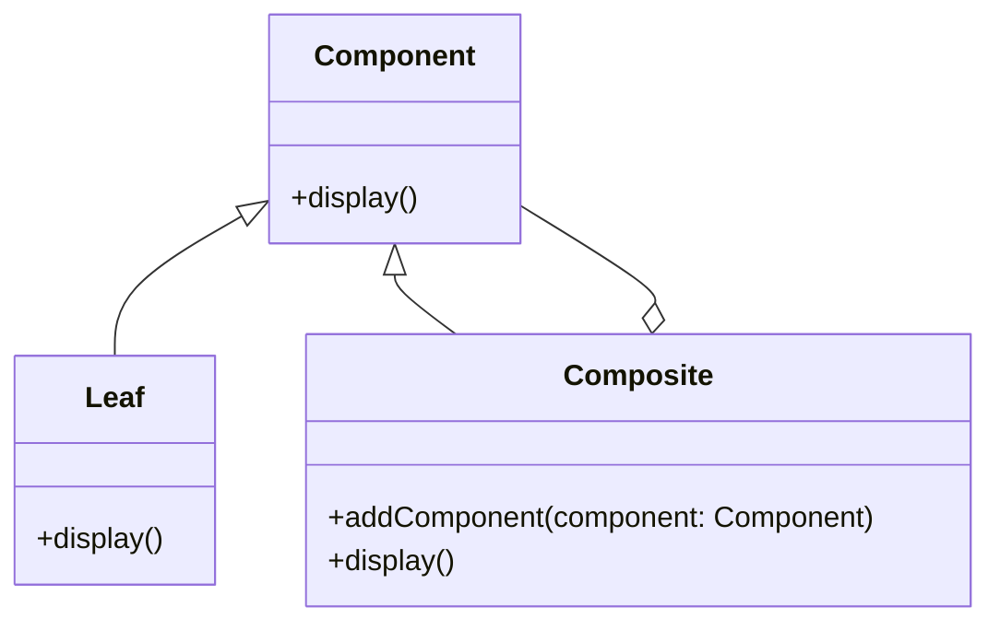
```mermaid
classDiagram
    class Component {
        +display()
    }
    class Leaf {
        +display()
    }
    class Composite {
        +addComponent(component: Component)
        +display()
    }
    Component <|-- Leaf
    Component <|-- Composite
    Composite o-- Component
```

> - `Component` 是抽象构件类，定义了通用的方法接口。
> - `Leaf` 是叶子构件类，实现了抽象构件的接口，表示没有子节点的节点。
> - `Composite` 是组合构件类，实现了抽象构件的接口，表示具有子节点的节点。它可以包含多个 `Component`，包括其他的 `Leaf` 和 `Composite`。

### 5. 案例：组织结构

假设你正在开发一个组织管理系统，需要处理不同级别的员工，包括普通员工和经理。同时，经理可以管理多个普通员工和其他经理。你可以使用组合模式来实现这个系统。

```java
// 抽象构件：员工通用接口
interface Employee {
    void display();
}

// 叶子构件：普通员工
class Worker implements Employee {
    private String name;

    public Worker(String name) {
        this.name = name;
    }

    @Override
    public void display() {
        System.out.println("员工: " + name);
    }
}

// 组合构件：经理
class Manager implements Employee {
    private String name;
    private List<Employee> employees = new ArrayList<>();

    public Manager(String name) {
        this.name = name;
    }

    public void addEmployee(Employee employee) {
        employees.add(employee);
    }

    @Override
    public void display() {
        System.out.println("经理: " + name);
        for (Employee employee : employees) {
            employee.display();
        }
    }
}

// 客户端代码
public class Organization {
    public static void main(String[] args) {
        Worker worker1 = new Worker("张三");
        Worker worker2 = new Worker("李四");

        Manager manager1 = new Manager("王五");
        manager1.addEmployee(worker1);
        manager1.addEmployee(worker2);

        Worker worker3 = new Worker("赵六");

        Manager manager2 = new Manager("孙七");
        manager2.addEmployee(worker3);
        manager2.addEmployee(manager1);

        manager2.display();
    }
}
```

在这个示例中，`Worker` 表示普通员工，`Manager` 表示经理，它们都实现了抽象构件 `Employee` 的接口。`Manager` 组合构件可以包含多个员工作为子节点，包括其他的 `Worker` 和 `Manager`。客户端代码可以递归地处理整个组织结构，而无需关心是普通员工还是经理。

通过组合模式，你可以更灵活地表示和处理不同级别的员工和组织结构，而不需要编写大量的条件判断和特定的处理逻辑。

组合模式是一种强大的设计模式，用于处理具有层次结构的对象。它可以使客户端代码以一致的方式处理单个对象和组合对象，从而提高了系统的灵活性和可维护性。组合模式常用于构建树形结构、组织结构和层次结构等场景。

---

## 结构型模式小结

### 1. 适配器模式（Adapter Pattern）

- **目的**：适配器模式用于将一个类的接口转换成另一个客户端期望的接口。它允许不兼容的接口协同工作，使现有的类可以在新环境中重复使用。
- **适用场景**：适配器模式适用于需要将现有组件与新组件或接口集成的情况，以确保它们可以协同工作。

### 2. 装饰器模式（Decorator Pattern）

- **目的**：装饰器模式允许动态地将责任附加到对象上，通过一系列包装类来扩展对象的功能。它比继承更加灵活，避免了类爆炸问题。
- **适用场景**：装饰器模式适用于需要在运行时添加或修改对象的行为，而不影响其原始类结构的情况。

### 3. 代理模式（Proxy Pattern）

- **目的**：代理模式提供了一个代理对象，控制对其他对象的访问。它可以用于控制访问权限、延迟加载对象、监视对象的操作等。
- **适用场景**：代理模式适用于需要在访问对象之前或之后执行额外操作的情况，或者需要将对象的访问控制在某些条件下的情况。

### 4. 享元模式（Flyweight Pattern）

- **目的**：享元模式用于共享大量细粒度对象，以减少内存消耗和提高性能。它通过共享相同状态的对象来减少重复创建。
- **适用场景**：享元模式适用于存在大量相似对象，并且它们的大部分状态可以共享的情况。

### 5. 外观模式（Facade Pattern）

- **目的**：外观模式提供一个简化的接口，隐藏系统复杂性，使客户端更容易与系统交互。它将多个子系统组合成一个单一接口。
- **适用场景**：外观模式适用于需要简化复杂系统的使用、降低耦合度、提供高层接口的情况。

### 6. 桥接模式（Bridge Pattern）

- **目的**：桥接模式将抽象部分与实现部分分离，允许它们可以独立地变化。这提供了更大的灵活性，允许构建不同的组合。
- **适用场景**：桥接模式适用于需要处理多维度变化的情况，以确保不同维度的变化可以独立扩展。

### 7. 组合模式（Composite Pattern）

- **目的**：组合模式用于将对象组织成树形结构以表示部分-整体层次关系。它使客户端可以统一对待单个对象和组合对象。
- **适用场景**：组合模式适用于需要构建层次结构，以表示部分和整体关系，并且希望客户端能够一致地处理单个对象和组合对象的情况。

---

## 十三、观察者模式

观察者模式（Observer Pattern）是一种行为型设计模式，用于定义对象之间的一对多依赖关系，当一个对象的状态发生改变时，所有依赖于它的对象都会得到通知并自动更新。这种模式实现了一种松耦合的方式，允许主题（被观察者）和观察者之间保持独立，降低了对象之间的直接耦合。

### 1. 问题

在软件开发中，经常会遇到一个对象的状态变化需要通知其他对象的情况，例如：

- 一个新闻网站需要在发布新的文章时通知订阅了该类文章的用户。
- 一个股票交易系统需要在股票价格发生变化时通知投资者。
- 一个气象站需要在气温变化时通知用户。
- ........

传统的方法通常是在对象之间直接进行耦合，当一个对象状态发生改变时，需要直接调用其他对象的方法来更新。这样的设计会导致代码紧密耦合，难以维护和扩展。

### 2. 解决方案

观察者模式通过引入一个`“主题”（Subject）`和多个`“观察者”（Observer）`来解决上述问题。主题维护一个观察者列表，当主题的状态发生改变时，它会通知所有注册的观察者。观察者根据接收到的通知来更新自己的状态。

### 3. 例子

以下是一个简单的观察者模式示例，假设我们要实现一个气象站，当气温发生变化时，通知注册的观察者：

1. **抽象主题（Subject）：气象站接口**
```java
// 定义气象站接口，包括注册观察者、移除观察者、通知观察者的方法
public interface WeatherStation {
    void registerObserver(WeatherObserver observer); // 注册观察者
    void removeObserver(WeatherObserver observer);  // 移除观察者
    void notifyObservers();                        // 通知观察者
}
```

2. **具体主题（Concrete Subject）：气象站实现**
```java
/ 具体气象站类，实现气象站接口
public class ConcreteWeatherStation implements WeatherStation {
    private List<WeatherObserver> observers = new ArrayList<>(); // 存储观察者
    private double temperature;                                // 气温

    public void setTemperature(double temperature) {
        this.temperature = temperature;
        notifyObservers(); // 设置气温并通知观察者
    }

    @Override
    public void registerObserver(WeatherObserver observer) {
        observers.add(observer); // 注册观察者
    }

    @Override
    public void removeObserver(WeatherObserver observer) {
        observers.remove(observer); // 移除观察者
    }

    @Override
    public void notifyObservers() {
        for (WeatherObserver observer : observers) {
            observer.update(temperature); // 通知观察者
        }
    }
}
```

3. **抽象观察者（Observer）：观察者接口**
```java
// 定义观察者接口，包括更新气温的方法
public interface WeatherObserver {
    void update(double temperature); // 更新气温
}
```

4. **具体观察者（Concrete Observer）：具体观察者实现**
```java
// 具体观察者类，表示用户
public class User implements WeatherObserver {
    private String name; // 用户姓名

    public User(String name) {
        this.name = name;
    }

    @Override
    public void update(double temperature) {
        System.out.println(name + " 收到气温更新，当前气温为 " + temperature + " 度");
    }
}
```

使用示例：

```java
public class Main {
    public static void main(String[] args) {
        ConcreteWeatherStation weatherStation = new ConcreteWeatherStation();

        WeatherObserver user1 = new User("张三");
        WeatherObserver user2 = new User("李四");

        weatherStation.registerObserver(user1); // 注册用户 张三
        weatherStation.registerObserver(user2); // 注册用户 李四

        weatherStation.setTemperature(25.5); // 触发通知

        weatherStation.removeObserver(user1); // 移除用户 张三

        weatherStation.setTemperature(28.0); // 触发通知
    }
}
```

在上述示例中，`ConcreteWeatherStation` 充当主题，`User` 充当观察者。当气温发生变化时，主题会通知所有注册的观察者进行更新。观察者接收到通知后，执行自己的更新操作。

### 4. 类图

下面是使用观察者模式的类图：

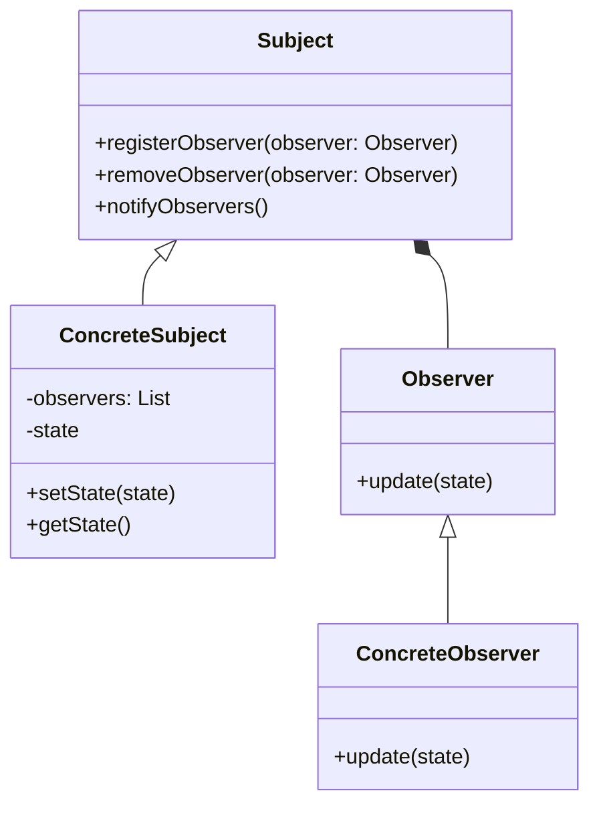
```mermaid
classDiagram
    class Subject {
        +registerObserver(observer: Observer)
        +removeObserver(observer: Observer)
        +notifyObservers()
    }
    class ConcreteSubject {
        -observers: List<Observer>
        -state
        +setState(state)
        +getState()
    }
    class Observer {
        +update(state)
    }
    class ConcreteObserver {
        +update(state)
    }
    Subject <|-- ConcreteSubject
    Observer <|-- ConcreteObserver
    Subject *-- Observer
```

> - `Subject` 是抽象主题类，定义了注册、移除和通知观察者的方法。
> - `ConcreteSubject` 是具体主题类，维护了观察者列表和状态，并在状态改变时通知观察者。
> - `Observer` 是抽象观察者类，定义了观察者更新的方法。
> - `ConcreteObserver` 是具体观察者类，实现了更新方法，并根据通知更新自身状态。
> - 主题和观察者之间通过依赖关系进行通信，实现了对象之间的松耦合。

### 5. 案例：股票价格变动通知

假设你正在开发一个股票交易应用，希望实现当股票价格发生变动时，通知投资者。这是一个很好的观察者模式应用场景。

首先，定义一个抽象主题类 `Stock`，其中包含注册、移除和通知观察者的方法，以及设置和获取股票价格的方法。然后，创建一个具体主题类 `ConcreteStock`，它维护观察者列表和股票价格，当价格发生变化时通知观察者。

创建一个抽象观察者类 `Investor`，其中定义了观察者更新的方法。然后，创建具体观察者类 `StockInvestor`，它实现了更新方法，在价格变动时打印出相应的信息。

最后，在主应用程序中创建股票对象，注册投资者观察者，然后模拟股票价格的变动，观察者会收到通知并打印出价格变动信息。

```java
// 抽象主题类：股票
interface Stock {
    void registerInvestor(Investor investor); // 注册投资者
    void removeInvestor(Investor investor);   // 移除投资者
    void notifyInvestors();                  // 通知投资者
    void setPrice(double price);             // 设置股票价格
    double getPrice();                       // 获取股票价格
}

// 具体主题类：具体股票
class ConcreteStock implements Stock {
    private List<Investor> investors = new ArrayList<>(); // 存储投资者
    private double price;                                // 股票价格

    @Override
    public void registerInvestor(Investor investor) {
        investors.add(investor); // 注册投资者
    }

    @Override
    public void removeInvestor(Investor investor) {
        investors.remove(investor); // 移除投资者
    }

    @Override
    public void notifyInvestors() {
        for (Investor investor : investors) {
            investor.update(price); // 通知投资者
        }
    }

    @Override
    public void setPrice(double price) {
        this.price = price;
        notifyInvestors(); // 设置股票价格并通知投资者
    }

    @Override
    public double getPrice() {
        return price; // 获取股票价格
    }
}

// 抽象观察者类：投资者
interface Investor {
    void update(double price); // 更新投资者的股票价格
}

// 具体观察者类：股票投资者
class StockInvestor implements Investor {
    private String name; // 投资者姓名

    public StockInvestor(String name) {
        this.name = name;
    }

    @Override
    public void update(double price) {
        System.out.println(name + " 收到股票价格更新，当前价格为 $" + price); // 投资者收到股票价格更新通知
    }
}
public class Main {
    public static void main(String[] args) {
        ConcreteStock stock = new ConcreteStock();

        Investor investor1 = new StockInvestor("张三");
        Investor investor2 = new StockInvestor("李四");

        stock.registerInvestor(investor1); // 注册投资者 张三
        stock.registerInvestor(investor2); // 注册投资者 李四

        stock.setPrice(100.0); // 模拟股票价格变动

        stock.removeInvestor(investor1); // 移除投资者 张三

        stock.setPrice(110.0); // 模拟股票价格变动
    }
}
```

在上述示例中，`ConcreteStock` 充当具体主题，`StockInvestor` 充当具体观察者。当股票价格发生变动时，主题通知所有注册的观察者进行更新，观察者收到通知后打印出价格变动信息。

观察者模式使得股票对象和投资者对象之间保持松耦合，可以轻松地添加或删除观察者，而不需要修改主题或观察者的具体实现。实际应用中，观察者模式可用于更复杂的情况，例如实现事件处理、消息发布订阅系统等。

---

## 十四、策略模式

策略模式（Strategy Pattern）是一种行为型设计模式，它定义了一系列算法，将每个算法封装起来，并使它们可以互换。策略模式允许客户端选择算法的具体实现，而不必改变其使用的上下文。

### 1. 问题

策略模式旨在解决以下问题：

1. **多种算法选择**：在某些情况下，一个任务可以有多种不同的算法或策略来执行。例如，排序算法可以有冒泡排序、快速排序等不同的实现方式。

2. **避免条件语句**：在许多情况下，如果我们不使用策略模式，就需要使用大量的条件语句来根据不同的情况选择适当的算法。这会导致代码变得复杂，难以维护，并且违反了开闭原则（对扩展开放，对修改关闭）。

### 2. 例子

以下是一个实际的例子，说明策略模式的应用：

**支付方式选择**：假设你正在开发一个电子商务网站，用户可以选择不同的支付方式来完成购买。支付方式可以包括信用卡支付、支付宝、微信支付等。使用策略模式，你可以将每种支付方式封装成一个策略（如 `CreditCardPaymentStrategy`、`AlipayPaymentStrategy`、`WeChatPaymentStrategy`），然后根据用户选择的支付方式，动态切换使用不同的支付策略。这种方式使得添加新的支付方式变得容易，同时不需要修改购买逻辑。

### 3. 代码示例

策略模式通常涉及以下角色：

1. **策略接口（Strategy Interface）**：定义了策略的通用接口，通常包括一个执行策略的方法。
2. **具体策略类（Concrete Strategy Class）**：实现了策略接口，提供了具体的算法实现。
3. **上下文类（Context Class）**：维护一个对策略对象的引用，并可以在运行时切换不同的策略。

下面是一个简单的示例，展示了策略模式的实现：

```java
// 策略接口
interface PaymentStrategy {
    void pay(int amount); // 支付方法，传入支付金额
}

// 具体策略类 - 信用卡支付
class CreditCardPaymentStrategy implements PaymentStrategy {
    private String cardNumber; // 信用卡卡号
    private String name;       // 持卡人姓名

    public CreditCardPaymentStrategy(String cardNumber, String name) {
        this.cardNumber = cardNumber;
        this.name = name;
    }

    @Override
    public void pay(int amount) {
        System.out.println("使用信用卡支付 " + amount + " 元");
        // 这里可以包含具体的支付逻辑，例如验证信用卡信息等
    }
}

// 具体策略类 - 支付宝支付
class AlipayPaymentStrategy implements PaymentStrategy {
    private String account; // 支付宝账号

    public AlipayPaymentStrategy(String account) {
        this.account = account;
    }

    @Override
    public void pay(int amount) {
        System.out.println("使用支付宝支付 " + amount + " 元");
        // 这里可以包含具体的支付逻辑，例如调用支付宝接口完成支付
    }
}

// 上下文类
class ShoppingCart {
    private PaymentStrategy paymentStrategy; // 当前选择的支付策略

    public void setPaymentStrategy(PaymentStrategy paymentStrategy) {
        this.paymentStrategy = paymentStrategy; // 设置支付策略
    }

    public void checkout(int amount) {
        paymentStrategy.pay(amount); // 执行支付
    }
}

public class Main {
    public static void main(String[] args) {
        ShoppingCart cart = new ShoppingCart();

        // 用户选择信用卡支付
        PaymentStrategy creditCardStrategy = new CreditCardPaymentStrategy("1234-5678-9876-5432", "张三");
        cart.setPaymentStrategy(creditCardStrategy); // 设置信用卡支付策略
        cart.checkout(1000); // 结账，支付1000元

        // 用户选择支付宝支付
        PaymentStrategy alipayStrategy = new AlipayPaymentStrategy("zhangsan");
        cart.setPaymentStrategy(alipayStrategy); // 设置支付宝支付策略
        cart.checkout(800); // 结账，支付800元
    }
}

```

通过策略模式，我们可以动态地切换不同的支付策略，而不需要改变购物车的代码。这种设计使得系统更加灵活，易于扩展，可以轻松添加新的支付方式。

### 4. 类图

下面是策略模式的类图示例：

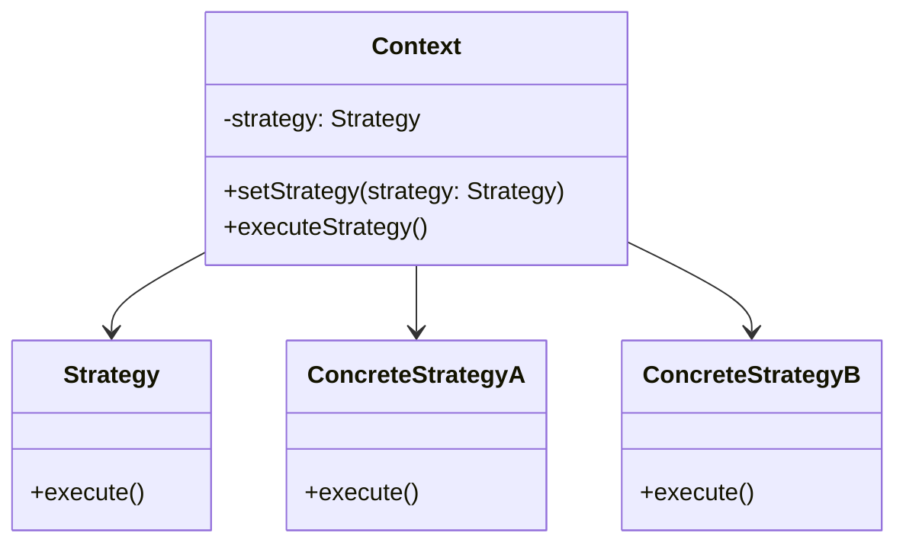
```mermaid
classDiagram
    class Context {
        -strategy: Strategy
        +setStrategy(strategy: Strategy)
        +executeStrategy()
    }
    class Strategy {
        +execute()
    }
    class ConcreteStrategyA {
        +execute()
    }
    class ConcreteStrategyB {
        +execute()
    }
    Context --> Strategy
    Context --> ConcreteStrategyA
    Context --> ConcreteStrategyB
```

在上述类图中：

- `Context` 是上下文类，维护一个对 `Strategy` 接口的引用，可以在运行时切换不同的策略。
- `Strategy` 是策略接口，定义了策略的通用方法。
- `ConcreteStrategyA` 和 `ConcreteStrategyB` 是具体策略类，分别实现了 `Strategy` 接口，提供了不同的算法实现。

### 5. 案例：图像压缩

假设你正在开发一个图像处理应用程序，需要实现图像的压缩功能。不同的图像压缩算法可以根据图像的类型和要求进行选择，例如JPEG压缩、PNG压缩和GIF压缩等。使用策略模式，你可以将每种压缩算法封装成一个策略类，并根据用户的选择动态切换压缩算法。

首先，定义一个压缩策略接口 `CompressionStrategy`，其中包含压缩图像的方法

。然后，创建具体的压缩策略类，如 `JPEGCompressionStrategy`、`PNGCompressionStrategy` 和 `GIFCompressionStrategy`，分别实现了压缩算法。

最后，创建一个图像处理上下文类 `ImageProcessor`，它包含一个对压缩策略的引用，可以在运行时切换不同的压缩策略。这样，用户可以根据需要选择不同的压缩算法，而不需要修改图像处理的核心代码。

```java
// 压缩策略接口
interface CompressionStrategy {
    void compress(String file); // 压缩方法，传入文件名
}

// 具体压缩策略类 - JPEG压缩
class JPEGCompressionStrategy implements CompressionStrategy {
    @Override
    public void compress(String file) {
        System.out.println("使用JPEG压缩算法压缩图像文件 " + file);
        // 实现JPEG压缩算法的逻辑
    }
}

// 具体压缩策略类 - PNG压缩
class PNGCompressionStrategy implements CompressionStrategy {
    @Override
    public void compress(String file) {
        System.out.println("使用PNG压缩算法压缩图像文件 " + file);
        // 实现PNG压缩算法的逻辑
    }
}

// 具体压缩策略类 - GIF压缩
class GIFCompressionStrategy implements CompressionStrategy {
    @Override
    public void compress(String file) {
        System.out.println("使用GIF压缩算法压缩图像文件 " + file);
        // 实现GIF压缩算法的逻辑
    }
}

// 图像处理上下文类
class ImageProcessor {
    private CompressionStrategy compressionStrategy;

    public void setCompressionStrategy(CompressionStrategy compressionStrategy) {
        this.compressionStrategy = compressionStrategy; // 设置压缩策略
    }

    public void compressImage(String file) {
        compressionStrategy.compress(file); // 执行压缩
    }
}

public class Main {
    public static void main(String[] args) {
        ImageProcessor imageProcessor = new ImageProcessor();

        // 用户选择JPEG压缩
        CompressionStrategy jpegStrategy = new JPEGCompressionStrategy();
        imageProcessor.setCompressionStrategy(jpegStrategy);
        imageProcessor.compressImage("image.jpg");

        // 用户选择PNG压缩
        CompressionStrategy pngStrategy = new PNGCompressionStrategy();
        imageProcessor.setCompressionStrategy(pngStrategy);
        imageProcessor.compressImage("image.png");

        // 用户选择GIF压缩
        CompressionStrategy gifStrategy = new GIFCompressionStrategy();
        imageProcessor.setCompressionStrategy(gifStrategy);
        imageProcessor.compressImage("image.gif");
    }
}
```

通过策略模式，我们可以根据用户的选择动态切换不同的压缩策略，而不需要改变图像处理的核心代码。这种设计使得系统更加灵活，易于扩展，可以轻松添加新的压缩算法。策略模式通过将不同的算法封装成策略类，使得算法可以互换，提高了代码的可维护性和扩展性。

---

## 十五、模板方法模式

模板方法模式是一种行为型设计模式，它定义了一个算法的骨架，将一些步骤延迟到子类中实现。模板方法允许子类在不改变算法结构的情况下，重新定义算法中的某些步骤，从而提高代码的复用性和扩展性。

### 1. 问题

模板方法模式旨在解决以下问题：

1. **共享算法的不同部分**：当多个类具有相似的算法结构，但其中一些步骤可能因类而异时，避免重复代码并提高代码复用性。

2. **在不破坏算法整体结构的情况下，允许子类自定义部分步骤**：模板方法允许在父类中定义算法的骨架，同时允许子类实现算法的具体步骤，从而在不改变算法整体结构的情况下自定义部分行为。

### 2. 例子

以下是一个实际的例子，说明模板方法模式的应用：

考虑一个咖啡制作的过程，包括煮水、冲泡咖啡、加入调料、倒入杯子等步骤。不同类型的咖啡（例如，咖啡和茶）在这个制作过程中的一些步骤是相同的，但也有一些步骤是特定于咖啡或茶的。

使用模板方法模式，我们可以定义一个抽象的饮料制作类，其中包含制作饮料的算法骨架，但留出一些步骤以便子类自定义。具体的咖啡类和茶类可以继承这个抽象类，并实现特定于它们的步骤。

### 3. 代码示例

模板方法模式在项目中常见的结构包括以下几个角色：

1. **抽象类（Abstract Class）**：定义了算法的骨架，包括一组抽象方法和具体方法。这些抽象方法由子类来实现。

2. **具体子类（Concrete Subclass）**：实现抽象类中定义的抽象方法，完成算法中特定的步骤。

下面是咖啡制作的示例代码：

```java
// 抽象饮料制作类
abstract class Beverage {
    // 制作饮料的算法骨架
    public void prepareBeverage() {
        boilWater();      // 煮开水
        brew();           // 冲泡
        pourInCup();      // 倒入杯子
        addCondiments();  // 加入调料
    }

    // 抽象方法，由子类实现
    abstract void brew();         // 冲泡方法
    abstract void addCondiments();// 加入调料方法

    // 公共方法
    void boilWater() {
        System.out.println("煮开水");
    }

    void pourInCup() {
        System.out.println("倒入杯子");
    }
}

// 具体咖啡类
class Coffee extends Beverage {
    @Override
    void brew() {
        System.out.println("冲泡咖啡");
    }

    @Override
    void addCondiments() {
        System.out.println("加入糖和牛奶");
    }
}

// 具体茶类
class Tea extends Beverage {
    @Override
    void brew() {
        System.out.println("浸泡茶叶");
    }

    @Override
    void addCondiments() {
        System.out.println("加入柠檬");
    }
}

// 客户端代码
public class Main {
    public static void main(String[] args) {
        Beverage coffee = new Coffee();
        System.out.println("制作咖啡:");
        coffee.prepareBeverage();

        System.out.println();

        Beverage tea = new Tea();
        System.out.println("制作茶:");
        tea.prepareBeverage();
    }
}
```

在上述示例中，`Beverage` 是抽象的饮料制作类，它定义了制作饮料的算法骨架，包括煮水、冲泡、倒入杯子和加入调料等步骤。`brew` 和 `addCondiments` 是抽象方法，由具体的子类来实现，分别代表冲泡和加入调料的步骤。`Coffee` 和 `Tea` 分别是具体的咖啡和茶类，它们继承了 `Beverage` 并实现了特定于它们的步骤。

在客户端代码中，我们可以通过创建具体的咖啡或茶对象来制作饮料，而不需要关心具体的制作步骤。这使得我们可以轻松地添加新的饮料类型，而不需要修改制作饮料的算法骨架。

### 4. 类图

下面是使用模板方法模式的类图：

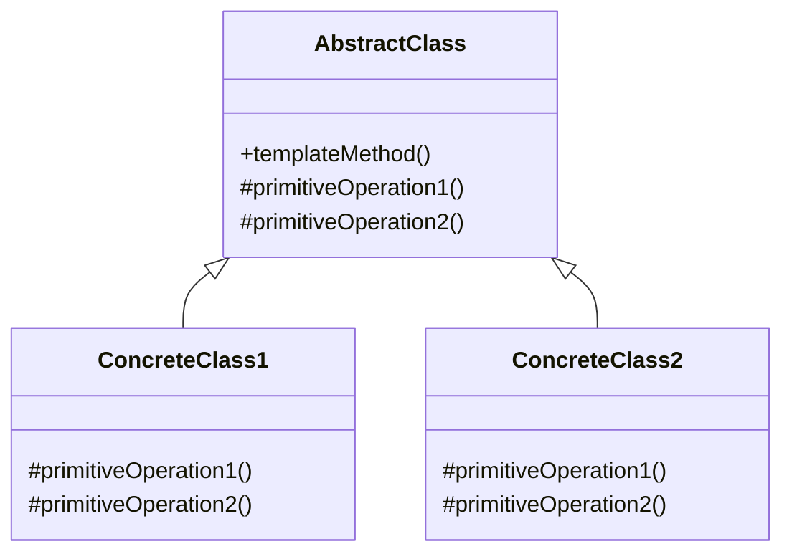
```mermaid
classDiagram
    class AbstractClass {
        +templateMethod()
        #primitiveOperation1()
        #primitiveOperation2()
    }
    class ConcreteClass1 {
        #primitiveOperation1()
        #primitiveOperation2()
    }
    class ConcreteClass2 {
        #primitiveOperation1()
        #primitiveOperation2()
    }
    AbstractClass <|-- ConcreteClass1
    AbstractClass <|-- ConcreteClass2
```

在类图中：

- `AbstractClass` 是抽象类，其中包含了一个模板方法 `templateMethod()`，该方法定义了算法的骨架，包括一组抽象方法 `primitiveOperation1()` 和 `primitiveOperation2()`，这些抽象方法由子类来实现。
- `ConcreteClass1` 和 `ConcreteClass2` 是具体子类，它们继承了抽象类 `AbstractClass` 并实现了抽象方法 `primitiveOperation1()` 和 `primitiveOperation2()`，完成算法中特定的步骤。

### 5. 案例：文档生成器

假设我们正在开发一个文档生成器应用程序，它可以生成不同类型的文档，如PDF文档和Word文档。生成文档的过程包括创建文档、添加内容、设置格式和保存文件等步骤。这些步骤在不同类型的文档中可能有所不同。使用模板方法模式，我们可以定义一个抽象的文档生成器类，其中包含生成文档的算法骨架，但留出一些步骤以便子类自定义。具体的PDF文档生成器和Word文档生成器可以继承这个抽象类，并实现特定于它们的步骤。

```java
// 抽象文档生成器类
abstract class DocumentGenerator {
    // 生成文档的算法骨架
    public final void generateDocument() {
        createDocument();   // 创建文档
        addContent();       // 添加内容
        formatDocument();   // 格式化文档
        saveDocument();     // 保存文档
    }

    // 抽象方法，由子类实现
    abstract void createDocument();   // 创建文档
    abstract void addContent();       // 添加内容
    abstract void formatDocument();   // 格式化文档
    abstract void saveDocument();     // 保存文档
}

// 具体PDF文档生成器
class PDFDocumentGenerator extends DocumentGenerator {
    @Override
    void createDocument() {
        System.out.println("创建PDF文档");
    }

    @Override
    void addContent() {
        System.out.println("添加PDF文本内容");
    }

    @Override
    void formatDocument() {
        System.out.println("设置PDF格式");
    }

    @Override
    void saveDocument() {
        System.out.println("保存PDF文件");
    }
}

// 具体Word文档生成器
class WordDocumentGenerator extends DocumentGenerator {
    @Override
    void createDocument() {
        System.out.println("创建Word文档");
    }

    @Override
    void addContent() {
        System.out.println("添加Word文本内容");
    }

    @Override
    void formatDocument() {
        System.out.println("设置Word格式");
    }

    @Override
    void saveDocument() {
        System.out.println("保存Word文件");
    }
}

// 客户端代码
public class Main {
    public static void main(String[] args) {
        DocumentGenerator pdfGenerator = new PDFDocumentGenerator();
        System.out.println("生成PDF文档:");
        pdfGenerator.generateDocument();

        System.out.println();

        DocumentGenerator wordGenerator = new WordDocumentGenerator();
        System.out.println("生成Word文档:");
        wordGenerator.generateDocument();
    }
}

```

在上述示例中，`DocumentGenerator` 是抽象的文档生成器类，它定义了生成文档的算法骨架，包括创建文档、添加内容、设置格式和保存文件等步骤。`createDocument`、`addContent`、`formatDocument` 和 `saveDocument` 是抽象方法，由具体的子类来实现，分别代表生成文档的不同步骤。

`PDFDocumentGenerator` 和 `WordDocumentGenerator` 分别是具体的PDF文档生成器和Word文档生成器，它们继承了 `DocumentGenerator` 并实现了特定于它们的步骤。

在客户端代码中，我们可以通过创建具体的文档生成器对象来生成不同类型的文档，而不需要关心具体的生成过程。这使得我们可以轻松地添加新的文档类型，而不需要修改生成文档的算法骨架。

---

## 十六、迭代器模式

迭代器模式（Iterator Pattern）是一种行为型设计模式，它用于顺序访问集合对象中的元素，而不需要暴露集合的内部表示。迭代器模式将遍历元素的责任封装在一个独立的迭代器对象中，使得集合和迭代过程分离，提高了代码的灵活性和可维护性。

### 1. 问题

在软件开发中，经常需要遍历集合（如数组、列表、树等）中的元素。传统的遍历方式是使用循环结构（如`for`循环或`while`循环），在遍历的过程中，需要直接访问集合的内部数据结构，这导致了以下问题：

1. **遍历算法与集合耦合度高**：遍历算法通常与特定的集合类型耦合在一起，如果需要更换集合类型，就需要修改遍历算法，违反了开闭原则。

2. **遍历逻辑分散在多处**：如果遍历逻辑分散在代码的多个地方，代码可读性差，维护困难。

3. **集合的内部结构暴露**：直接访问集合的内部结构可能导致不必要的数据泄露和风险。

### 2. 迭代器模式的解决方案

迭代器模式通过引入迭代器对象，将集合的遍历从集合本身中分离出来，从而解决了上述问题。该模式的关键是定义一个抽象的迭代器接口，包含访问集合元素的方法，然后为每种集合类型创建具体的迭代器实现。这样，客户端代码可以通过迭代器接口访问集合元素，而不需要了解集合的内部结构。

### 3. 代码示例

考虑一个简单的集合类 `List`，我们将为其实现一个迭代器模式。

1. **抽象迭代器接口**：

```java
// 迭代器接口
public interface Iterator<T> {
    boolean hasNext(); // 是否有下一个元素
    T next();         // 获取下一个元素
}
```

2. **具体集合类**：

```java
// 集合类
public class ListCollection<T> {
    private List<T> items;

    public ListCollection() {
        items = new ArrayList<>();
    }

    public void add(T item) {
        items.add(item); // 向集合中添加元素
    }

    public Iterator<T> createIterator() {
        return new ListIterator(); // 创建集合的迭代器
    }

    // 具体迭代器类
    private class ListIterator implements Iterator<T> {
        private int index = 0;

        @Override
        public boolean hasNext() {
            return index < items.size(); // 检查是否有下一个元素
        }

        @Override
        public T next() {
            if (this.hasNext()) {
                T item = items.get(index); // 获取下一个元素
                index++;
                return item;
            }
            return null;
        }
    }
}
```

3. **客户端代码**：

```java
public class Client {
    public static void main(String[] args) {
        ListCollection<String> collection = new ListCollection<>();
        collection.add("Item 1");
        collection.add("Item 2");
        collection.add("Item 3");

        // 创建迭代器
        Iterator<String> iterator = collection.createIterator();

        // 遍历集合
        while (iterator.hasNext()) {
            String item = iterator.next();
            System.out.println(item);
        }
    }
}
```

在上述示例中，我们首先定义了一个通用的迭代器接口 `Iterator`，它包含了两个方法 `hasNext` 和 `next`，分别用于检查是否还有下一个元素和获取下一个元素。

然后，我们创建了一个具体的集合类 `ListCollection`，其中包含了一个内部类 `ListIterator`，它实现了迭代器接口。客户端代码通过调用集合的 `createIterator` 方法来获取迭代器对象，然后使用迭代器遍历集合元素，而不需要了解集合的内部结构。

这样，迭代器模式使得集合与遍历算法之间的耦合度降低，客户端代码更加清晰和可维护。

### 4. 类图

以下是迭代器模式的类图：

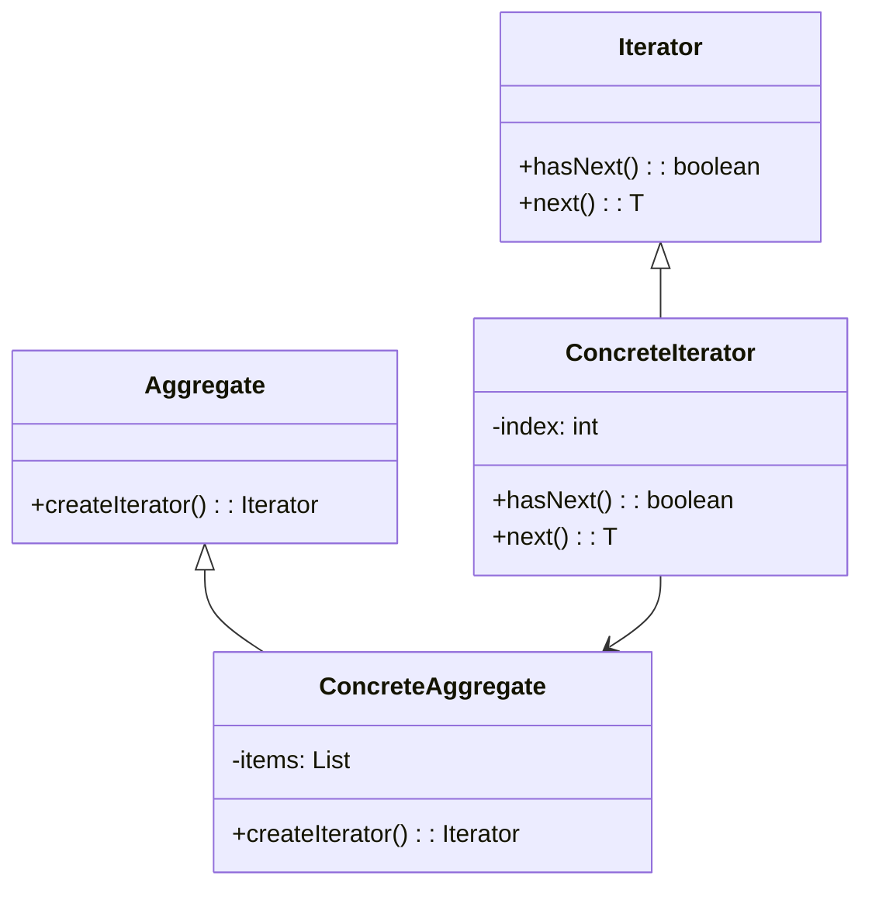
```mermaid
classDiagram
    class Iterator {
        +hasNext(): boolean
        +next(): T
    }
    class ConcreteIterator {
        -index: int
        +hasNext(): boolean
        +next(): T
    }
    class Aggregate {
        +createIterator(): Iterator
    }
    class ConcreteAggregate {
        -items: List<T>
        +createIterator(): Iterator
    }
    Iterator <|-- ConcreteIterator
    Aggregate <|-- ConcreteAggregate
    ConcreteIterator --> ConcreteAggregate
```

在上述类图中：

- `Iterator` 是迭代器接口，定义了遍历集合的方法。
- `ConcreteIterator` 是具体迭代器类，实现了迭代器接口，负责具体的遍历逻辑。
- `Aggregate` 是集合抽象类或接口，定义了创建迭代器的方法。
- `ConcreteAggregate` 是具体集合类，实现了集合抽象类或接口，负责创建具体的迭代器对象。
- 迭代器对象与集合对象之间存在关联关系，迭代器对象通过集合对象获取数据进行遍历。

### 5. 案例：文件系统遍历

假设我们正在开发一个文件系统管理器应用程序，需要遍历文件系统中的文件和文件夹。我们可以使用迭代器模式来实现这个功能。

首先，我们定义一个抽象的文件系统元素接口 `FileSystemElement`，其中包含了访问元素名称的方法。

然后，我们创建具体的文件和文件夹类，它们都实现了 `FileSystemElement` 接口。

接下来，我们创建一个文件系统容器类 `FileSystemContainer`，它包含一个列表来存储文件和文件夹元素，并实现了 `Iterator` 接口，负责遍历文件系统元素。

最后，客户端代码可以通过迭代器来遍历文件系统中的元素，而不需要了解文件系统的内部结构。

```java
// 文件系统元素接口
interface FileSystemElement {
    String getName(); // 获取元素名称
}

// 具体文件类
class File implements FileSystemElement {
    private String name;

    public File(String name) {
        this.name = name;
    }

    @Override
    public String getName() {
        return name;
    }
}

// 具体文件夹类
class Folder implements FileSystemElement {
    private String name;
    private List<FileSystemElement> elements;

    public Folder(String name) {
        this.name = name;
        elements = new ArrayList<>();
    }

    public void addElement(FileSystemElement element) {
        elements.add(element);
    }

    @Override
    public String getName() {
        return name;
    }

    public List<FileSystemElement> getElements() {
        return elements;
    }
}

// 文件系统容器类，实现迭代器接口
class FileSystemContainer implements Iterator<FileSystemElement> {
    private List<FileSystemElement> elements;
    private int index = 0;

    public FileSystemContainer() {
        elements = new ArrayList<>();
    }

    public void addElement(FileSystemElement element) {
        elements.add(element);
    }

    @Override
    public boolean hasNext() {
        return index < elements.size();
    }

    @Override
    public FileSystemElement next() {
        if (this.hasNext()) {
            FileSystemElement element = elements.get(index);
            index++;
            return element;
        }
        return null;
    }
}

public class Client {
    public static void main(String[] args) {
        // 创建文件系统元素
        File file1 = new File("file1.txt");
        File file2 = new File("file2.txt");
        Folder folder1 = new Folder("Folder 1");
        folder1.addElement(file1);
        folder1.addElement(file2);

        Folder folder2 = new Folder("Folder 2");
        File file3 = new File("file3.txt");
        folder2.addElement(file3);

        // 创建文件系统容器
        FileSystemContainer container = new FileSystemContainer();
        container.addElement(file1);
        container.addElement(folder1);
        container.addElement(file2);
        container.addElement(folder2);

        // 遍历文件系统
        while (container.hasNext()) {
            FileSystemElement element = container.next();
            System.out.println(element.getName());
        }
    }
}
```

在上述示例中，我们使用迭代器模式来遍历文件系统中的文件和文件夹。具体文件和文件夹类实现了 `FileSystemElement` 接口，而 `FileSystemContainer` 类实现了 `Iterator` 接口，负责遍历文件系统元素。

通过迭代器模式，我们可以轻松地遍历文件系统中的各种元素，而不需要了解文件系统的内部结构。这提高了代码的灵活性和可维护性，使得文件系统管理器应用程序更易于扩展和维护。迭代器模式允许我们以统一的方式遍历集合或其他容器中的元素，提高了代码的可维护性和扩展性。

---

## 十七、责任链模式

责任链模式是一种行为型设计模式，旨在通过一系列处理对象来解耦发送者和接收者。在责任链中，每个处理对象都包含了对下一个处理对象的引用，从而形成一个链条。当请求被发送时，它会沿着这个链条依次传递，直到某个处理对象能够处理该请求为止。这种方式可以使多个对象都有机会处理请求，而发送者无需知道哪个对象会最终处理请求。

### 1. 问题

责任链模式旨在解决以下问题：

1. **请求发送者和接收者之间的耦合度降低**：在传统的处理方式中，请求发送者需要知道接收者的具体信息，这会导致发送者与接收者之间的紧密耦合。使用责任链模式，发送者只需要将请求发送给第一个处理对象，无需关心请求的具体处理者。

2. **请求的处理对象可以动态配置**：责任链模式允许在运行时动态添加或删除处理对象，而不会影响发送者的代码。这使得系统更加灵活和可维护。

### 2. 例子

以下是一个实际的例子，说明责任链模式的应用：

**审批流程**：假设在一个企业中存在一种审批流程，需要依次经过部门经理、副总裁和总裁的审批。使用责任链模式，可以创建一个处理对象链条，每个处理对象代表一个审批角色。当一个请求（如请假申请）发送时，它会依次经过这些审批角色，直到最终得到批准或拒绝。

### 3. 代码示例

责任链模式通常包含以下角色：

1. **抽象处理者（Handler）**：定义了一个处理请求的接口，通常包含一个指向下一个处理者的引用。
2. **具体处理者（ConcreteHandler）**：实现了处理请求的方法，并在必要时将请求传递给下一个处理者。
3. **客户端（Client）**：创建请求并将其发送给第一个处理者，负责建立责任链。

以下是一个简单的请假申请审批的责任链模式示例：

```java
// 抽象处理者
public abstract class Approver {
    protected Approver nextApprover; // 下一个处理者

    public void setNextApprover(Approver nextApprover) {
        this.nextApprover = nextApprover;
    }

    public abstract void processRequest(Request request); // 处理请求的抽象方法
}

// 具体处理者 - 部门经理
public class DepartmentManager extends Approver {
    @Override
    public void processRequest(Request request) {
        if (request.getDays() <= 2) {
            System.out.println("部门经理审批通过");
        } else {
            if (nextApprover != null) {
                nextApprover.processRequest(request); // 交给下一个处理者处理
            } else {
                System.out.println("无法处理，审批流程结束");
            }
        }
    }
}

// 具体处理者 - 副总裁
public class VicePresident extends Approver {
    @Override
    public void processRequest(Request request) {
        if (request.getDays() <= 5) {
            System.out.println("副总裁审批通过");
        } else {
            if (nextApprover != null) {
                nextApprover.processRequest(request); // 交给下一个处理者处理
            } else {
                System.out.println("无法处理，审批流程结束");
            }
        }
    }
}

// 具体处理者 - 总裁
public class President extends Approver {
    @Override
    public void processRequest(Request request) {
        if (request.getDays() <= 7) {
            System.out.println("总裁审批通过");
        } else {
            System.out.println("无法处理，审批流程结束");
        }
    }
}

// 请求类
public class Request {
    private int days;

    public Request(int days) {
        this.days = days;
    }

    public int getDays() {
        return days;
    }
}

// 客户端
public class Client {
    public static void main(String[] args) {
        // 创建处理者
        Approver departmentManager = new DepartmentManager();
        Approver vicePresident = new VicePresident();
        Approver president = new President();

        // 建立责任链
        departmentManager.setNextApprover(vicePresident);
        vicePresident.setNextApprover(president);

        // 创建请求
        Request request1 = new Request(1);
        Request request3 = new Request(3);
        Request request6 = new Request(6);
        Request request8 = new Request(8);

        // 发送请求
        departmentManager.processRequest(request1);
        departmentManager.processRequest(request3);
        departmentManager.processRequest(request6);
        departmentManager.processRequest(request8);
    }
}

```

在上述示例中，各个审批角色（部门经理、副总裁、总裁）都继承自抽象处理者 `Approver`，并实现了 `processRequest` 方法。每个处理者在处理请求时，如果自己无法处理，就会将请求传递给下一个处理者（如果存在）。最终，请求会依次经过这些处理者，直到被批准或被拒绝。

### 4. 类图

以下是责任链模式的类图：

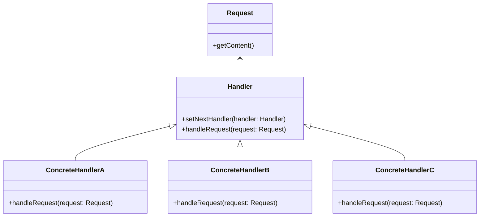
```mermaid
classDiagram
    class Handler {
        +setNextHandler(handler: Handler)
        +handleRequest(request: Request)
    }
    class ConcreteHandlerA {
        +handleRequest(request: Request)
    }
    class ConcreteHandlerB {
        +handleRequest(request: Request)
    }
    class ConcreteHandlerC {
        +handleRequest(request: Request)
    }
    class Request {
        +getContent()
    }
    Handler <|-- ConcreteHandlerA
    Handler <|-- ConcreteHandlerB
    Handler <|-- ConcreteHandlerC
    Request <-- Handler
```

- `Handler` 是抽象处理者，包含了设置下一个处理者和处理请求的方法。
- `ConcreteHandlerA`、`ConcreteHandlerB` 和 `ConcreteHandlerC` 是具体处理者，它们实现了处理请求的方法，并根

据条件来决定是否传递请求给下一个处理者。
- `Request` 包含了请求的内容。

责任链模式的核心是建立一条处理对象链，每个处理对象都有机会处理请求，如果自己不能处理，就会将请求传递给下一个处理对象。这种方式使得请求发送者与接收者解耦，并允许动态配置处理链。

### 5. 案例：日志记录器

考虑一个日志记录系统，需要根据不同的日志级别（如INFO、WARNING、ERROR）将日志消息输出到不同的目标（如控制台、文件、数据库）。责任链模式可以用来实现这样的日志记录系统。

首先，我们定义一个抽象的日志记录器 `Logger`，其中包含记录日志的方法，并包含一个指向下一个日志记录器的引用。然后，我们创建具体的日志记录器类，如`ConsoleLogger`、`FileLogger` 和 `DatabaseLogger`，分别用于将日志消息输出到控制台、文件和数据库。

接下来，我们建立一个责任链，将这些具体的日志记录器链接在一起。当一个日志消息到达时，它会依次经过这些记录器，每个记录器根据自己的能力来决定是否处理该消息。如果某个记录器可以处理该消息，它会记录日志并不再传递给下一个记录器。

```java
// 抽象日志记录器
abstract class Logger {
    protected Logger nextLogger; // 下一个日志记录器

    public void setNextLogger(Logger nextLogger) {
        this.nextLogger = nextLogger; // 设置下一个日志记录器
    }

    public abstract void logMessage(String message, int level); // 记录日志消息的抽象方法
}

// 具体日志记录器 - 控制台
class ConsoleLogger extends Logger {
    @Override
    public void logMessage(String message, int level) {
        if (level <= 1) {
            System.out.println("Console Logger: " + message); // 控制台日志记录
        } else if (nextLogger != null) {
            nextLogger.logMessage(message, level); // 交给下一个日志记录器处理
        }
    }
}

// 具体日志记录器 - 文件
class FileLogger extends Logger {
    @Override
    public void logMessage(String message, int level) {
        if (level <= 2) {
            System.out.println("File Logger: " + message); // 文件日志记录
        } else if (nextLogger != null) {
            nextLogger.logMessage(message, level); // 交给下一个日志记录器处理
        }
    }
}

// 具体日志记录器 - 数据库
class DatabaseLogger extends Logger {
    @Override
    public void logMessage(String message, int level) {
        if (level <= 3) {
            System.out.println("Database Logger: " + message); // 数据库日志记录
        } else {
            System.out.println("No more loggers can handle this message."); // 不再有日志记录器可以处理此消息
        }
    }
}

// 客户端
public class Client {
    public static void main(String[] args) {
        // 创建具体日志记录器
        Logger consoleLogger = new ConsoleLogger();
        Logger fileLogger = new FileLogger();
        Logger databaseLogger = new DatabaseLogger();

        // 建立责任链
        consoleLogger.setNextLogger(fileLogger);
        fileLogger.setNextLogger(databaseLogger);

        // 记录日志消息
        consoleLogger.logMessage("This is an INFO message.", 1);
        consoleLogger.logMessage("This is a WARNING message.", 2);
        consoleLogger.logMessage("This is an ERROR message.", 3);
        consoleLogger.logMessage("This is a DEBUG message.", 4);
    }
}

```

在上述示例中，日志记录器被链接成一个责任链，每个记录器根据日志级别来决定是否处理消息。如果某个记录器可以处理消息，它会记录日志；否则，它会将消息传递给下一个记录器。这种方式使得日志记录系统具有灵活性和可扩展性，可以根据需要添加新的记录器或修改日志记录逻辑。

责任链模式在处理消息、请求等场景中具有广泛的应用，它可以实现请求的传递和处理，同时解耦发送者和接收者，提高系统的灵活性和可维护性。

---

## 十八、命令模式

命令模式（Command Pattern）是一种行为设计模式，它将请求或操作封装成一个独立的对象，从而使你能够参数化客户端对象（即命令的发送者）并延迟执行请求。命令模式的核心思想是将命令的请求者（客户端）与命令的执行者（接收者）解耦，使得客户端不需要知道如何执行命令，只需知道如何发送命令即可。

### 1. 问题

命令模式旨在解决以下问题：

1. **将请求发送者与接收者解耦**：在某些情况下，请求的发送者和接收者之间可能紧密耦合在一起，这样的代码难以维护和扩展。命令模式通过将请求封装成一个独立的命令对象，可以有效地解耦这两者。

2. **支持命令的撤销和重做**：命令模式可以轻松支持对命令的撤销和重做操作。通过保存命令的历史记录，可以实现撤销和重做多个命令。

3. **支持命令的队列和延迟执行**：命令模式允许将命令存储在队列中，并在需要时执行它们。这对于实现任务调度和异步执行非常有用。

### 2. 结构

命令模式包含以下关键角色：

- **命令（Command）**：定义了执行操作的接口，通常包括一个 `execute` 方法，该方法封装了具体的操作。

- **具体命令（Concrete Command）**：实现了命令接口，并将具体的操作绑定到接收者对象上。具体命令对象负责调用接收者的方法来执行操作。

- **接收者（Receiver）**：执行命令所指定的操作。它知道如何实现具体的操作。

- **调用者（Invoker）**：负责创建命令对象，并将命令对象与接收者关联起来。调用者通常包含一个命令队列，可以按照一定的策略来执行命令。

- **客户端（Client）**：创建命令对象，并将命令对象与接收者关联起来，然后将命令对象交给调用者来执行。

### 3. 代码示例

下面是一个简单的命令模式的示例，假设我们要实现一个遥控器，可以控制电视的开关和音量调节。

首先，我们定义命令接口 `Command`，其中包含 `execute` 方法用于执行命令。

```java
// 命令接口
interface Command {
    void execute(); // 执行命令的抽象方法
}
```

然后，我们创建具体的命令类，例如 `TurnOnCommand` 和 `VolumeUpCommand`，它们实现了 `Command` 接口并将具体的操作绑定到电视对象上。

```java
// 开启电视命令
class TurnOnCommand implements Command {
    private TV tv;

    public TurnOnCommand(TV tv) {
        this.tv = tv;
    }

    @Override
    public void execute() {
        tv.turnOn();
    }
}

// 调高音量命令
class VolumeUpCommand implements Command {
    private TV tv;

    public VolumeUpCommand(TV tv) {
        this.tv = tv;
    }

    @Override
    public void execute() {
        tv.volumeUp();
    }
}
```

接下来，我们创建接收者类 `TV`，它包含了具体的操作方法。

```java
// 电视类（接收者）
class TV {
    public void turnOn() {
        System.out.println("电视已开启");
    }

    public void volumeUp() {
        System.out.println("音量已调高");
    }
}
```

现在，我们创建调用者类 `RemoteControl`，它负责存储和执行命令。

```java
// 遥控器类（调用者）
class RemoteControl {
    private Command command;

    public void setCommand(Command command) {
        this.command = command; // 设置命令
    }

    public void pressButton() {
        command.execute(); // 执行命令
    }
}
```

最后，我们在客户端中使用这些类来控制电视。

```java
public class Client {
    public static void main(String[] args) {
        // 创建电视和命令对象
        TV tv = new TV();
        Command turnOnCommand = new TurnOnCommand(tv);
        Command volumeUpCommand = new VolumeUpCommand(tv);

        // 创建遥控器
        RemoteControl remote = new RemoteControl();

        // 设置命令并执行
        remote.setCommand(turnOnCommand);
        remote.pressButton(); // 输出：电视已开启

        remote.setCommand(volumeUpCommand);
        remote.pressButton(); // 输出：音量已调高
    }
}
```

通过命令模式，我们实现了将命令封装成对象，使得客户端可以在不知道具体操作细节的情况下控制电视的开关和音量调节。这种方式也使得我们可以轻松扩展命令，例如添加新的命令来实现其他操作，而不需要修改现有的代码。

### 4. 类图

下面是命令模式的类图示例：

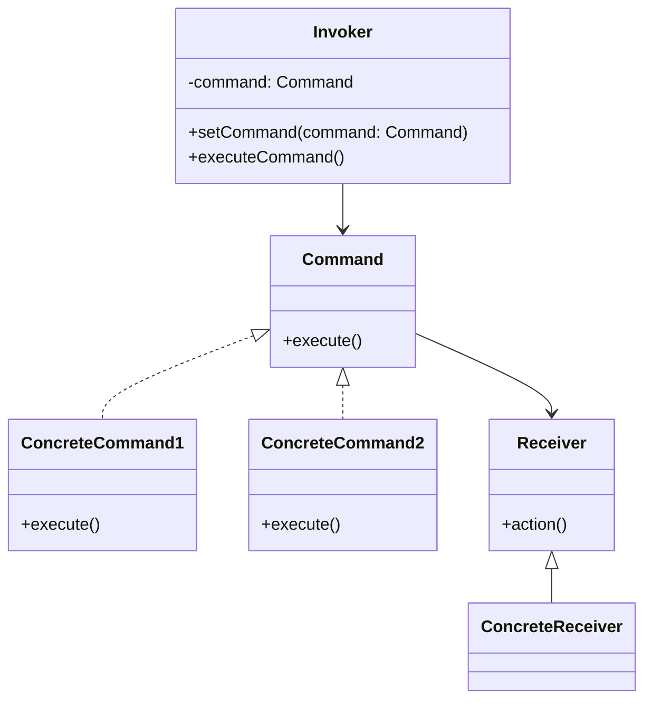
```mermaid
classDiagram
    class Command {
        +execute()
    }
    class ConcreteCommand1 {
        +execute()
    }
    class ConcreteCommand2 {
        +execute()
    }
    class Receiver {
        +action()
    }
    class Invoker {
        -command: Command
        +setCommand(command: Command)
        +executeCommand()
    }
    Receiver <|-- ConcreteReceiver
    Command <|.. ConcreteCommand1
    Command <|.. ConcreteCommand2
    Command --> Receiver
    Invoker --> Command
```

在上面的类图中：

- `Command` 是命令的抽象接口，定义了 `execute` 方法。

- `ConcreteCommand1` 和 `ConcreteCommand2` 是具

体的命令类，实现了 `Command` 接口，分别代表不同的具体操作。

- `Receiver` 是接收者类，负责执行具体的操作，它知道如何实现命令。

- `Invoker` 是调用者类，负责将命令对象与接收者关联，并执行命令。

### 5. 案例：文本编辑器的撤销和重做功能

假设我们正在开发一个文本编辑器应用程序，并需要实现撤销（Undo）和重做（Redo）功能。使用命令模式可以很好地支持这两个操作。

首先，我们定义一个抽象的命令接口 `Command`，其中包含 `execute` 方法，用于执行具体的编辑操作和 `undo` 方法，用于撤销操作。

```java
// 命令接口
interface Command {
    void execute(); // 执行命令
    void undo();    // 撤销命令
}
```

然后，我们创建具体的命令类，例如 `InsertCommand` 和 `DeleteCommand`，它们实现了 `Command` 接口并将具体的编辑操作封装起来。

```java
// 插入文本命令
class InsertCommand implements Command {
    private TextEditor textEditor;
    private String textToInsert;

    public InsertCommand(TextEditor textEditor, String textToInsert) {
        this.textEditor = textEditor;
        this.textToInsert = textToInsert;
    }

    @Override
    public void execute() {
        textEditor.insertText(textToInsert);
    }

    @Override
    public void undo() {
        textEditor.deleteText(textToInsert);
    }
}

// 删除文本命令
class DeleteCommand implements Command {
    private TextEditor textEditor;
    private String deletedText;

    public DeleteCommand(TextEditor textEditor, String deletedText) {
        this.textEditor = textEditor;
        this.deletedText = deletedText;
    }

    @Override
    public void execute() {
        deletedText = textEditor.getSelectedText();
        textEditor.deleteText(deletedText);
    }

    @Override
    public void undo() {
        textEditor.insertText(deletedText);
    }
}
```

接下来，我们创建接收者类 `TextEditor`，它包含了文本编辑的具体操作，例如插入文本、删除文本和获取选中文本等。

```java
// 文本编辑器类（接收者）
class TextEditor {
    private StringBuilder text = new StringBuilder();
    private String selectedText = "";

    public void insertText(String textToInsert) {
        text.append(textToInsert);
    }

    public void deleteText(String textToDelete) {
        int startIndex = text.indexOf(textToDelete);
        if (startIndex != -1) {
            text.delete(startIndex, startIndex + textToDelete.length());
        }
    }

    public void selectText(int startIndex, int endIndex) {
        selectedText = text.substring(startIndex, endIndex);
    }

    public String getSelectedText() {
        return selectedText;
    }

    public String getText() {
        return text.toString();
    }
}
```

现在，我们创建调用者类 `EditorInvoker`，它负责管理命令对象并执行命令。

```java
// 编辑器调用者类
class EditorInvoker {
    private Stack<Command> undoStack = new Stack<>();
    private Stack<Command> redoStack = new Stack<>();

    public void executeCommand(Command command) {
        command.execute();
        undoStack.push(command);
        redoStack.clear();
    }

    public void undo() {
        if (!undoStack.isEmpty()) {
            Command command = undoStack.pop();
            command.undo();
            redoStack.push(command);
        }
    }

    public void redo() {
        if (!redoStack.isEmpty()) {
            Command command = redoStack.pop();
            command.execute();
            undoStack.push(command);
        }
    }
}
```

最后，我们在客户端中使用这些类来实现文本编辑器的撤销和重做功能。

```java
public class TextEditorClient {
    public static void main(String[] args) {
        TextEditor textEditor = new TextEditor();
        EditorInvoker invoker = new EditorInvoker();

        // 插入文本
        Command insertCommand = new InsertCommand(textEditor, "Hello, ");
        invoker.executeCommand(insertCommand);
        System.out.println("文本内容: " + textEditor.getText());

        // 删除文本
        Command deleteCommand = new DeleteCommand(textEditor, "Hello, ");
        invoker.executeCommand(deleteCommand);
        System.out.println("文本内容: " + textEditor.getText());

        // 撤销操作
        invoker.undo();
        System.out.println("文本内容: " + textEditor.getText());

        // 重做操作
        invoker.redo();
        System.out.println("文本内容: " + textEditor.getText());
    }
}
```

通过命令模式，我们成功实现了文本编辑器的撤销和重做功能，而不需要直接操作具体的编辑操作，从而增强了代码的可维护性和扩展性。命令模式允许我们封装请求成命令对象，使得可以参数化客户端并支持撤销、重做、队列等功能。命令模式在很多应用中都有广泛的应用，例如文本编辑器、遥控器、任务调度等场景。通过抽象命令接口、具体命令类、接收者和调用者的组合，可以实现灵活的命令管理和执行。

---

## 十九、状态模式

状态模式是一种行为型设计模式，它允许对象在内部状态发生改变时改变其行为，使得对象看起来好像修改了其类。状态模式将对象的状态抽象为独立的类，然后将对象的行为委托给与当前状态相关联的类。这种方式可以使得对象在不同状态下有不同的行为，同时避免了大量的条件语句，提高了代码的可读性和可维护性。

### 1. 问题

状态模式旨在解决以下问题：

1. **对象状态导致的复杂条件逻辑**：当对象的行为在不同状态下发生变化时，往往需要使用大量的条件语句来处理不同的情况，导致代码变得复杂且难以维护。

2. **状态转换的管理困难**：在对象的状态发生改变时，需要将对象从一个状态转换到另一个状态，管理状态之间的转换关系可能变得混乱。

### 2. 例子

以下是一个示例，说明状态模式的应用：

考虑一个自动售货机系统，它有不同的状态：无货物状态、有货物状态、投币状态、售出状态等。每个状态下自动售货机的行为和响应用户的方式都不同。使用状态模式，我们可以将每个状态封装为一个独立的类，并根据当前状态的不同来执行相应的行为。

### 3. 代码示例

状态模式在项目中常见的结构包括以下几个角色：

> 1. **上下文（Context）**：维护一个对抽象状态对象的引用，可以将状态的切换委托给具体状态类。
> 2. **抽象状态（State）**：定义状态的接口，包含了状态下可能的行为。
> 3. **具体状态（Concrete State）**：实现抽象状态接口，实现特定状态下的行为。

假设我们要实现自动售货机的状态模式：

1. **抽象状态（State）**：
```java
// 抽象状态接口
public interface VendingMachineState {
    void insertCoin();   // 插入硬币
    void pressButton();  // 按下按钮
    void dispenseItem(); // 发放商品
}
```

2. **具体状态（Concrete State）**：
```java
// 无货物状态
public class NoItemState implements VendingMachineState {
    @Override
    public void insertCoin() {
        System.out.println("无货物，不能插入硬币");
    }

    @Override
    public void pressButton() {
        System.out.println("无货物，不能按下按钮");
    }

    @Override
    public void dispenseItem() {
        System.out.println("无货物，无法发放商品");
    }
}

// 有货物状态
public class HasItemState implements VendingMachineState {
    @Override
    public void insertCoin() {
        System.out.println("已有货物，可以插入硬币");
    }

    @Override
    public void pressButton() {
        System.out.println("已有货物，可以按下按钮");
    }

    @Override
    public void dispenseItem() {
        System.out.println("已有货物，正在发放商品");
    }
}

// 投币状态
public class HasCoinState implements VendingMachineState {
    @Override
    public void insertCoin() {
        System.out.println("已投币，无需再次插入硬币");
    }

    @Override
    public void pressButton() {
        System.out.println("已投币，正在处理订单");
    }

    @Override
    public void dispenseItem() {
        System.out.println("已投币，等待发放商品");
    }
}

// 售出状态
public class DispensedState implements VendingMachineState {
    @Override
    public void insertCoin() {
        System.out.println("商品已售出，请取走商品");
    }

    @Override
    public void pressButton() {
        System.out.println("商品已售出，不能再次按下按钮");
    }

    @Override
    public void dispenseItem() {
        System.out.println("商品已售出，请取走商品");
    }
}

```

3. **上下文（Context）**：
```java
// 自动售货机上下文
public class VendingMachine {
    private VendingMachineState currentState;

    public VendingMachine() {
        // 初始化为无货物状态
        currentState = new NoItemState();
    }

    public void setState(VendingMachineState state) {
        currentState = state;
    }

    public void insertCoin() {
        currentState.insertCoin();
    }

    public void pressButton() {
        currentState.pressButton();
    }

    public void dispenseItem() {
        currentState.dispenseItem();
    }
}
```

最后我们以一个示例 Main 类，演示如何使用状态模式的自动售货机：

```java
public class Main {
    public static void main(String[] args) {
        // 创建自动售货机对象
        VendingMachine vendingMachine = new VendingMachine();

        // 初始状态是无货物状态
        vendingMachine.insertCoin(); // 无货物，不能插入硬币
        vendingMachine.pressButton(); // 无货物，不能按下按钮

        // 改变状态为有货物状态
        vendingMachine.setState(new HasItemState());
        vendingMachine.insertCoin(); // 已有货物，可以插入硬币
        vendingMachine.pressButton(); // 已有货物，可以按下按钮

        // 改变状态为投币状态
        vendingMachine.setState(new HasCoinState());
        vendingMachine.insertCoin(); // 已投币，无需再次插入硬币
        vendingMachine.pressButton(); // 已投币，正在处理订单

        // 改变状态为售出状态
        vendingMachine.setState(new DispensedState());
        vendingMachine.insertCoin(); // 商品已售出，请取走商品
        vendingMachine.pressButton(); // 商品已售出，不能再次按下按钮
    }
}

```

在上述示例中，不同的状态被封装为独立的类，每个状态类实现了 `VendingMachineState` 接口定义的方法。`VendingMachine` 类维护了当前的状态，根据不同的状态执行相应的行为。

通过状态模式，自动售货机可以在不同状态下表现出不同的行为，而客户端代码只需要与上下文类 `VendingMachine` 进行交互，无需关心状态切换和具体状态的实现细节。

### 4. 类图

下面是使用状态设计模式的类图：

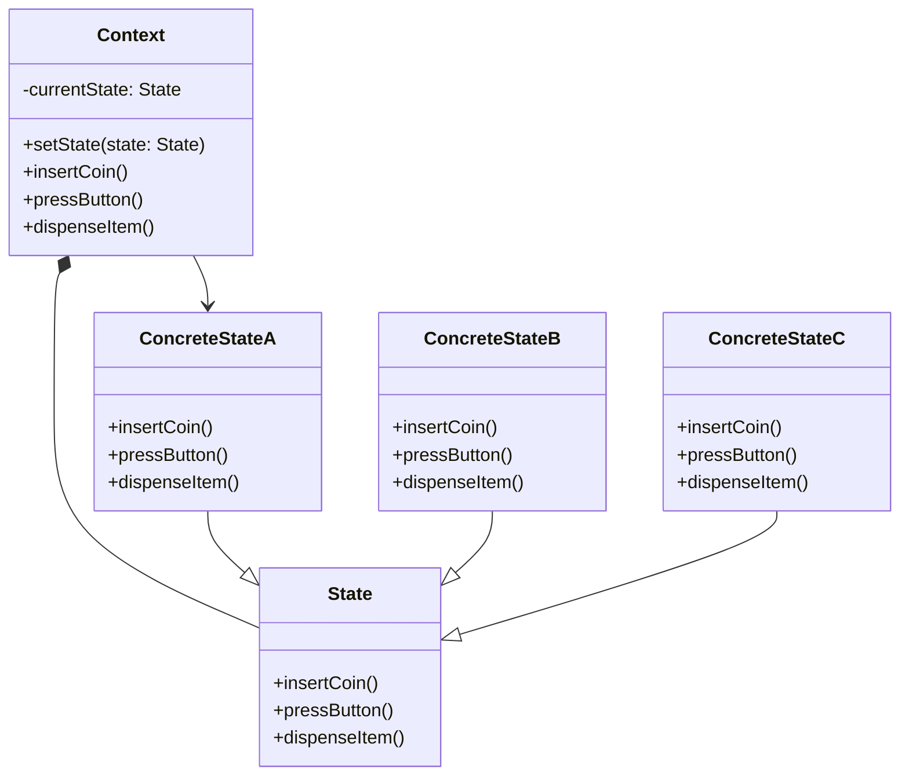
```mermaid
classDiagram
    class Context {
        -currentState: State
        +setState(state: State)
        +insertCoin()
        +pressButton()
        +dispenseItem()
    }
    class State {
        +insertCoin()
        +pressButton()
        +dispenseItem()
    }
    class ConcreteStateA {
        +insertCoin()
        +pressButton()
        +dispenseItem()
    }
    class ConcreteStateB {
        +insertCoin()
        +pressButton()
        +dispenseItem()
    }
    class ConcreteStateC {
        +insertCoin()
        +pressButton()
        +dispenseItem()
    }
    Context *-- State
    ConcreteStateA --|> State
    ConcreteStateB --|> State
    ConcreteStateC --|> State
    Context --> ConcreteStateA
```

> - `Context` 是上下文类，它维护了对当前状态对象的引用，并可以调用状态的方法。
> - `State` 是抽象状态类，定义了状态的接口。
> - `ConcreteStateA`、`ConcreteStateB` 和 `ConcreteStateC` 是具体状态类，它们实现了抽象状态类的接口，分别表示不同的状态。
> - 上下文类 `Context` 与状态类 `State` 之间存在关联关系，表示上下文类委托状态类来执行相应的行为。

### 5. 案例：电梯控制器

假设我们正在设计一个电梯控制器，它有不同的状态：关门状态、开门状态、运行状态和停止状态。每个状态下电梯的行为和响应用户的方式都不同。使用状态模式，我们可以将每个状态封装为一个独立的类，并根据当前状态的不同来执行相应的行为。

```java
// 抽象状态接口
interface ElevatorState {
    void openDoors();
    void closeDoors();
    void move();
    void stop();
}

// 具体状态类：门关闭状态
class DoorClosedState implements ElevatorState {
    @Override
    public void openDoors() {
        System.out.println("打开电梯门");
    }

    @Override
    public void closeDoors() {
        System.out.println("电梯门已经关闭");
    }

    @Override
    public void move() {
        System.out.println("电梯开始运行");
    }

    @Override
    public void stop() {
        System.out.println("电梯已停止");
    }
}

// 具体状态类：门打开状态
class DoorOpenedState implements ElevatorState {
    @Override
    public void openDoors() {
        System.out.println("电梯门已经打开");
    }

    @Override
    public void closeDoors() {
        System.out.println("关闭电梯门");
    }

    @Override
    public void move() {
        System.out.println("无法运行，电梯门还开着");
    }

    @Override
    public void stop() {
        System.out.println("电梯已停止");
    }
}

// 具体状态类：运行状态
class RunningState implements ElevatorState {
    @Override
    public void openDoors() {
        System.out.println("无法开门，电梯正在运行");
    }

    @Override
    public void closeDoors() {
        System.out.println("无法关闭门，电梯正在运行");
    }

    @Override
    public void move() {
        System.out.println("电梯继续运行");
    }

    @Override
    public void stop() {
        System.out.println("电梯已停止");
    }
}

// 具体状态类：停止状态
class StoppedState implements ElevatorState {
    @Override
    public void openDoors() {
        System.out.println("打开电梯门");
    }

    @Override
    public void closeDoors() {
        System.out.println("关闭电梯门");
    }

    @Override
    public void move() {
        System.out.println("电梯开始运行");
    }

    @Override
    public void stop() {
        System.out.println("电梯已停止");
    }
}

// 电梯控制器上下文
class ElevatorController {
    private ElevatorState currentState;

    public void setState(ElevatorState state) {
        currentState = state;
    }

    // 委托当前状态的方法调用
    public void openDoors() {
        currentState.openDoors();
        // 在开门后切换到门打开状态
        setState(new DoorOpenedState());
    }

    public void closeDoors() {
        currentState.closeDoors();
        // 在关门后切换到门关闭状态
        setState(new DoorClosedState());
    }

    public void move() {
        currentState.move();
        // 在开始运行后切换到运行状态
        setState(new RunningState());
    }

    public void stop() {
        currentState.stop();
        // 在停止后切换到停止状态
        setState(new StoppedState());
    }
}

public class ElevatorExample {
    public static void main(String[] args) {
        ElevatorController controller = new ElevatorController();
        
        // 初始状态是门关闭状态
        controller.setState(new DoorClosedState());

        // 电梯运行的场景
        controller.move();
        controller.stop();
        controller.openDoors();
        controller.closeDoors();

        // 电梯开门的场景
        controller.openDoors();
        controller.closeDoors();

        // 电梯停止的场景
        controller.stop();
    }
}

```

在这个示例中，不同的状态被封装为独立的类，每个状态类实现了 `ElevatorState` 接口定义的方法。`ElevatorController` 类维护了当前的状态，根据不同的状态执行相应的行为。

通过状态模式，电梯控制器可以在不同状态下表现出不同的行为，而客户端代码只需要与控制器类 `ElevatorController` 进行交互，无需关心状态切换和具体状态的实现细节。

---

## 二十、中介者模式

中介者模式是一种行为设计模式，用于减少对象之间的直接通信，而是通过一个中介对象来协调它们的交互。这种模式有助于降低系统中各个对象之间的耦合度，使系统更易于维护和扩展。

### 1. 问题

中介者模式旨在解决以下问题：

1. **对象之间的紧耦合**：在大型系统中，对象之间的相互依赖关系可能会导致复杂的、难以维护的代码。当一个对象的状态发生变化时，它必须通知其他相关对象，这可能导致对象之间的紧耦合。

2. **难以维护的交互逻辑**：当对象之间的交互逻辑散布在整个系统中时，维护和理解这些逻辑变得困难。这种情况下，每次添加新的对象或修改现有对象的行为时，都需要考虑其与其他对象之间的交互影响。

### 2. 例子

以下是一个实际的例子，说明中介者模式的应用：

**飞机交通管制系统**：考虑一个飞机交通管制系统，其中有多架飞机在同一空域飞行。每架飞机都具有各自的行为，如起飞、降落、改变高度等。如果没有中介者模式，那么每架飞机都需要知道其他飞机的状态，以避免碰撞。这会导致飞机之间的复杂耦合关系。

通过使用中介者模式，我们可以创建一个交通管制中心作为中介者，每架飞机只需要与交通管制中心通信，而无需直接与其他飞机通信。交通管制中心负责协调和监视所有飞机的行动，以确保它们安全地飞行。这种方式降低了飞机之间的耦合度，使得系统更容易扩展和维护。

### 3. 代码示例

中介者模式在项目中常见的结构包括以下几个角色：

1. **中介者（Mediator）**：定义了各个同事对象通信的接口，提供了一个集中的方式来协调同事对象之间的交互。

2. **具体中介者（Concrete Mediator）**：实现了中介者接口，负责协调具体同事对象之间的通信。

3. **同事对象（Colleague）**：每个同事对象都知道中介者对象，与其他同事对象通过中介者来通信。

4. **具体同事对象（Concrete Colleague）**：实现同事对象接口，每个具体同事对象都需要与其他同事对象通信时，通过中介者来实现。

下面是一个简单的示例，演示了中介者模式的应用。假设有一个聊天应用，其中多个用户可以发送消息给其他用户。

```java
// 中介者接口
interface ChatMediator {
    void sendMessage(String message, User user);
}

// 具体中介者类
class ChatRoom implements ChatMediator {
    @Override
    public void sendMessage(String message, User user) {
        System.out.println(user.getName() + " 发送消息: " + message);
    }
}

// 同事对象接口
class User {
    private String name;
    private ChatMediator mediator;

    public User(String name, ChatMediator mediator) {
        this.name = name;
        this.mediator = mediator;
    }

    public String getName() {
        return name;
    }

    public void sendMessage(String message) {
        mediator.sendMessage(message, this);
    }
}

public class Main {
    public static void main(String[] args) {
        // 创建中介者
        ChatMediator chatMediator = new ChatRoom();

        // 创建用户并让他们发送消息
        User user1 = new User("张三", chatMediator);
        User user2 = new User("李四", chatMediator);
        User user3 = new User("王五", chatMediator);

        user1.sendMessage("大家好！");
        user2.sendMessage("嗨，张三！");
        user3.sendMessage("你好！");
    }
}
```

在这个示例中，`ChatRoom` 充当中介者，每个用户对象（`User`）都知道中介者，并通过中介者来发送消息。中介者负责协调消息的传递和显示。

通过中介者模式，用户对象之间的通信被解耦，每个用户只需要知道中介者即可。这使得系统更易于扩展，例如，可以轻松添加新的用户，而不需要修改现有用户的代码。

### 4. 类图

下面是使用中介者模式的类图：

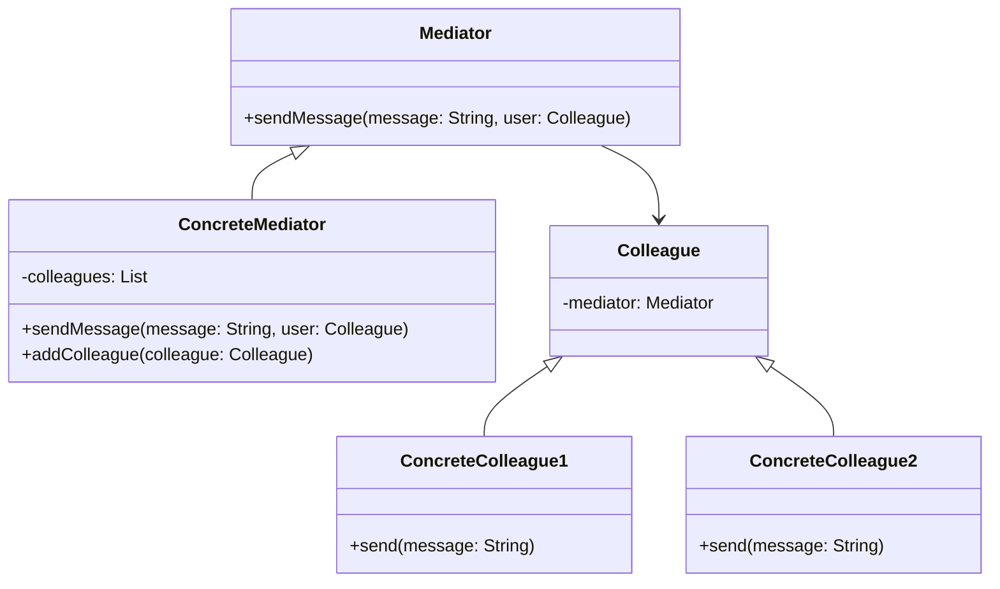
```mermaid
classDiagram
    class Mediator {
        +sendMessage(message: String, user: Colleague)
    }
    class ConcreteMediator {
        +sendMessage(message: String, user: Colleague)
        -colleagues: List<Colleague>
        +addColleague(colleague: Colleague)
    }
    class Colleague {
        -mediator: Mediator
    }
    class ConcreteColleague1 {
        +send(message: String)
    }
    class ConcreteColleague2 {
        +send(message: String)
    }
    Mediator <|-- ConcreteMediator
    Colleague <|-- ConcreteColleague1
    Colleague <|-- ConcreteColleague2
    Mediator --> Colleague
```

- `Mediator` 是中介者接口，定义了同事对象通信的方法 `sendMessage`。
- `ConcreteMediator` 是具体中介者类，实现了中介者接口，负责协调各个同事对象之间的通信，并维护一个同事对象列表。
- `Colleague` 是同事对象接口，每个同事对象都知道中介者对象，通过中介者来通信。
- `ConcreteColleague1` 和 `ConcreteColleague2` 是具体同事对象类，实现同事对象接口，通过中介者来发送消息。

### 5. 案例：智能家居系统

假设我们正在开发一个智能家居系统，其中有多个智能设备，如灯、温控器和音响。这些设备需要协同工作，例如，当用户进入房间时，灯应该自动开启，温控器应该调整温度，音响可以播放欢迎音乐。

使用中介者模式，我们可以创建一个智能家居中心作为中介者，每个智能设备都与中介者通信，而不是直接与其他设备通信。中介者负责协调设备之间的交互，例如，在用户进入房间时，中介者可以通知灯打开、调整温控器和音响的设置。

这种方式降低了智能设备之间的耦合度，使得系统更容易维护和扩展。当需要添加新的智能设备时，只需创建新的具体设备类并确保它们与中介者通信即可。

```java
// 中介者接口
interface SmartHomeMediator {
    void notify(String device, String event);
}

// 具体中介者类
class SmartHomeController implements SmartHomeMediator {
    @Override
    public void notify(String device, String event) {
        System.out.println(device + " 触发事件: " + event);
    }
}

// 智能设备抽象类
abstract class SmartDevice {
    protected SmartHomeMediator mediator;
    protected String name;

    public SmartDevice(SmartHomeMediator mediator, String name) {
        this.mediator = mediator;
        this.name = name;
    }

    public abstract void performEvent(String event);
}

// 具体智能设备类
class Light extends SmartDevice {
    public Light(SmartHomeMediator mediator, String name) {
        super(mediator, name);
    }

    @Override
    public void performEvent(String event) {
        System.out.println(name + " 响应事件: " + event);
        mediator.notify(name, event);
    }
}

class Thermostat extends SmartDevice {
    public Thermostat(SmartHomeMediator mediator, String name) {
        super(mediator, name);
    }

    @Override
    public void performEvent(String event) {
        System.out.println(name + " 响应事件: " + event);
        mediator.notify(name, event);
    }
}

class Speaker extends SmartDevice {
    public Speaker(SmartHomeMediator mediator, String name) {
        super(mediator, name);
    }

    @Override
    public void performEvent(String event) {
        System.out.println(name + " 响应事件: " + event);
        mediator.notify(name, event);
    }
}

public class Main {
    public static void main(String[] args) {
        // 创建中介者
        SmartHomeMediator mediator = new SmartHomeController();

        // 创建智能设备并让它们触发事件
        SmartDevice light = new Light(mediator, "客厅灯");
        SmartDevice thermostat = new Thermostat(mediator, "客厅温控器");
        SmartDevice speaker = new Speaker(mediator, "客厅音响");

        light.performEvent("开启");
        thermostat.performEvent("将温度设为26°C");
        speaker.performEvent("播放欢迎音乐");
    }
}
```

在这个示例中，`SmartHomeController` 充当中介者，每个智能设备对象都知道中介者，并通过中介者来触发事件。中介者负责协调设备之间的通信和事件处理。通过中介者模式，我们可以轻松添加新的智能设备，而不需要修改现有设备或中介者的代码。

---

## 二十一、访问者模式

访问者模式是一种行为型设计模式，旨在将数据结构与数据操作分离，使得可以在不改变数据结构的情况下，定义新的操作（访问者），并将其应用于数据结构中的元素。这种模式适用于数据结构相对稳定，但需要频繁添加新的操作的情况。

### 1. 问题

在某些情况下，我们希望对一个复杂的数据结构进行多种不同的操作，而这些操作可能会随着时间的推移不断变化和增加。如果将这些操作直接加入数据结构的类中，会导致类变得庞大且难以维护，同时违反了开闭原则（对扩展开放，对修改关闭）。

### 2. 解决方案

访问者模式通过将操作（访问者）从数据结构中抽离出来，以一种独立的方式实现新的操作，从而实现了操作和数据结构的分离。它的核心思想是，为数据结构中的每个元素提供一个接受访问者的方法，让访问者能够针对不同的元素执行不同的操作，而无需修改元素的类。

### 3. 例子

假设我们有一个图书馆管理系统，其中包含图书、杂志和报纸等不同类型的资料。我们希望能够实现不同的操作，如展示资料的详细信息、统计各类资料的数量等。访问者模式可以帮助我们实现这种需求。

首先，我们定义一个抽象的访问者接口（`Visitor`），其中包含了针对不同类型资料的访问方法。然后，我们为每种资料类型（图书、杂志、报纸）创建对应的类，并实现接受访问者的方法。

接下来，我们定义一个抽象的元素接口（`LibraryItem`），其中包含一个接受访问者的方法。每种资料类型都实现了这个接口。

最后，我们在具体的访问者类中实现对不同类型资料的操作，而不需要修改资料的类。

以下是代码示例：

```java
// 抽象访问者接口
interface Visitor {
    void visit(Book book);
    void visit(Magazine magazine);
    void visit(Newspaper newspaper);
}

// 具体访问者类
class InfoVisitor implements Visitor {
    @Override
    public void visit(Book book) {
        System.out.println("展示图书信息：" + book.getTitle());
    }

    @Override
    public void visit(Magazine magazine) {
        System.out.println("展示杂志信息：" + magazine.getTitle());
    }

    @Override
    public void visit(Newspaper newspaper) {
        System.out.println("展示报纸信息：" + newspaper.getTitle());
    }
}

// 抽象元素接口
interface LibraryItem {
    void accept(Visitor visitor);
}

// 具体元素类：图书
class Book implements LibraryItem {
    private String title;

    public Book(String title) {
        this.title = title;
    }

    public String getTitle() {
        return title;
    }

    @Override
    public void accept(Visitor visitor) {
        visitor.visit(this);
    }
}

// 具体元素类：杂志
class Magazine implements LibraryItem {
    private String title;

    public Magazine(String title) {
        this.title = title;
    }

    public String getTitle() {
        return title;
    }

    @Override
    public void accept(Visitor visitor) {
        visitor.visit(this);
    }
}

// 具体元素类：报纸
class Newspaper implements LibraryItem {
    private String title;

    public Newspaper(String title) {
        this.title = title;
    }

    public String getTitle() {
        return title;
    }

    @Override
    public void accept(Visitor visitor) {
        visitor.visit(this);
    }
}

// 客户端代码
public class Main {
    public static void main(String[] args) {
        LibraryItem[] items = {
            new Book("Java编程"),
            new Magazine("读者"),
            new Newspaper("晚间新闻")
        };

        Visitor infoVisitor = new InfoVisitor();

        for (LibraryItem item : items) {
            item.accept(infoVisitor);
        }
    }
}

```

### 4. 类图

下面是访问者模式的类图：

```mermaid
classDiagram
    class Visitor {
        +visit(Book)
        +visit(Magazine)
        +visit(Newspaper)
    }
    class InfoVisitor {
        +visit(Book)
        +visit(Magazine)
        +visit(Newspaper)
    }
    class LibraryItem {
        +accept(Visitor)
    }
    class Book {
        +getTitle()
        +accept(Visitor)
    }
    class Magazine {
        +getTitle()
        +accept(Visitor)
    }
    class Newspaper {
        +getTitle()
        +accept(Visitor)
    }
    Visitor <|-- InfoVisitor
    Visitor <|-- OtherVisitor
    LibraryItem <|-- Book
    LibraryItem <|-- Magazine
    LibraryItem <|-- Newspaper
    Visitor ..> LibraryItem
```

> - `Visitor` 是抽象访问者类，定义了访问不同元素的方法。
> - `InfoVisitor` 是具体访问者类，实现了具体的访问操作。
> - `LibraryItem` 是抽象元素类，定义了接受访问者的方法。
> - `Book`、`Magazine` 和 `Newspaper` 是具体元素类，实现了接受访问者的方法。
> - 具体访问者类和具体元素类之间存在关联关系，表示访问者可以访问元素。
> - `Visitor` 和 `LibraryItem` 之间存在关联关系，表示访问者通过调用元素的接受方法来访问元素。

### 5. 案例：计算机部件价格

假设我们有一个计算机部件的结构，包括 CPU、内存和硬盘。我们希望能够实现不同的操作，如计算部件

的价格、计算部件的能耗等。访问者模式可以帮助我们实现这种需求。

首先，我们定义一个抽象的访问者接口（`Visitor`），其中包含了针对不同类型部件的访问方法。然后，我们为每种部件类型（CPU、内存、硬盘）创建对应的类，并实现接受访问者的方法。

接下来，我们定义一个抽象的元素接口（`ComputerPart`），其中包含一个接受访问者的方法。每种部件类型都实现了这个接口。

最后，我们在具体的访问者类中实现对不同类型部件的操作，如计算价格和计算能耗，而不需要修改部件的类。

以下是代码示例：

```java
// 抽象访问者接口
interface Visitor {
    void visit(CPU cpu);
    void visit(Memory memory);
    void visit(HardDrive hardDrive);
}

// 具体访问者类
class PriceVisitor implements Visitor {
    private double totalPrice = 0;

    public double getTotalPrice() {
        return totalPrice;
    }

    @Override
    public void visit(CPU cpu) {
        totalPrice += cpu.getPrice();
    }

    @Override
    public void visit(Memory memory) {
        totalPrice += memory.getPrice();
    }

    @Override
    public void visit(HardDrive hardDrive) {
        totalPrice += hardDrive.getPrice();
    }
}

// 抽象元素接口
interface ComputerPart {
    void accept(Visitor visitor);
    double getPrice();
}

// 具体元素类：CPU
class CPU implements ComputerPart {
    private double price;

    public CPU(double price) {
        this.price = price;
    }

    @Override
    public void accept(Visitor visitor) {
        visitor.visit(this);
    }

    @Override
    public double getPrice() {
        return price;
    }
}

// 具体元素类：内存
class Memory implements ComputerPart {
    private double price;

    public Memory(double price) {
        this.price = price;
    }

    @Override
    public void accept(Visitor visitor) {
        visitor.visit(this);
    }

    @Override
    public double getPrice() {
        return price;
    }
}

// 具体元素类：硬盘
class HardDrive implements ComputerPart {
    private double price;

    public HardDrive(double price) {
        this.price = price;
    }

    @Override
    public void accept(Visitor visitor) {
        visitor.visit(this);
    }

    @Override
    public double getPrice() {
        return price;
    }
}

// 客户端代码
public class Main {
    public static void main(String[] args) {
        ComputerPart[] parts = {
            new CPU(1200),
            new Memory(880),
            new HardDrive(420)
        };

        Visitor priceVisitor = new PriceVisitor();

        for (ComputerPart part : parts) {
            part.accept(priceVisitor);
        }

        System.out.println("总价: ￥" + ((PriceVisitor) priceVisitor).getTotalPrice());
    }
}
```

通过访问者模式，我们可以轻松地实现不同的操作，而不需要修改部件的类。这种模式将操作和数据结构分离，使得代码更具扩展性和可维护性。

---

## 二十二、解释器模式

解释器设计模式是一种行为型设计模式，它旨在定义一种语言文法的表示，并且使用该表示来解释语言中的句子。该模式适用于需要处理和解释一些特定类型语法规则的情况，例如编程语言解释器、正则表达式引擎等。

### 1. 问题

解释器模式旨在解决以下问题：

1. **需要处理自定义语言或规则**：有些应用程序需要解释和处理自定义的领域特定语言或规则。在这种情况下，使用解释器模式可以将语言的语法和解释逻辑分离，使其易于维护和扩展。

2. **需要解释和执行一系列复杂操作**：有些情况下，需要将一系列操作组合成更高级别的操作。解释器模式允许你创建一个解释器来执行这些复杂的操作，从而将代码的组织和执行分离。

### 2. 例子

考虑一个简单的数学表达式解析器，它可以解释和计算基本的数学表达式，如加法、减法、乘法和除法。使用解释器模式，我们可以定义一些抽象的解释器类来表示不同类型的表达式，然后创建具体的解释器类来实现解释和计算逻辑。

### 3. 代码示例

解释器模式在项目中常见的结构包括以下几个角色：

> 1. **抽象表达式（Abstract Expression）**：定义解释器的接口，声明解释方法。
> 2. **终结符表达式（Terminal Expression）**：实现抽象表达式接口，表示文法中的终结符，即不再可以解释的最小单位。
> 3. **非终结符表达式（Non-terminal Expression）**：实现抽象表达式接口，表示文法中的非终结符，即可以继续解释的部分。
> 4. **上下文（Context）**：包含解释器之外的一些全局信息，供解释器使用。

以下是一个简化的数学表达式解释器的代码示例：

```java
// 抽象表达式接口
interface Expression {
    int interpret(Context context);
}

// 终结符表达式类
class NumberExpression implements Expression {
    private int number;

    public NumberExpression(int number) {
        this.number = number;
    }

    @Override
    public int interpret(Context context) {
        return number;
    }
}

// 非终结符表达式类（加法）
class AddExpression implements Expression {
    private Expression leftOperand;
    private Expression rightOperand;

    public AddExpression(Expression leftOperand, Expression rightOperand) {
        this.leftOperand = leftOperand;
        this.rightOperand = rightOperand;
    }

    @Override
    public int interpret(Context context) {
        return leftOperand.interpret(context) + rightOperand.interpret(context);
    }
}

// 上下文类
class Context {
    private String expression;

    public Context(String expression) {
        this.expression = expression;
    }

    public String getExpression() {
        return expression;
    }
}

// 客户端代码
public class Main {
    public static void main(String[] args) {
        Context context = new Context("5 + 3 - 2");
        
        Expression expression = new AddExpression(
            new NumberExpression(5),
            new AddExpression(
                new NumberExpression(3),
                new NumberExpression(-2)
            )
        );

        int result = expression.interpret(context);
        System.out.println("表达式结果: " + result); // 输出：表达式结果: 6
    }
}
```

在这个例子中，我们定义了抽象表达式接口 `Expression`，以及终结符表达式类 `NumberExpression` 和非终结符表达式类 `AddExpression`。`Context` 类用于存储上下文信息，供解释器使用。

客户端代码首先创建一个上下文对象，并定义一个数学表达式 "5 + 3 - 2"。然后，通过使用不同的表达式类和组合，构建了一个解释器来解释和计算这个表达式的结果。

### 4. 类图

下面是使用解释器设计模式的类图：

```mermaid
classDiagram
    class Context {
        -expression: String
        +getContext(): String
    }
    
    class Expression {
        +interpret(context: Context): int
    }
    
    class TerminalExpression {
        +interpret(context: Context): int
    }
    
    class NonTerminalExpression {
        +interpret(context: Context): int
    }
    
    Context *-- Expression
    Expression <|-- TerminalExpression
    Expression <|-- NonTerminalExpression

```

> - `Expression` 是抽象表达式类，定义了解释方法。
> - `NumberExpression` 和 `AddExpression` 是具体表达式类，分别表示终结符和非终结符表达式，实现了解释方法。
> - `Context` 类保存上下文信息，供解释器使用。

### 5. 案例：正则表达式引擎

另一个实际的例子是正则表达式引擎。正则表达式是一种用于匹配字符串的模式，可以用于搜索、替换和验证字符串。正则表达式引擎使用解释器模式来解释正则表达式的语法，并将其转换为实际的匹配逻辑。

```java
// 抽象表达式接口
interface RegularExpression {
    boolean interpret(String input);
}

// 终结符表达式类（匹配单个字符）
class CharacterExpression implements RegularExpression {
    private char character;

    public CharacterExpression(char character) {
        this.character = character;
    }

    @Override
    public boolean interpret(String input) {
        return input.contains(String.valueOf(character));
    }
}

// 非终结符表达式类（并操作）
class AndExpression implements RegularExpression {
    private RegularExpression expression1;
    private RegularExpression expression2;

    public AndExpression(RegularExpression expression1, RegularExpression expression2) {
        this.expression1 = expression1;
        this.expression2 = expression2;
    }

    @Override
    public boolean interpret(String input) {
        return expression1.interpret(input) && expression2.interpret(input);
    }
}

// 非终结符表达式类（或操作）
class OrExpression implements RegularExpression {
    private RegularExpression expression1;
    private RegularExpression expression2;

    public OrExpression(RegularExpression expression1, RegularExpression expression2) {
        this.expression1 = expression1;
        this.expression2 = expression2;
    }

    @Override
    public boolean interpret(String input) {
        return expression1.interpret(input) || expression2.interpret(input);
    }
}

// 客户端代码
public class Main {
    public static void main(String[] args) {
        // 创建正则表达式: "a" 或 "b" 并且同时包含 "c"
        RegularExpression regex = new AndExpression(
            new OrExpression(
                new CharacterExpression('a'),
                new CharacterExpression('b')
            ),
            new CharacterExpression('c')
        );

        String[] testStrings = { "abc", "ac", "bc", "ab", "xyz" };

        for (String testString : testStrings) {
            boolean result = regex.interpret(testString);
            System.out.println("Input: " + testString + " Matches: " + result);
        }
    }
}
```

正则表达式的语法可以非常复杂，但使用解释器模式可以将其拆分成各种子表达式和操作符，然后根据这些子表达式和操作符构建解释器来执行匹配操作。这种方式使得正则表达式引擎的设计和扩展更加可控和模块化。

### 6. 优点和注意事项

#### 优点

1. **分离语法解析和执行逻辑**：解释器模式将语法解析和执行逻辑分离，使得解释器可以独立于语法的变化而变化。这使得语法的修改或扩展更加容易。

2. **易于添加新的表达式**：通过创建新的终结符和非终结符表达式类，可以轻松地添加新的表达式类型，而无需修改已有的解释器类。

3. **灵活性**：解释器模式可以应用于各种领域，包括自定义领域特定语言、查询语言、正则表达式引擎等，提供了灵活的解释和处理复杂规则的方法。

#### 注意事项

1. **复杂性**：解释器模式的实现可能会变得相当复杂，特别是对于复杂的语法规则。因此，需要仔细考虑是否真正需要使用解释器模式。
2. **性能**：解释器模式通常不是最高效的解决方案，因为它需要解释和执行语法规则。在性能要求较高的情况下，可能需要考虑其他设计模式或优化方法。
3. **维护**：随着语法规则的复杂性增加，维护解释器模式的代码可能变得困难。因此，需要谨慎设计和组织解释器的结构。
---

## 二十三、备忘录模式

备忘录模式（Memento Pattern）是一种行为型设计模式，它用于捕获对象的内部状态并在不破坏对象封装的前提下将其保存，以便稍后可以恢复到先前的状态。备忘录模式通常涉及三个核心角色：**原发器（Originator）**、**备忘录（Memento）**和**负责人（Caretaker）**。

### 1. 问题

备忘录模式旨在解决以下问题：

1. **需要保存对象的历史状态**：在某些情况下，我们需要跟踪和保存对象的内部状态的历史记录，以便将来可以回滚或还原对象到先前的状态。

2. **需要实现撤销和恢复功能**：备忘录模式可以用于实现撤销和恢复功能，让用户可以取消操作或将对象状态还原到之前的某个时间点。

### 2. 例子

考虑一个文本编辑器应用程序，用户可以输入文本并进行编辑操作。在这种情况下，备忘录模式可以用于实现撤销和恢复功能，以便用户可以撤销之前的编辑操作或者恢复到之前的编辑状态。

### 3. 代码示例

下面是一个备忘录模式的简单示例，以文本编辑器为例：

1. **原发器（Originator）**：表示文本编辑器，负责创建备忘录并在需要时将当前文本状态保存到备忘录中。

```java
// 文本编辑器类，负责编辑和保存文本
public class TextEditor {
    private String text;

    public void setText(String text) {
        this.text = text;
    }

    public String getText() {
        return text;
    }

    // 创建备忘录，保存当前文本状态
    public TextEditorMemento save() {
        return new TextEditorMemento(text);
    }

    // 恢复文本状态
    public void restore(TextEditorMemento memento) {
        this.text = memento.getText();
    }
}
```

2. **备忘录（Memento）**：表示文本编辑器的备忘录，负责存储文本编辑器的状态。

```java
// 备忘录类，用于存储文本编辑器的状态
public class TextEditorMemento {
    private final String text;

    public TextEditorMemento(String text) {
        this.text = text;
    }

    public String getText() {
        return text;
    }
}
```

3. **负责人（Caretaker）**：表示文本编辑器的撤销和恢复功能，负责管理备忘录对象的存储和恢复。

```java
// 历史管理类，用于存储和恢复备忘录
public class TextEditorHistory {
    private Stack<TextEditorMemento> history = new Stack<>();

    // 存储备忘录
    public void push(TextEditorMemento memento) {
        history.push(memento);
    }

    // 恢复备忘录
    public TextEditorMemento pop() {
        if (!history.isEmpty()) {
            return history.pop();
        }
        return null;
    }
}

```

现在，我们可以使用备忘录模式来实现文本编辑器的撤销和恢复功能：

```java
// 主应用程序
public class Main {
    public static void main(String[] args) {
        TextEditor textEditor = new TextEditor();
        TextEditorHistory history = new TextEditorHistory();

        // 编辑文本
        textEditor.setText("第一行文本");
        history.push(textEditor.save());

        // 编辑并保存文本
        textEditor.setText("第一行文本\n第二行文本");
        history.push(textEditor.save());

        // 编辑并保存文本
        textEditor.setText("第一行文本\n第二行文本\n第三行文本");
        history.push(textEditor.save());

        // 恢复到之前的状态
        textEditor.restore(history.pop());
        System.out.println("恢复后的文本：\n" + textEditor.getText());
    }
}
```

在这个示例中，我们创建了一个文本编辑器对象 `textEditor`，并使用 `TextEditorHistory` 来存储和管理文本编辑器的状态备忘录。用户可以编辑文本，保存状态，并在需要时撤销到之前的状态。

### 4. 类图

下面是备忘录模式的类图：

```mermaid
classDiagram
    class Originator {
        +setText(text: String)
        +getText(): String
        +save(): Memento
        +restore(memento: Memento)
    }
    class Memento {
        +getText(): String
    }
    class Caretaker {
        +push(memento: Memento)
        +pop(): Memento
    }
    Originator -- Memento
    Originator <-- Caretaker
```

- **`Originator`** 是原发器，负责创建备忘录并保存状态，还可以恢复状态。
- **`Memento`** 是备忘录，用于存储原发器的内部状态。
- **`Caretaker`** 是负责人，负责管理备忘录对象，包括存储和恢复。

备忘录模式允许我们有效地管理对象的状态历史记录，并实现撤销和恢复功能，从而提高了程序的灵活性和可维护性。

### 5. 备忘录模式的应用

备忘录模式在实际应用中有许多用途，特别是在需要跟踪和管理对象状态历史记录的情况下。以下是一些备忘录模式的应用场景：

1. **文本编辑器和图形编辑器**：像文本编辑器、图形编辑器等应用程序通常需要支持撤销和恢复功能。备忘录模式可以用于记录用户的编辑历史，使用户可以撤销和恢复编辑操作。

2. **数据库事务管理**：在数据库系统中，备忘录模式可以用于实现事务管理。事务可以被保存为备忘录，如果发生错误或需要回滚，可以恢复到之前的事务状态。

3. **游戏进度保存**：在游戏开发中，备忘录模式可以用于保存游戏进度。玩家可以随时保存游戏状态，以便在之后恢复到保存的状态。

4. **配置管理**：备忘录模式可以用于管理应用程序的配置状态。用户可以保存不同的配置文件，并在需要时恢复到特定的配置状态。

5. **历史记录管理**：在应用程序中记录用户的历史操作可以使用备忘录模式。这对于审计和追踪用户活动非常有用。

6. **电子邮件草稿保存**：电子邮件客户端可以使用备忘录模式来保存用户的电子邮件草稿。用户可以随时保存当前编辑的电子邮件，以便以后继续编辑。

7. **浏览器会话管理**：Web浏览器可以使用备忘录模式来保存浏览会话状态，以便用户可以恢复到以前的浏览历史记录。

### 6. 优点和注意事项

#### 优点

- **状态的封装性**：备忘录模式允许将对象的状态封装在备忘录对象中，使原发器对象不会直接暴露其内部状态，从而维护了封装性和隔离性。

- **撤销和恢复功能**：备忘录模式提供了撤销和恢复功能，使用户可以回滚到对象的先前状态，从而提供了更好的用户体验。

- **历史记录管理**：备忘录模式可以用于管理对象的状态历史记录，用于审计、追踪和记录对象的活动历史。

#### 注意事项

- **资源消耗**：如果需要保存大量的备忘录对象，可能会占用大量内存。因此，需要根据具体应用场景来考虑备忘录对象的保存和管理。

- **性能开销**：创建和管理备忘录对象可能会引入性能开销。因此，在性能敏感的应用程序中需要谨慎使用。

- **版本管理**：如果备忘录对象的状态发生变化，需要考虑如何管理不同版本的备忘录，以避免混淆和错误恢复。

备忘录模式是一种强大的设计模式，适用于需要撤销、恢复或跟踪对象状态历史记录的场景，备忘录模式提高了程序的灵活性和可维护性，但需要谨慎管理资源和性能。

---

## 行为型模式小结

### 1. 观察者模式（Observer Pattern）

- **目的**：观察者模式定义了一种一对多的依赖关系，使多个观察者对象可以自动通知并更新主题对象的状态变化。这样，在对象之间建立了松耦合的关系。
- **适用场景**：观察者模式适用于当一个对象的改变需要通知其他对象，并且不知道这些对象是谁以及它们的数量时，或者当一个对象需要广播消息给多个对象时。

### 2. 策略模式（Strategy Pattern）

- **目的**：策略模式定义了一系列算法，并将每个算法封装成一个独立的策略类，使它们可以相互替换。这样，客户端可以根据需要选择不同的策略，而不影响使用方式。
- **适用场景**：策略模式适用于需要在运行时动态选择算法的情况，或者当有多个类似行为但实现方式不同的情况。

### 3. 模板方法模式（Template Method Pattern）

- **目的**：模板方法模式定义了一个算法的骨架，将具体步骤延迟到子类中实现。这样，子类可以重新定义算法的某些步骤，而不改变算法的结构。
- **适用场景**：模板方法模式适用于将算法的结构固定下来，但允许各个子类提供算法的具体实现。

### 4. 迭代器模式（Iterator Pattern）

- **目的**：迭代器模式提供一种统一的方式来访问集合对象中的元素，而不暴露其内部结构。这使得可以在不修改集合类的情况下，迭代不同类型的集合。
- **适用场景**：迭代器模式适用于需要遍历集合对象的情况，以便能够以统一的方式访问不同类型的集合。

### 5. 责任链模式（Chain of Responsibility Pattern）

- **目的**：责任链模式允许构建一个处理请求的对象链，每个处理者对象决定是否处理请求，以及是否将请求传递给下一个处理者。这样可以避免请求发送者和接收者之间的紧耦合。
- **适用场景**：责任链模式适用于有多个对象可以处理请求，但不确定哪个对象会处理请求，或者希望请求能够按照一定顺序经过一系列处理。

### 6. 命令模式（Command Pattern）

- **目的**：命令模式将请求封装成一个对象，以便能够参数化客户端对象，将请求排队、记录请求日志、支持可撤销操作等。这使得可以将发起请求的对象与执行请求的对象解耦。
- **适用场景**：命令模式适用于需要将请求发送者和接收者解耦，或者需要支持撤销和重做操作的情况。

### 7. 状态模式（State Pattern）

- **目的**：状态模式允许一个对象在其内部状态改变时改变其行为，看起来就像是改变了对象的类。这通过将状态抽象成独立的状态类来实现。
- **适用场景**：状态模式适用于对象有多个状态，并且状态之间的转换会导致对象的行为发生变化的情况。

### 8. 中介者模式（Mediator Pattern）

- **目的**：中介者模式定义了一个中介对象，用于协调一组对象之间的交互。这降低了对象之间的直接耦合，使系统更加灵活。
- **适用场景**：中介者模式适用于系统中的对象之间存在复杂的相互关系，需要通过一个中介来协调它们的情况。

### 9. 访问者模式（Visitor Pattern）

- **目的**：访问者模式用于在不改变元素类的前提下，为元素类添加新的操作。它将操作封装成访问者对象，以便可以在不同元素上执行不同操作。
- **适用场景**：访问者模式适用于需要为一组具有不同类型的元素添加新操作，而不希望修改这些元素的类定义的情况。

### 10. 解释器模式（Interpreter Pattern）

- **目的**：解释器模式定义了一种语言文法的解释器，使得可以解释特定语言的句子。它将句子解释为抽象语法树，然后执行相应操作。
- **适用场景**：解释器模式适用于需要解释和执行特定语言或表达式的情况，例如编译器、查询语言解析等。

### 11. 备忘录模式（Memento Pattern）

- **目的**：备忘录模式允许在不暴露对象内部状态的情况下，捕获和恢复对象的状态。它通过将对象状态保存到备忘录对象中来实现。
- **适用场景**：备忘录模式适用于需要在不破坏封装性的前提下保存和恢复对象状态的情况，例如撤销操作、快照功能等。
